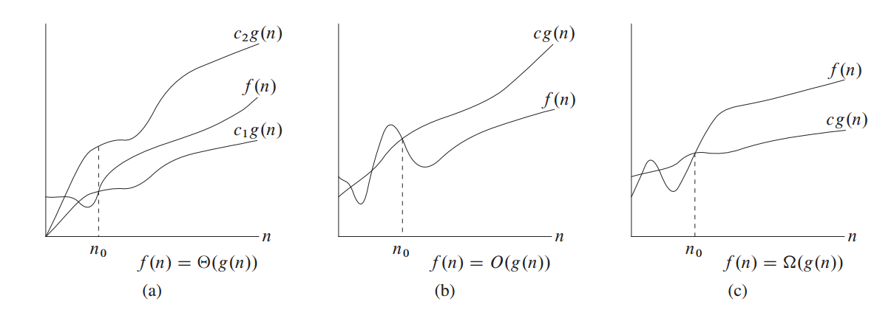
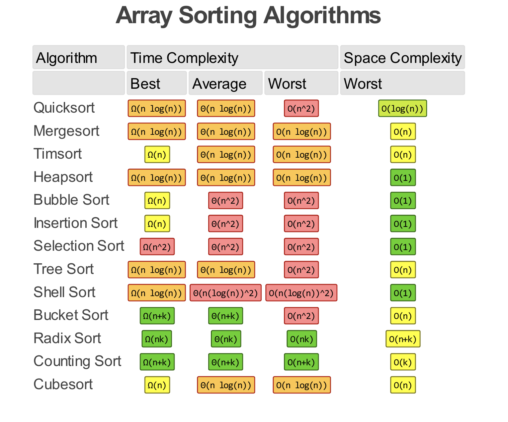
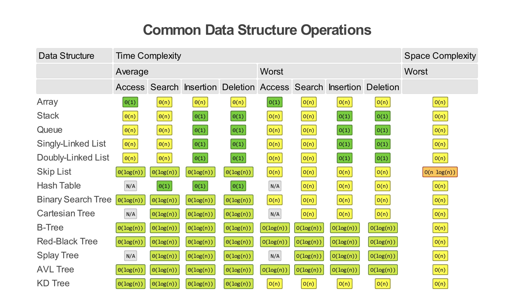

### 前言：函数的增长

* 算法的渐进效率：我们关心当输入规模无限增加时，算法的运行时间如何随着输入规模的变大而增加。例子：输入规模$n$增大，最坏情况运行时间为$\Theta(n\lg n)$的归并排序战胜最坏情况运行时间为$\Theta(n^2)$的插入排序；
* 我们设最坏情况运行时间函数为$T(n)$；
* 算法分析的种类：
       最坏情况（Worst Case）：任意输入规模的最大运行时间。（Usually）
      平均情况（Average Case）：任意输入规模的期待运行时间。（Sometimes）
      最佳情况（Best Case）：通常最佳情况不会出现。（Bogus）

### 渐近记号（Asymptotic Notation）

渐进记号是应用于函数上的记号。

渐进记号刻画算法的运行时间，为了全面性（综合覆盖所有输入），提出了不同的渐进符号。

通常有 $O$、 $Θ$ 和 $Ω$ 记号法。$Θ$ 记号渐进地给出了一个函数的上界和下界，当只有渐近上界时使用 $O$ 记号，当只有渐近下界时使用 $Ω$ 记号。

尽管技术上 $Θ$ 记号较为准确，但通常仍然使用 $O$记号表示。

使用 $O$ 记号法（Big O Notation）表示最坏运行情况的上界。

如下的函数$f(n)$都是**渐进非负**的，也就是当$n$足够大，$f(n)$非负。

渐进记号出现在公式中，出现在等式右边，可以视为某一个不关心的匿名函数，如：
$$
T(n) =T(n/2) + \Theta(n)
$$
出现在等式左边，表示左边无论是什么匿名函数，右边总有一个匿名函数使得等式成立，例如：
$$
2n^2+3n + 1=2n^2+\Theta(n) =\Theta(n^2)
$$

#### 前示

#### $\Theta$ 记号
定义：$\Theta(g (n))=\{f(n)$ ：存在正常量$c_1,c_2,n_0 $使得对所有$n\ge n_0$，有$0 \le c_1g(n) \le f(n) \le c_2g(n)\}$

$\Theta(g (n))$ 表示一个函数集合， $f(n)\in \Theta(g (n))$；

$g(n)$是$f(n)$的渐进紧确界。

#### $O$ 记号
定义：$O(g (n))=\{f(n)$ ：存在正常量$c,n_0 $使得对所有$n\ge n_0$，有$0\le f(n) \le c g(n)\}$。

只有一个渐进上界时，使用$O$记号。

$f(n)=O(g(n))$代表$f(n)\in O(g(n))$,因此$\Theta$是一个比$O$更强的概念，有$\Theta(g(n)) \subseteq O(g(n))$;

####  $\Omega$ 记号

 定义：$\Omega(g (n))=\{f(n)$ ：存在正常量$c,n_0 $使得对所有$n\ge n_0$，有$0\le c g(n) \le f(n) \}$。

只有一个渐进下界时，使用$\Omega$记号。

#### $o$ 记号

是一个非渐进紧确的上界。

定义： $o(g (n))=\{f(n)$ ：存在正常量 $c$，存在常量 $n_0$，使得对所有 $n\ge n_0$，有 $0 \le f(n) < cg(n) \}$。

也就是说当$n$趋于无穷时， $g(n)$比$f(n)$大至少一个数量级。

引入的原因：$O$ 提供的渐进上界可能是也可能不是渐进紧确的。例子：$2n=O(n^2)$不是渐进紧确的。

#### $\omega$ 记号

是一个非渐进紧确的下界。

定义： $\omega(g (n))=\{f(n)$ ：存在正常量 $c$，存在常量 $n_0$，使得对所有$n\ge n_0$，有$0\le cg(n) < f(n) \}$。

也就是说当$n$趋于无穷时， $f(n)$ 比 $g(n)$大至少一个数量级。

#### comlexity table

------

Reference：算法导论

https://www.bigocheatsheet.com