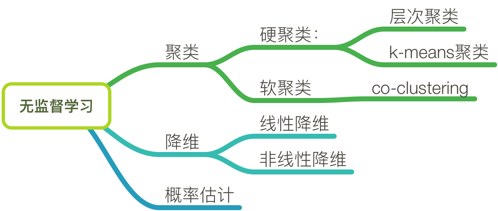

title: Cluster
mathjax: true
date: 2019-08-18 10:18:48
tags: MachineLearning
categories: 机器学习


### 聚类




-----


### Kmeans

The K-Means algorithm:

* First initialize $k$ centroids randomly: $k$ distinct instances are chosen randomly from the dataset and the centroids are placed at their locations.

* Repeat until convergence (i.e., **until the centroids stop moving**):

  * Assign each instance to the closest centroid.

  * Update the centroids to be the mean of the instances that are assigned to them.


上述Kmeans属于硬聚类，即每个样本直接归属于最近的聚类中心。**缺点**：受到不同初始化参数的影响。

因此，判断Kmeans学习**是否好的指标**：`Inertia`，即每个样本到聚类中心的距离。

**解决办法**： run the K-Means algorithm **multiple times with different random initializations,** and select the solution that **minimizes the inertia**.


```python
from sklearn.cluster import KMeans

k = 5
kmeans = KMeans(n_clusters=k, random_state=42)
y_pred = kmeans.fit_predict(X)
```


###  K-Means++

The K-Means++ algorithm:

* Take one centroid $c_1$, chosen uniformly at random from the dataset.

* Take a new center $c_i$, choosing an instance $\mathbf{x}_i$ with probability: $D(\mathbf{x}_i)^2$ / $\sum\limits_{j=1}^{m}{D(\mathbf{x}_j)}^2$ where $D(\mathbf{x}_i)$ is the distance between the instance $\mathbf{x}_i$ and the closest centroid that was already chosen. This probability distribution ensures that instances that are further away from already chosen centroids are much more likely be selected as centroids.

*  Repeat the previous step until all $k$ centroids have been chosen.

```python
KMeans(algorithm='auto', copy_x=True, init='k-means++', max_iter=300,
    n_clusters=8, n_init=10, n_jobs=None, precompute_distances='auto',
    random_state=None, tol=0.0001, verbose=0)
```


### Accelerated K-Means

The K-Means algorithm can be significantly accelerated by avoiding many unnecessary distance calculations: this is achieved **by exploiting the triangle inequality** and **by keeping track of lower and upper bounds for distances between instances and centroids**。


```python
%timeit -n 50 KMeans(algorithm="elkan").fit(X)
```


### GaussianMixture

```python
from sklearn.mixture import GaussianMixture
# INPUT：给出聚成多少类的数量
y_pred = GaussianMixture(n_components=3, random_state=42).fit(X).predict(X)
```


GMM原理：https://zhengchu1994.github.io/2020/05/05/GMM/

* 为计算输入数据的极大似然估计而引入隐变量，隐变量服从多项式分布；做法：EM算法。

EM算法：https://zhengchu1994.github.io/2019/09/05/EM/

* 为计算**带隐变量的输入数据**的极大似然估计，**通过全概率公式分解既然函数**，然后证明最大似然估计的下界是一个$Q$函数，最大化$Q$函数。
  * 流程：1、初始化参数；2、循环：first、第$i+1$轮迭代求出$Q$函数；second、最大化$Q$函数。


------

* REFERENCES:

  * github/ageron/handson-ml2

    