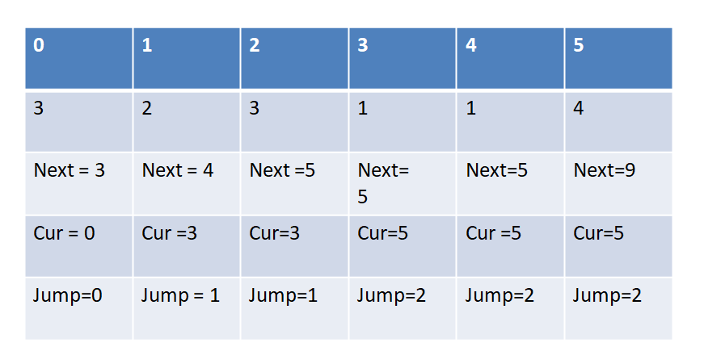
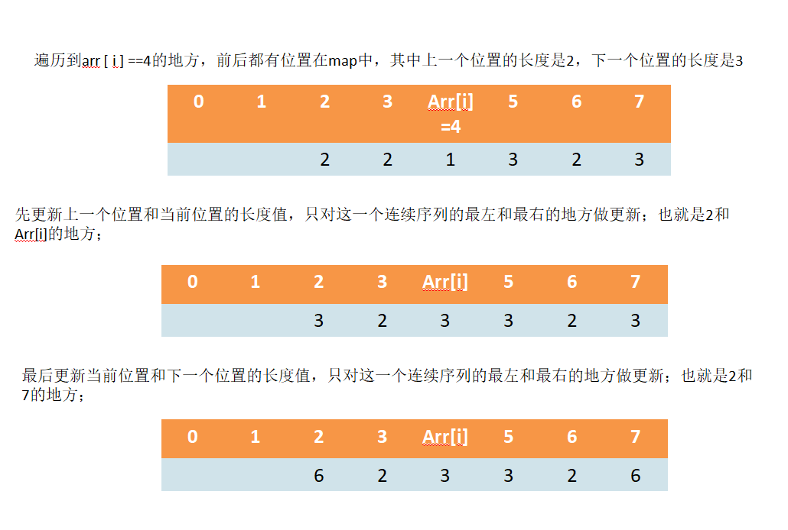

#### 斐波那契递归: 由斐波那契数列的递归关系推导出`n>2`时的状态矩阵，然后利用快速矩阵乘法完成；


知识点：

1. $n^m$次方，等于计算$n^{2^{(10010101..1101)}}$，用$m$的二进制位完成乘法；

2. 幂计算的过程中，有$m\&1$判断$m$的最右一个bit位是否为1；

    

```C++
//1.
#include<iostream>
#include<vector>
#include<algorithm>
using namespace std;
int mod=1e9 + 7;
/*fib数列的1、2项为0，其余项为前两项的和；*/
int fib1(int n) //O(2^N)
{
    if(n<=1)
        return 1;
    return fib1(n) + fib1(n-1);   
}

int fib2(int n) //O(N)
{
    if(n==1 || n==2)
        return 1;
    int res=1;
    int pre=1;
    int tmp=0;
    for(int i=3;i<=n;++i)
    {
        tmp = res;
        res = pre + res;
        pre = tmp;
    }
    return res;
}


vector<vector<long>> multiply(vector<vector<long>> mat1,vector<vector<long>> mat2)
{
    vector< vector<long>> res(mat1.size(), vector<long>(mat2[0].size(), 0));
    for(int i=0; i<mat1.size(); i++)
    {
        for(int j=0; j<mat2[0].size(); j++)
        {
            for(int k=0; k < mat1[0].size(); k++)
            {
                //res[i][j] += mat1[i][k]*mat2[k][j]; 
                res[i][j]=(res[i][j]+(mat1[i][k]*mat2[k][j])%mod)%mod;
            }
        }
    }
    return res;
}

vector< vector<long>> matrixPower(vector< vector<long>> base, long p)//O(logN)
/*
base: A state matrix;
p: the power number.
*/
{
    vector<vector<long>> res(base.size(), vector<long>(base.size(),0));
    //Set to a unit matrix
    for(int i=0; i<res.size(); i++)
    {
        res[i][i] = 1;
    }
    for(;p!=0; p>>=1)
    {
        if((p&1)!= 0) //every last bit of p 
            res = multiply(base,res);
        base = multiply(base, base); //update tmp for next multuply res when last bit of p equal to 1
    }
    return res;
}

  
void fib3(long n)
{
    vector<vector<long>> base={{1, 1},{1, 0}};
    vector<vector<long>> ans;
    ans = matrixPower(base, n-2);
    cout<<(ans[0][0]+ans[0][1])% mod<< endl;
}


int main(){
    long n;
    cin >> n;
    if(n<1)
    {
        cout << 0;
        return 0;
    }
    if(n==1 || n==2)
    {
        cout << 1;
        return 0;
    }
    fib3(n);
    return 0;
}
```

#### 同类型的题：青蛙跳台阶，一次能跳1或者2步，求跳到n个台阶可能的跳法。

1.最后的状态矩阵为$(F(n),F(n-1))=(F(n-1),F(n-2))* \begin{bmatrix}1 & 1\\1 & 0\end{bmatrix}=\cdots=(2,1)\times\begin{bmatrix}1 & 1\\1 & 0\end{bmatrix}^{n-2}$

```c++
#include<iostream>
#include<vector>
using namespace std;
int mod =1e9+7;

vector< vector<long>>  multiply(vector<vector<long>> mat1, vector<vector<long>> mat2)
{
    vector< vector<long>> res(mat1.size(),vector<long>(mat2[0].size(),0));
    for(int i=0; i<mat1.size(); i++)
    {
        for(int j=0; j<mat2[0].size(); j++)
        {    //rm写错k为j
            for(int k=0; k<mat2.size();k++)
            {
                res[i][j] = (res[i][j]+(mat1[i][k] * mat2[k][j])%mod)%mod;
            }
        }
    }
    return res;
}


long jump(vector< vector<long>> base, long n)
    /*
    base: The state matrix.
    n: The power number.
    */
{
    if(n<1) return 0;
    if(n==1 || n==2)
        return n;
    vector<vector<long>> ans(base.size(),vector<long>(base[0].size(),0));
    for(int i=0; i<ans.size(); ++i)
    {
        ans[i][i] = 1;
    }
    n = n-2;
    for(;n!=0;n>>=1)
    {
        if((n&1)!=0)
            ans = multiply(base, ans);
        base = multiply(base, base);
    }
    return (2 *ans[0][0] + ans[1][0]) % mod;
}

int main()
{
    long n;
    cin >> n;
    vector<vector<long>> base={{1,1}, {1,0}};
    cout << jump(base, n) << endl;
    return 0;
}
```

#### 假设农场中成熟的母牛每年只会生 1 头小母牛，并且永远不会死。第一年农场中有一只成熟的母牛，从第二年开始，母牛开始生小母牛。每只小母牛 3 年之后成熟又可以生小母牛。给定整数 n，求出 n 年后牛的数量。

- 类似一样是求解状态矩阵：设
  $$
  (F(n),F(n-1),F(n-2))=(F(n-1),F(n-2),(F-3))*\begin{bmatrix}1 & 1&0\\0 & 0 & 1\\1 & 0 & 0\end{bmatrix}=  \\\\ 
  \cdots=(3,2,1)\times\begin{bmatrix}1 & 1&0\\0 & 0 & 1\\1 & 0 & 0\end{bmatrix}^{n-3}
  $$

```c++
#include<iostream>
#include<vector>
using namespace std;
int mod =1e9+7;

vector< vector<long>>  multiply(vector<vector<long>> mat1, vector<vector<long>> mat2)
{
    vector< vector<long>> res(mat1.size(),vector<long>(mat2[0].size(),0));
    for(int i=0; i<mat1.size(); i++)
    {
        for(int j=0; j<mat2[0].size(); j++)
        {    //rm写错k为j
            for(int k=0; k<mat2.size();k++)
            {
                res[i][j] = (res[i][j]+(mat1[i][k] * mat2[k][j])%mod)%mod;
            }
        }
    }
    return res;
}


long born(vector< vector<long>> base, long n)
    /*
    base: The state matrix.
    n: The power number.
    */
{
    if(n<1) return 0;
    if(n==1 || n==2 || n==3)
        return n;
    vector<vector<long>> ans(base.size(),vector<long>(base[0].size(),0));
    for(int i=0; i<ans.size(); ++i)
    {
        ans[i][i] = 1;
    }
    n = n-3;
    for(;n!=0;n>>=1)
    {
        if((n&1)!=0)
            ans = multiply(base, ans);
        base = multiply(base, base);
    }
    return (3 *ans[0][0] + 2*ans[1][0] + ans[2][0]) % mod;
}

int main()
{
    long n;
    cin >> n;
    vector<vector<long>> base={{1, 1, 0}, {0, 0, 1},{1, 0, 0}};
    cout << born(base, n) << endl;
    return 0;
}
```


#### 题目描述：给定一个 n * m 的矩阵 a，从左上角开始每次只能向右或者向下走，最后到达右下角的位置，路径上所有的数字累加起来就是路径和，输出所有的路径中最小的路径和。

- 解析：动态规划：

  ```c++
  #include<iostream>
  #include<vector>
  #include<algorithm>
  using namespace std;
  
  int minPathSum1(const vector<vector<int>> &mat)
  {
      if(mat.empty()) return 0;
      int row = mat.size(), col = mat[0].size();
      if(row ==0 || col==0) return 0;
      
      vector<vector<int>> table(row, vector<int>(col, 0));
      table[0][0] = mat[0][0];
      for(int i=1; i<col;++i)
          table[0][i] = mat[0][i] + table[0][i-1]; //tag:easy error
      for(int j=1; j<row; ++j)
          table[j][0] = mat[j][0] + table[j-1][0]; //tag:easy error
      
      for(int i=1; i<row; ++i)
      {
          for(int j=1; j<col; ++j)
          {
              table[i][j] = min(table[i-1][j],table[i][j-1]) + mat[i][j];
          }
      }
      return table[row-1][col-1];
  }
  
  int main()
  {
      int m, n;
      cin >> m >> n;
      vector<vector<int>> vec(m,vector<int>(n, 0));
      for(int i=0; i<m; ++i)
      {
          for(int j=0;j<n; ++j)
          {
              cin>>vec[i][j];
          }
      }
      int res = minPathSum1(vec);
      cout << res << endl;
      return 0;
  }
  ```

  

  方法2：空间复杂度降低为$O(\min(M,N))$,滚动的更新一个数组来保存结果，比如列少行多，那初始化第一行，每次滚动到下一行做更新；$arr[0]=arr[0] + \text{下一行第0列的值}$，然后对于每一列$j \rightarrow N$有$arr[j]=\min (arr[j-1],arr[j])+mat[i][j]$,也就是左边与右边的最小dp值加上当前的数组值：

```c++
#include<iostream>
#include<vector>
#include<algorithm>
using namespace std;

int minPathSum2(const vector<vector<int>> &mat)
{
    if(mat.empty() ||mat.size()==0 || mat[0].size()==0) return 0;
    //确定行和列谁更长；
    int row = mat.size();
    int col = mat[0].size();
    bool rowMore=false;
    int more, less;
    if(row>col)
    {
        rowMore=true;
        more=row,less=col;
    }else{
        more=col,less=row;
    }
    vector<int> table(less, 0);
    table[0] = mat[0][0];
    //确定第一行或列的初始dp值
    for(int i=1; i<less; ++i)
        if(rowMore)
            table[i] = table[i-1] + mat[0][i]; //行多，那么初始第一行 easy error:set mat[0][i] as mat[0][i-1] 
        else
            table[i] = table[i-1] + mat[i][0]; //行少，初始第一列
    
    for(int i=1; i<more; ++i)
    {
        //假设行多列少，初始为第一行，向下一行滚动更新数组，那么有比如arr[0] = arr[0] + mat[1][0];
        //简而言之，朝着更新方向加一个对应数字
        table[0] = table[0] + (rowMore ? mat[i][0] : mat[0][i]);
        for(int j=1; j<less; ++j)
        {
            //两个方向的dp值取最小
            table[j] = min(table[j-1],table[j]) + (rowMore ? mat[i][j] : mat[j][i]); 
        }
    }
    return table[less-1];
}

int main()
{
    int m, n;
    cin >> m >> n;
    vector<vector<int>> vec(m,vector<int>(n, 0));
    for(int i=0; i<m; ++i)
    {
        for(int j=0;j<n; ++j)
        {
            cin>>vec[i][j];
        }
    }
    int res = minPathSum2(vec);
    cout << res << endl;
    return 0;
}
```


#### 题目描述：假设有排成一行的N个位置，记为1~N，开始时机器人在M位置，机器人可以往左或者往右走，如果机器人在1位置，那么下一步机器人只能走到2位置，如果机器人在N位置，那么下一步机器人只能走到N-1位置。规定机器人只能走k步，最终能来到P位置的方法有多少种。由于方案数可能比较大，所以答案需要对1e9+7取模。

```
输出包括一行四个正整数N（2<=N<=5000）、M(1<=M<=N)、K(1<=K<=5000)、P(1<=P<=N)。
```

```
输出一个整数，代表最终走到P的方法数对10^9+7109+7取模后的值。
```


暴力递归->动态规划->空间压缩
解析：当前处于cur位置，还剩rest步要走；1<=cur<=N

1. cur==1,那么下一步只能往右走，也就是走到2，还剩rest-1步；
2. cur==N,那么下一步只能往左走，也就是走到N-1，还剩rest-1步；
3. cur在中间位置，可以往左(cur-1)或者右走(cur+1),还剩rest-1步，
4. 终止条件：rest==0,若定在p处，返回1表示能走到，返回0表示未走到；

```c++
#include<iostream>
#include<vector>
#include<algorithm>
using namespace std;
int mod = 1e9+7;
/*
暴力递归->动态规划->空间压缩
解析：当前处于cur位置，还剩rest步要走；1<=cur<=N
1. cur==1,那么下一步只能往右走，也就是走到2，还剩rest-1步；
2. cur==N,那么下一步只能往左走，也就是走到N-1，还剩rest-1步；
3. cur在中间位置，可以往左(cur-1)或者右走(cur+1),还剩rest-1步，
4.终止条件：rest==0,若定在p处，返回1表示能走到，返回0表示未走到；
*/

int walk1(int N, int cur, int rest, int P)
// N:一共N个位置
// cur:当前所处位置
// rest:还剩多少步
// p:目标地点
{
    if(rest == 0) return cur==P ? 1: 0;
    if(cur == 1)
        return walk1(N, 2, rest-1, P);
    if(cur == N)
        return walk1(N, N-1, rest-1, P);
    return walk1(N, cur-1, rest-1, P) + walk1(N, cur+1, rest-1, P);
}


int walk2(int N, int cur, int rest, int P)
/*
考虑dp分析： 
1.确定算法无后效性，也就是当前状态到终止状态，与过去状态到达当前状态无关；
2.对可变参数建立table，记录base case；根据base case计算其他未知格子；
3.返回目标格子记录的值；
*/
{
    //1.可变参数为cur,cur的范围在N内，还有参数rest;
    vector<vector<int>> dp(rest+1,vector<int>(N+1, 0));
    //当rest为0,那么直接返回0,1（目标位置P）；
    dp[0][P] = 1;
    //可以推测walk1,中其他的三个情况下，每一个行（rest）,都仅仅依赖于上一行的结果（rest-1）,因此有了第一行结果，便可
    //求解全部的结果
    for(int row=1; row<=rest; ++row)//row表步数rest,col表当前位置cur
        for(int col=1; col<=N; ++col)
        {
            if(col==1)
                dp[row][col] = dp[row-1][2] %mod; //easy error: set 2  
            else if(col==N)
                dp[row][col] = dp[row-1][N-1] %mod; //easy error: set 2N-1
            else
                dp[row][col] = (dp[row-1][col-1] + dp[row-1][col+1])%mod;
        }
    return dp[rest][cur]%mod; //返回目标步数为rest，终点为P的结果
}

int walk3(int N, int cur, int rest, int P)
/*
dp:每次递增rest，每个位置记录是否满足要求步数抵达的值；
*/
{
    //rest为0的dp状态
    vector<int> dp(N+1, 0);
    dp[P] = 1; 
    
    for(int i=1; i<=rest; ++i) //一直更新到指定步数
    {
        int leftUp = dp[1];
        for(int j=1; j<=N; ++j)
        {
            int tmp = dp[j];
            if(j==1){
                dp[j] = dp[2] % mod; //dp[j+1]恰好是上一行右以为的结果，即rest-1,在2位置。
            }else if(j==N){
                dp[j] = leftUp % mod; //leftUp恰好是上一行左边的结果，即rest-1,在n-1位置。
            }else{
                dp[j] = (leftUp+dp[j+1]) % mod;
            }
            leftUp=tmp;
        }
    }
    return dp[cur] % mod; //从cur开始走rest步的答案
}
int main(){
    int N, M, K, P;
    cin >> N >> M >> K >> P;
    if(N<2 || K<1 || M>N || M<1|| P>N || P<1)
        return 0;
    cout << walk3(N, M, K, P) << endl;
    return 0;
}
```


#### 给定数组arr，arr中所有的值都为正整数且不重复。每个值代表一种面值的货币，每种面值的货币可以使用任意张，再给定一个aim，代表要找的钱数，求组成aim的最少货币数。

输出一个整数，表示组成aim的最小货币数，无解时输出-1.

- 解析：时间复杂度$O(n*aim)O(n∗aim)$，空间复杂度$O(n)O(n)$。

//dp:无后效性：前面用了x张面值为t1的钱币，用了y张面值为t2的钱币；$x*t1==y*t2$,此时后续的搜索是同样的结果，因此无后效性；
//cur的范围:从$0<=cur<=N$,即迭代所有的面值；total的范围:从$0<=total<=total$；
//每行是迭代的面值，每列是迭代的剩余值，面值从0取到N结束，再判断是都是有效的，也就是最后的剩余值为0，即$DP[N][0]$处；
//最终状态：有效位置$dp[N][0]$处为0,其余部分是-1；$dp[0][total]$为题目要求的结果；

```c++
#include<iostream>
#include<vector>
#include<algorithm>
using namespace std;

//第一想法：暴力搜索，过程是先从大到小sort钱币数组，去数组第一个最大值可取得的最多张钱，然后贪心的后找剩余钱，若找不到；
//逐步回溯到上次，减少取钱的数目，若回溯到了最开始的地方，且都没找到，取第二大的值，进行同样操作；
//递归设计，设minMoney为给定了钱币数组arr，从cur开始取钱，取total数目的钱的最少货币数。
int minMoney1(const vector<int> &arr, int cur, int total)
{
    for(int i=cur; i<arr.size(); ++i)
    {
        int num = total / arr[i]; //当前取多少钱
        int resi = total % arr[i]; //还剩多少要取；
        if(num==0) return minMoney1(arr, cur+1, total);
        if(resi==0) 
            return num; //已经取完了；
        else 
            return num + minMoney1(arr, cur+1, resi);
    }
    return -1;
}

//不用先sort钱币数组arr的暴力搜索:
int  process(const vector<int> &arr, int i, int rest)
{
    if(i == arr.size())
        return (rest==0) ? 1: 0;
    //最少张数，初始为-1，因为还没有找到有效解
    int res = -1;
    //一次使用卡片k张；
    for(int k=0; k*arr[i]<=rest; k++)
    {
        int next = process(arr, i+1, rest - k*arr[i]);
        if(next != -1)//说明这个过程有效
            res = res == -1 ? next+k: min(res, next+k);
    }
    return res;
}
//dp:无后效性：前面用了x张面值为t1的钱币，用了y张面值为t2的钱币；x*t1==y*t2,此时后续的搜索是同样的结果，因此无后效性；
//cur的范围:从0<=cur<=N,即迭代所有的面值；total的范围:从0<=total<=total；
//每行是迭代的面值，每列是迭代的剩余值，面值从0取到N结束，再判断是都是有效的，也就是最后的剩余值为0，即DP[N][0]处；
//最终状态：有效位置dp[N][0]处为0,其余部分是-1；dp[0][total]为题目要求的结果；
int minMoney2(const vector<int> &arr, int total)
{
    int N = arr.size(); 
    vector< vector<int>> dp(N+1,vector<int>(total+1, 0));
    //设置最后一排的值
    for(int i=1; i<=total; ++i)
        dp[N][i] = -1;
    for(int i=N-1; i>=0; --i) //最后一排是已知状态，没次向上计算;
    {
        for(int rest=0; rest<=total; ++rest)
        {
            dp[i][rest] = -1; //先置位默认-1；
            if(dp[i+1][rest] != -1){ // 有效位置
                dp[i][rest] = dp[i+1][rest];
            }
            //如果左边的位置不越界且有效
            if(rest-arr[i]>=0 && dp[i][rest-arr[i]] != -1){
                if(dp[i][rest] == -1){ //之前下面的值为无效的值
                    dp[i][rest] = dp[i][rest-arr[i]] + 1;
                }else{
                    dp[i][rest] = min(dp[i][rest], dp[i][rest-arr[i]] + 1);
                }
            }
        }
    }
    return dp[0][total];
}

//单行迭代更新：只需要拿走上面代码中的[i]循环，并且记录上一次里rest的值：dp[i][rest] = dp[i+1][rest];
int minMoney3(const vector<int> &arr, int total)
{
    int N = arr.size();
    vector<int> dp(total+1, 0);
    for(int i=1; i<=total; ++i)
        dp[i] = -1;
    for(int i=N-1; i>=0; --i) //每次更新一行
    {

        for(int rest=0; rest<=total; ++rest) //一行一共total列
        {
            int tmp = dp[rest]; //上一轮的rest处的结果
            dp[rest] = -1; //先置位默认-1；
            if(tmp != -1){
                dp[rest] = tmp;
            }
            if(rest-arr[i]>=0 && dp[rest-arr[i]]!= -1){
                if(dp[rest] == -1)
                    dp[rest] = dp[rest-arr[i]] + 1;
                else
                    dp[rest] = min(dp[rest], dp[rest-arr[i]] +1);
            }
        }
    }
    return dp[total];
}

int main()
{
    int length, aim;
    cin >> length >> aim;
    if(length==0 || aim<0)
        return 0;
    vector<int> arr(length, 0);
    for(int i=0; i<length; ++i)
        cin >> arr[i];
    cout << minMoney3(arr, aim) << endl;
}

```


#### 换钱的方法数

> 给定数组arr，设数组长度为n，arr中所有的值都为正整数且不重复。每个值代表一种面值的货币，每种面值的货币可以使用任意张，再给定一个整数aim，代表要找的钱数，求换钱的方法数有多少种。由于方法的种数比较大，所以要求输出对10^9+7109+7进行取模后的答案.


- 解析：明确$\text{dp[N][aim]}$ 的意思：用面值为arr[1...N]的纸币，换面值为aim的钱有几种方式，最后初始第一行，每行结果只依赖于上一行左边1位与当前行左边的$\text{ [j-arr[i]]}$ 处。

```c++
#include<iostream>
#include<vector>
#include<algorithm>
using namespace std;
int mod = 1e9 + 7;

//暴力解法：递归每一个面值的货币
int coins1(const vector<int> &arr, int cur, int total)
{
    int res = 0; //后面的递归结果需要累加，则需要设一个累加值
    if(cur == arr.size())
        return total==0 ? 1: 0;
    else
    {
        for(int i=0; arr[cur] * i<=total; ++i)
            res += coins1(arr, cur+1, total-arr[cur]*i); // 上一个cur的结果等于下一个cur的结果求和
    }
    return res;
}

//dp[N][total]含义: 使用面值为arr[0...N]的钱,组成面额total。
//面值：0<= cur <= arr.size(), 面额：0<=total<=total
int coins2(const vector<int> &arr, int total)
{
    int N = arr.size();
    vector< vector<int>> dp(N, vector<int>(total+1, 0));
    for(int i=0; i<N; ++i) //面额为0的组成方法为1种，就是不使用任何货币。
        dp[i][0] = 1;
    for(int j=0; j*arr[0]<=total; j++) //只能使用arr[0],那么能组成的合理面值处为1；
        dp[0][j*arr[0]] = 1;
    
    int num = 0;
    for(int i=1; i < N; i++)
    {
        for(int j=1; j<=total; ++j)
        {
            num = 0;
            for(int k=0; j-k*arr[i]>=0; ++k)
                num =  (num+dp[i-1][j-k*arr[i]])%mod;
            dp[i][j] = num%mod;
        }
    }
    return dp[N-1][total] % mod;
}

//省去上面的第三个for循环，当前的值只依赖于上面行的对应值和本行的一个值；
//时间复杂度为O(N*total)
int coins3(const vector<int> &arr, int total)
{
    int N = arr.size();
    vector< vector<int>> dp(N, vector<int>(total+1, 0));
    for(int i=0; i<N; ++i) //面额为0的组成方法为1种，就是不使用任何货币。
        dp[i][0] = 1;
    for(int j=0; j*arr[0]<=total; j++) //只能使用arr[0],那么能组成的合理面值处为1；
        dp[0][j*arr[0]] = 1;
    
    for(int i=1; i < N; i++)
    {
        for(int j=1; j<=total; ++j)
        {
            dp[i][j] = dp[i-1][j] % mod; //先等于左边的值
            dp[i][j] += j - arr[i] >= 0 ? dp[i][j-arr[i]] % mod: 0;
        }
    }
    return dp[N-1][total] % mod;
}

//空间压缩
int coins4(const vector<int> &arr, int total)
{
    int N = arr.size();
    vector<long> dp(total+1, 0);
    
    for(int j=0; j*arr[0]<=total; j++) //只能使用arr[0],那么能组成的合理面值处为1；
        dp[j*arr[0]] = 1;
    for(int i=1;i<N;++i)
    {
        for(int j=0; j<=total; ++j)
        {
             dp[j] += (j-arr[i]>=0) ? (dp[j-arr[i]]% mod) : 0;
        }
    }
    return dp[total] % mod;
}


int main()
{
    int n, total;
    cin >> n >> total;
    if(n<=0 || total<0)
        return 0;
    vector<int> arr(n, 0);
    for(int i=0; i<n; ++i)
        cin >> arr[i];
    cout << coins4(arr ,total) << endl;
    return 0;
}

```

#### 打气球的最大分数

> 给定一个数组arr,长度为n。代表排有分数的气球。 每打爆一个气球都能获得分数，假设打爆气球的分数为X，获得分数的规则如下:
>       1)如果被打爆气球的左边有没被打爆的气球，找到离被打爆气球最近的气球，假设分数为L:如果被打爆气球的右边有没被打爆的气球，找到离被打爆气球最近的气球，假设分数为R.获得分数为L*X*R
>       2)如果被打爆的气球的左边有没被打爆的气球，找到离被打爆气球最近的气球，假设分数为L:如果被打爆气球的右边所有气球都已经被打爆，获得分数为L*X。
>       3)如果被打爆气球的左边所有的气球都已经被打爆:如果被打爆气球的右边有没被打爆的气球，找到离被打爆气球最近的气球。获得分数为X*R.
>       4)如果被打爆气球的左边和右边所有的气球都已经被打爆。获得分数为X。
>       目标是打爆所有气球，获得每次打爆的分数。通过选择打爆气球的顺序，可以得到不同的总分，请返回能获得的最大分数。
>
> ```c++
> 输入
> 3
> 3 2 5
> 
> 输出
> 50
> 2->1->3  3*2*5+3*5+5=50
> 
> ```

- 解析：

  > 设要打爆arr[L..R]范围的所有气球，并且假设arr[L-1]和arr[R+1]都没有打爆，记为process(L,R);
  > 1.最后打爆arr[L]的方案;
  > 2.最后打爆arr[R]的方案；
  > 3.最后打爆arr[i]的方法，其中有 L..i...R；
  > 去上面三种情况中最大的便是最大得分，同时记arr的开头和结尾都是1，这样便不用考虑越界问题。

  

  ```c++
  #include <iostream>
  #include <vector>
  #include <string>
  #include <algorithm>
  using namespace std;
  int process1(const vector<int> & arr, int L, int R){ //递归法
      //若只有一个气球，直接打爆就行；
      if (L == R) return arr[L - 1] * arr[L] * arr[R + 1];
      //最后打爆arr[L]的方案;最后打爆arr[R]的方案；
      int Max = max(arr[L - 1] * arr[L] * arr[R + 1] + process1(arr, L + 1, R),
                   arr[L - 1] * arr[R] * arr[R + 1] + process1(arr, L, R - 1));
      //最后打爆arr[i]的方法，其中有 L..i...R；
      for (int i = L + 1; i < R; i++)
      {
          Max = max(Max, arr[L - 1] * arr[i] * arr[R + 1] + 
                   process1(arr, L, i - 1) + process1(arr, i + 1, R));
      }
      return Max;
  }
  
  /*
  考虑打5个气球，建立一个7*7的dp表，变量为L,R；
  L<R，下山角用不上，二维dp表最外环都用不上；
  L == R，对角线元素为arr[L - 1] * arr[L] * arr[R + 1]可直接得到；
  其他位置，经分析比如最终答案在dp[1][5]的地方，它依赖于最后打爆1,那么有dp[2][5]（下边）,最后打爆5，那么有dp[1][4](左边)
  ，只依赖于左边与下边位置，因此从下往上，从左往右填表；
  */
  
  int process2(const vector<int> & arr) // 动态规划
  {
      vector< vector<int>> dp(arr.size(), vector<int>(arr.size(), 0));
      for (int i = 1; i <= arr.size() - 2; ++i)
          dp[i][i] = arr[i - 1] * arr[i] * arr[i + 1];
      for (int L = arr.size() - 2; L >= 1; L--)
          for(int R = L + 1; R <= arr.size() - 2 ; R++)
          {//dp[L][R],表示打爆arr[L..R]上所有气球的得分；
              //最后打爆L的得分;最后打爆R的得分
              int finalL = arr[L - 1] * arr[L] * arr[R + 1]  + dp[L+1][R];
              int finalR = arr[L - 1] * arr[R] * arr[R + 1] + dp[L][R - 1];
              dp[L][R] = max(finalL, finalR);
              //中间打爆的情况
              for( int i = L + 1; i < R; i++)
                  dp[L][R] = max(dp[L][R], arr[L - 1] * arr[i] * arr[R + 1] + dp[L][i - 1] + dp[i + 1][R]);
          }
      return dp[1][arr.size() - 2];
  }
  
  int main ()
  {
      int N; cin >> N;
      if (!N)
      {
          cout << 0;
          return 0;
      }
      vector<int> arr(N + 2, 0);
      arr[0] = 1; arr[N + 1] = 1;
      for (int i = 1; i <= N; ++i)
          cin >> arr[i];
      cout << process2(arr) << endl;
  }
  
  ```

  

#### 最长递增子序列

> 给定数组arr，设长度为n，输出arr的最长递增子序列。（如果有多个答案，请输出其中字典序最小的）
>
> ```c++
> 输出一行。代表你求出的最长的递增子序列。
> 9
> 2 1 5 3 6 4 8 9 7
> 
> 输出
> 1 3 4 8 9
> 
> ```

- 解析：1.动态规划算法：

  ```c++
  #include <iostream>
  #include <vector>
  #include <string>
  #include <algorithm>
  using namespace std;
  
  /* 
  1. O(N^2)的解法
  2. O(NlgN)的解法：利用辅助数组配合使用二分查找；
  step1: 得到dp表
  设dp[i]为数组arr以第i个元素结尾的时候最长递增子序列的长度；
  若arr[i]结尾，那么在arr[0...i-1]中所有比arr[i]小的数都可以作为倒数第二个数；选择以结尾有最长递增子序列的数；
  即dp[i] = dp[j] + 1, 其中有 0<= j < i；
  step2:从dp里得到最长递增子序列
  先遍历dp找到最大数的位置i，该i位置的数为递增子序列的结尾数字；
  然后从右到左寻找递增子序列的倒数第2个数, 它的位置j满足dp[j] + 1 = dp[i]；依次下去；
  */
  vector<int> getdp1(const vector<int> &arr)
  {
      vector<int> dp(arr.size(), 0);
      for(int i=0;  i < arr.size(); ++i)
      {
          dp[i] = 1;
          for (int j = 0; j < i; j++)
              if(arr[j] < arr[i]) dp[i] = max(dp[i], dp[j] + 1);
      }
      return dp;
  }
  //辅助数组ends[i]里存着长度为i+1的递增序列结尾最小的数，如2,5   2,3则，ends[1]=3里存着长度为2的递增序列结尾最小数
  vector<int> getdp2(const vector<int> &arr)
  {
      vector<int> dp(arr.size(), 0);
      vector<int> ends(arr.size(), 0);
      ends[0] = arr[0];
      dp[0] = 1;
      int right = 0, l = 0, r = 0 , m = 0;
      for(int i = 1; i < arr.size(); i++)
      {
          l = 0; r = right;
          while(l <= r){
              m = l + (r - l)/ 2;
              if (arr[i] > ends[m]) l = m + 1; //最终递归结束时排查了ends里最末的数字，l等于ends的长度
              else r = m - 1;
          }
          right = max(right, l);
          ends[l] = arr[i];
          dp[i] = l + 1;
      }
      return dp;
  }
  vector<int> generateLIS(const vector<int> &arr, const vector<int> &dp)
  {
      int len = 0;
      int index = 0;
      for (int i = 0; i < dp.size(); i++)
      {
          if (dp[i] >= len){len = dp[i]; index = i;}
      }
      vector<int> LIS(len, 0);
      LIS[--len] = arr[index];
      for(int i = index; i >= 0; i--)
          //两个条件：1.小于结尾；满足差为1；
          if(dp[i] + 1 == dp[index] && arr[i] < arr[index])
          {
              index = i;
              LIS[--len] = arr[i];
          }
      return LIS;
  }
  
  int main()
  {
      int  N; cin >> N;
      vector<int> arr(N, 0);
      for (int i = 0; i < N; i++) cin >> arr[i];
      vector<int> dp = getdp2(arr);
      vector<int> LIS = generateLIS(arr, dp);
      for(auto i : LIS) cout << i << " ";
  }
  
  ```


#### 信封嵌套问题

> 给n个信封的长度和宽度。如果信封A的长和宽都小于信封B，那么信封A可以放到信封B里，请求出信封最多可以嵌套多少层。
>
> ```markdown
> 输出包含多行，第一行包括一个整数，代表信封的个数n\left(1 \leq n\leq  10^{5}\right)(1≤n≤105)。接下来n行，每行两个整数l_ili和w_iwi，代表信封的长度和宽度\left( -1e9\leq l_i,w_i \leq 1e9 \right)(−1e9≤li,wi≤1e9)。
> 
> ```
>
> 输出包括一行，代表信封最多嵌套多少层。

- 解析：先按着信封的长度顺序排列好，然后对宽度的处理与最长递增子序列一样;

  注：c++中的 `multimap<int, int> table`是按键有序的，因此放入其中已经有序。

  倒序的存储先设置比较的函数`multimap<int, int, greater<int>>`

  ```c++
  #include <iostream>
  #include <vector>
  #include <algorithm>
  #include <map>
  using namespace std;
  
  int countLetter(const vector<int> &width)
  {
      vector<int> table;
      for (int i = 0; i < width.size(); ++i)
      {
          auto it = lower_bound(table.begin(), table.end(), width[i]);
          if (it == table.end()) table.push_back(width[i]);
          else
              *it = width[i];
      }
      return table.size();
  }
  
  int main()
  {
      int N; cin >> N;
      multimap<int, int> table;
      int a, b;
      for (int i = 0; i < N; i++)
      {
          cin >> a >> b;
          table.insert(make_pair(a, b));
      }
      vector<int> width;
      for (auto it = table.begin(); it != table.end(); ++it)
      {
          width.push_back(it->second);
      }
      cout << countLetter(width);
  }
  
  ```

  

#### 汉诺塔问题

> 汉诺塔问题比较经典，这里修改一下游戏规则：现在限制不能从最左侧的塔直接移动到最右侧，也不能从最右侧直接移动到最左侧，而是必须经过中间。求当塔有n层的时候，打印最优移动过程和最优移动总步数。
>
> ```c++
> 输入一个数n，表示塔层数
> 
> ```
>
> ```mariadb
> 2
> Move 1 from left to mid
> Move 1 from mid to right
> Move 2 from left to mid
> Move 1 from right to mid
> Move 1 from mid to left
> Move 2 from mid to right
> Move 1 from left to mid
> Move 1 from mid to right
> It will move 8 steps.
> 
> ```
>
> ```c#
> 当塔数为两层时，最上层的塔记为1，最下层的塔记为2
> 
> ```

- 解析：递归解决，因为必须经过中间，那么递归函数从左到右、从右到左，其中插入经过中间的打印函数；

```c++
#include<iostream>
#include<vector>
#include<string>
using namespace std;
long step = 0;

void left_mid(int n)
{
    step++;
    cout << "Move " << n <<" from left to mid" << endl;
}
void mid_left(int n)
{
    step++;
    cout << "Move " << n <<" from mid to left" << endl;
}
void right_mid(int n)
{
    step++;
    cout << "Move " << n <<" from right to mid" << endl;
}
void mid_right(int n)
{
    step++;
    cout << "Move " << n <<" from mid to right" << endl;
}

void _hanoi(int n, bool type){ //type==1 left to right type==0 right to left
    if(!n) return;
    else{
        _hanoi(n-1, type); //翻转开始，左边翻到右边
        type ? left_mid(n): right_mid(n); //经过中间
        _hanoi(n-1,type^1); // 右边翻到左边
        type ? mid_right(n): mid_left(n); //经过中间
        _hanoi(n-1,type);   //下一轮翻转开始....
    }
}
void hanoi(int n){
    if (n > 0) 
        _hanoi(n, 1);
    cout << "It will move " << step << " steps." << endl;
}

int main()
{
    int N; cin >> N;
    hanoi(N);
    
}

```


#### 最常公共子序列

> 给定两个字符串str1和str2，输出连个字符串的最长公共子序列。如过最长公共子序列为空，则输出-1。给定两个字符串str1和str2，输出连个字符串的最长公共子序列。如过最长公共子序列为空，则输出-1。
>
> ```c++
> 输出包括两行，第一行代表字符串str1，第二行代表str2。\left( 1\leq length(str1),length(str2) \leq 5000\right)(1≤length(str1),length(str2)≤5000)
> 
> ```
>
> ```c++
> 1A2C3D4B56
> B1D23CA45B6A
> 
> ```
>
> ```
> "123456"和“12C4B6”都是最长公共子序列，任意输出一个。
> 
> ```

- 解析：1. 最长公共子序列：先初始化dp的第一行和第一列，从左到右，从上到下计算每一个`dp[i][j]`;含义是`str1[0...i]` 与`str[0....j]`的最长公共子序列的长度。

  ​			2. 回溯的过程也是判断怎么生成dp的过程，如果`dp[i][j]`位置大于左边`i-1`和上边`j-1`位置，那么该`i`处的字符属于公共最长里的，否则网上或左走就行。

```c++
#include <iostream>
#include <vector>
#include <algorithm>
#include <map>
using namespace std;
/*

*/
vector< vector<int>> getdp(const string &str1, const string &str2)
{
    vector< vector<int>> dp(str1.size(), vector<int>(str2.size(), 0));
    
    dp[0][0] = str1[0] == str2[0] ? 1 : 0;
    for (int i = 1; i < str1.size(); i++)
        dp[i][0] = max(dp[i - 1][0], dp[i][0] == str2[0] ? 1 : 0);
    
    for (int j = 1; j < str2.size(); j++)
        dp[0][j] = max(dp[0][j - 1], dp[0][j] == str1[0] ? 1 : 0);
    
    for (int i = 1; i < str1.size(); i++)
    {
        for (int j = 1; j < str2.size(); j++)
        {
            dp[i][j] = max(dp[i][j - 1], dp[i - 1][j]);
            if (str1[i] == str2[j])
                dp[i][j] = max(dp[i - 1][j - 1] + 1, dp[i][j]);
        }
    }
    return dp;
}


string longestCommonSubsequense(const string str1, const string str2)
{
    if(str1.empty() || str2.empty() || str1.size()< 1 || str2.size() < 1)
        return "";
    vector< vector<int>> dp = getdp(str1, str2);
    int l1 = str1.size() - 1, l2 = str2.size() - 1;
    int index = dp[l1][l2];
    char  res[index--];
    while(index >= 0) //
    {
        if (l1 > 0 && dp[l1][l2] == dp[l1 - 1][l2]) //等于左或上方向的时候，只移动方向便可，公共字符在前面。
            l1--;
        else if (l2 > 0 && dp[l1][l2] == dp[l1][l2 - 1])
            l2--;
        else{ //比左或上方向都大的时候，可以确定这一个位置的字符是公共字符，加入结果并且到下一个公共dp子串上看剩下的结果
            res[index--] = str1[l1];
            l1--;
            l2--;
        }
    }
    return res;
}

int main()
{
    string str1, str2;
    cin >> str1 >> str2;
    string res = longestCommonSubsequense(str1, str2);
    cout << res <<endl;
}

```


#### 最长公共子串

> 给定两个字符串str1和str2,输出两个字符串的最长公共子串，如果最长公共子串为空，输出-1。
>
> ```c++
> 1AB2345CD
> 12345EF
> 输出：
> 2345
> 
> ```

- 两种方法如下：

```c++
#include <iostream>
#include <vector>
#include <string>
#include <algorithm>
using namespace std;

/*
1.DP解法:
dp[i][j]代表的意思：当str1[i]与str2[j]作为公共结尾的情况下，最长的公共子串能有多长；
当str1[i]与str2[j]不等时，dp[i][j]=0；
当str1[i]与str2[j]相等时，dp[i][j]=dp[i-1][j-1] + 1了。
*/
string func(const string &str1, const string &str2)
{
    if (str1.empty() || str2.empty() || str1.size() < 1 || str2.size() < 1)
        return "";
    int row = str1.size() - 1, col = str2.size() - 1;
    vector< vector<int>> dp(str1.size(), vector<int>(str2.size(), 0));
    //dp[0][0] = str1[0] == str2[0] ? 1 : 0;
    for (int i = 0; i <= row; i++)
        dp[i][0] = str1[i] == str2[0] ? 1 : 0;
    for (int j = 1; j <= col; j++)
        dp[0][j] = str1[0] == str2[j] ? 1 : 0;
    for (int i = 1; i <= row; i++)
        for(int j = 1; j <= col; j++)
            if (str1[i] == str2[j])
                dp[i][j] = dp[i-1][j-1] + 1;
            else
                dp[i][j] = 0;
    int max = 0, end = 0;
    for (int i = 0; i <= row; i++)
        for (int j = 0; j <= col; j++)
            if (dp[i][j] > max){
                end = i;
                max = dp[i][j];
            }
    
    return (max == 0) ?  "-1": str1.substr(end - max + 1, max);
}

//2.观察发现dp中的状态依赖dp[i][j]只依赖于左上元素，因此可以简化为空间复杂度$O(1)$
//用len表示左上方的值；
//注意：每一条从左上到右下的斜线代表了可能的最长公共子串，对每条斜线都初始化len；
string func2(const string &str1, const string &str2)
{
    if (str1.empty() || str2.empty() || str1.size() < 1 || str2.size() < 1)
        return "";
    int row = 0, col = str2.size() - 1;//斜线开始位置的行，斜线开始位置的列；
    int Max = 0, end = 0; //Max:记录最大长度，end:记录最大长度更新时，子串的结束位置。
    while (row < str1.size())
    {
        int i = row, j = col, len = 0;
        //从（i，j）开始向右下方遍历
        while(i < str1.size() && j < str2.size())
        {
            if (str1[i] != str2[j]) len = 0;
            else len++;
            //记录最大值
            if (len > Max)
            {
                end = i;
                Max = len;
            }
            i++;
            j++;
        }
        if (col > 0) col--;
        else row++;
    }
    return (Max == 0) ?  "-1": str1.substr(end - Max + 1, Max);
}

int main()
{
    string str1, str2;
    cin >> str1 >> str2;
    cout << func2(str1, str2) << endl;
    return 0;
}

```

#### 最小编辑代价

> 给定两个字符串str1和str2，再给定三个整数ic，dc和rc，分别代表插入、删除和替换一个字符的代价，请输出将str1编辑成str2的最小代价。
>
> ```markdown
> 输出三行，第一行和第二行均为一行字符串，分别表示两个字符串str1，str2。\left( 1\leq length(str1),length(str2) \leq 5000 \right)(1≤length(str1),length(str2)≤5000)。第三行为三个正整数，代表ic，dc和rc。（1<=ic<=10000、1<=dc<=10000、1<=rc<=10000）
> 
> ```
>
> ```c++
> abc
> adc
> 5 3 2
> 
> 
> ```
>
> ```c++
> 2
> 
> ```

- 解析如下：

```c++
#include <iostream>
#include <vector>
#include <algorithm>
using namespace std;
/*

给定条件：ic：插入一个字符的代价；dc：删除一个字符的代价；rc：替换一个字符的代价；

s1长度为N，s2长度为M，生成dp[N+1] [M+1]；
<span style="color:orange">dp[i] [j]：子串s1[0...i-1]编辑成为子串s2[0...j-1]的最小代价；</span>

dp[0] [0]：空串编辑成为空串的代价为0；

dp[0] [i]：空串编辑成为s2的代价为插入s2里所有的字符：= ic * i;

dp[i] [0] ：子串s1编辑成为空串的代价为删除所有s1中的字符：= dc * i

dp[i] [j] ：的来源有四种情况：

- 1、子串s1[0...i-1]删除最后一个字符，然后由s1[0...i-2]编辑为s2[0...j-1]，dp[i] [j] = dc + dp[i - 1] [j]
- 2、子串s1[0...i-1]编辑成s2[0....j-2]，然后由s2[0...j-2]插入最后字符s2[j-1]得到，dp[i] [j] = ic + dp[i] [j - 1]
- 3、如果s1[i - 1] != s2[j - 1]， 那么可由前面s1[0... i - 2]编辑为s2[0.... j - 2],最后的字符替换为s2[j - 1]，dp[i] [j] = rc + dp[i - 1] [j - 1]
- 4、 如果s1[i - 1] == s2[j - 1]，那么可由前面的s1[0... i - 2]编辑为s2[0.... j - 2],最后的字符已经相等，dp[i] [j] =  dp[i - 1] [j - 1]

*/

int dp(const string &str1, const string &str2, int ic,int dc,int rc)
{
    int row = str1.size(), col = str2.size();
    vector< vector<int>> dp(row + 1, vector<int>(col + 1, 0));
    for (int i = 1; i <= row; i++)//str1编辑为空串str2：删除
        dp[i][0] = i * dc;
    for (int j = 1; j <= col; j++) //str1为空串：插入
        dp[0][j] = j * ic; 
    for (int i = 1; i <= row; i++)
        for (int j = 1; j <= col; j++)
        {
            dp[i][j] = min(dc + dp[i - 1][j], ic + dp[i][j - 1]);
            if (str1[i - 1] == str2[j - 1]) //dp[i][j]代表的子串对比是i-1与j-1
                dp[i][j] = min(dp[i][j], dp[i - 1][j - 1]);
            else
                dp[i][j] = min(dp[i][j], dp[i - 1][j - 1] + rc);
        }
    return dp[row][col];
}


/*
方法2：空间复杂度为最短的串长，但是得把该短的串作为列对应的串，若串1短，交换串2，并且交换插入代价ic和删除代价dc
*/
int dp2(const string &str1, const string &str2, int ic,int dc,int rc)
{
    string LongStr = str1.size() > str2.size() ? str1  : str2;
    string ShortStr = str1.size() > str2.size() ? str2 : str1;
    if (str1.size() < str2.size())
    {
        ic = ic ^ dc; // a^b^b = a; a^b^a = b
        dc = ic ^ dc;
        ic = ic ^ dc;
    }
    vector<int> dp(ShortStr.size() + 1, 0);
    for (int i = 1; i <= ShortStr.size(); i++)
        dp[i] = i * ic; 
    for (int i = 1; i <= LongStr.size(); i++){
        int pre = dp[0]; //pre表示左上角的值
        dp[0] = dc * i;
        for (int j = 1; j <= ShortStr.size(); j++)
        {
            int tmp = dp[j]; //还未更新前先保存
            if (LongStr[i - 1] == ShortStr[j - 1])
                dp[j] = pre;
            else 
                dp[j] = pre + rc;
            dp[j] = min(dp[j], dp[j - 1] + ic);
            dp[j] = min(dp[j], tmp + dc);
            pre = tmp; //pre变成dp[j]没更新前的值
        }
    }
    return dp[ShortStr.size()];
}
int main()
{
    string str1, str2;
    cin >> str1 >> str2;
    int ic, dc, rc;
    cin >> ic >> dc >> rc;
    cout << dp2(str1, str2, ic, dc, rc);
}

```

#### 子数组异或和为0的最多划分

> 给定一个整型数组arr，其中可能有正有负有零。你可以随意把整个数组切成若干个不相容的子数组，求异或和为0的子数组最多可能有多少个？整数异或和定义：把数组中所有的数异或起来得到的值。
>
> ```markdown
> 输出包括两行，第一行一个整数，代表数组长度n(1 \leq n \leq 10^6)(1≤n≤106)。第二行有n个整数，代表数组arr\left(-1e9 \leq arr_i \leq 1e9 \right)(−1e9≤arri≤1e9)。
> 
> ```
>
> ```C++
> 10
> 3 2 1 9 0 7 0 2 1 3
> Output:
> 4
>最优划分：{3,2,1},{9},{0},{7},{0},{2,1,3} 其中{3,2,1},{0},{0},{2,1,3}的异或和为0
> ```
>


- 解析如下：

```c++
#include <iostream>
#include <vector>
#include <string>
#include <map>
#include <algorithm>
using namespace std;
/*

dp[i]:长度为i的数组的子数组异或和为0的最多划分结果；
假设dp[0...i-1]已经求出来了，那么求dp[i]：
考虑最后一个子数组包含了最后的最后这个i元素
1. 最后一个子数组的异或和不为0, 那么dp[i] = dp[i-1],因为跟这个子数组无关；
2. 最后一个子数组的异或和为0, 那么需要找到这个子数组的开头在哪里，也就是[k...i]中的k；
3. 用hash表，
4.异或：0^n = n; n^n = 0, n是大于0的整数;
*/
int XorMaxZero(const vector<int> &arr)
{
    //查找上一个异或和为0的索引，键等于异或和，值为索引
    map<int, int> table;
    //表示未遍历时便有了0这个异或和
    table.insert(pair<int, int>(0, -1));
    int XOR = 0;
    vector<int> dp(arr.size(), 0);
    dp[0] = arr[0] == 0 ? 1 : 0;
    table.insert(pair<int, int>(arr[0], 0));
    for (size_t i = 1; i < arr.size(); i++)
    {
        XOR ^= arr[i];
        auto it = table.find(XOR);
        if (it != table.end())
        {
            dp[i] = it->second == -1 ? 1: (dp[it->second] + 1);
        }
        dp[i] = max(dp[i - 1], dp[i]);
        table[XOR] = i; // 不能用insert;
    }
    return dp[arr.size() - 1];
}

int main()
{
    int N; cin >> N;
    vector<int> arr(N, 0);
    for(size_t i = 0; i < arr.size(); i++)
        cin >> arr[i];
    cout << XorMaxZero(arr) << endl;
}

```


#### N皇后问题

> N皇后问题是指在N*N的棋盘上要摆N个皇后，要求任何两个皇后不同行，不同列也不再同一条斜线上，求给一个整数n，返回n皇后的摆法。
>
> ```
> 8
> 92
> 
> ```

- 解析：考虑递归解法：
  - 用一个等于输入N的数组来记录，其中 value of table[i] means column position of a Queen in row i.
  - 注重点：（a,b）位置放置了一个皇后，那它的对角线位置（i，j）满足公式：|a-i| == |b-j|

```c++
#include <iostream>
#include <map>
#include <set>
#include <vector>
#include <string>
#include <cstdlib> 
#include <algorithm>
using namespace std;

/*
考虑递归解法：
注重点：（a,b）位置放置了一个皇后，那它的对角线位置（i，j）满足公式：|a-i| == |b-j|
*/
//table[i]代表的是第i行放置皇后的列位置为table[i]:也就是：行i列table[i]
bool isValid(vector<int> &record, int i, int j)
{
    for (int k = 0; k < i; k++)//之前的列位置拿出来比较，不能相等；斜对角线的位置比较，不能相等；
        if (j == record[k] || abs(record[k] - j) == abs(i - k))
            return false;
    return true;
}

int process1(int i, vector<int> &record, int N)
{
    if (i == N) return 1;
    int res = 0;
    for (int j = 0; j < N; j++)
    {
        if (isValid(record, i, j))
        {
            record[i] = j;
            res += process1(i + 1, record, N);
        }
    }
    return  res;
}


int num1(int n)
{
    if (n < 1) return 0;
    vector<int> record(n, 0);
    return process1(0, record, n);
}

int main()
{
    int  N; cin >> N;
    cout << num1(N) << endl;
}

```

```c++
#include <iostream>
#include <map>
#include <set>
#include <vector>
#include <string>
#include <cstdlib> 
#include <algorithm>
using namespace std;
int num2(int N, int row, vector<int> &record){
    if (row == N) return 1; 
    int res = 0;
    bool flag = true; 
    // 从每一行都递归计算每一列
    for (int col = 0; col < N; col++)
    {
        for (int preRow = 0; preRow < row; preRow++)//排查前面各行位置
        {
            //前面的列不能用这一列; 前面没有该列的对角线位置皇后
            if (col == record[preRow] || abs(record[preRow] - col) == abs(preRow - row))
            {
                flag = false; 
                break;
            }
        }
        if (flag)
        {    //这一列可以放置皇后
            record[row] = col;
            res += num2(N, row + 1, record);
        }
        flag = true;
    }
    return res;
}
int main()
{
    int  N, sum = 0; cin >> N;
    if(N < 1){cout << 0; return 0;}
    vector<int> record(N, 0);
    cout << num2(N, 0, record) << endl;
}

```

位运算加速：

```c++
与 (and):                      5 & 6 = 4        (101 & 110 = 100)
或 (or):                       5 | 6 = 7        (101 | 110 = 111)
异或 (xor):                    5 ^ 6 = 3        (101 ^ 110 = 011)
取反 (not / complement):       ~5 = -6          (~00000101 = 11111010)
左移 (shift left):             5 << 2 = 20      (101 << 2 = 10100)
右移 (shift right):            5 >> 2 = 1       (101 >> 2 = 1)

```

左移n位等价于乘以$2^n$：

```c++
int main()
{
    cout << (1 << 1) << " " << (1 << 2) << " " << (1 << 3) <<endl;
    cout << (2 << 1) << " " << (2 << 2) << " " << (2 << 3) <<endl;
    cout << (3 << 1) << " " << (3 << 2) << " " << (3 << 3) <<endl;
}

2 4 8
4 8 16
6 12 24

```

```c++
upperLim = (1 << n) - 1 # 使得二进制表示的最右边n位都为1.其他都为0

pos = upperLim & (~(colLim | leftDiaLim | rightDiaLim)); # pos里位值为1的地方可以选择放置皇后

mostRightOne = pos & (~pos + 1) # 找出最右边的1，~pos取反+1得到最右边的值与pos一样，此处在与运算&pos后不为0


```


- process2：返回值代表剩余的皇后在之前的皇后的影响下，有多少种合法的摆法。
- upperLim：表示当前行哪些位置可以放置皇后，1代表可以放置，0代表不能放置。八皇后问题中初始时为00000...000011111111，也就是32位整数的255。
- colLim：表示递归计算到上一行，那些列已经放置了皇后，1代表已经放置，0代表没有放置。
- leftDiaLim：表示递归计算到上一行为止，因为受以放置的所有皇后的左下方斜线的影响，导致当前行不能放置皇后，1代表不能放置，0代表可以放置。
- 表示递归计算到上一行为止，因为受以放置的所有皇后的右下方斜线的影响，导致当前行不能放置皇后，1代表不能放置，0代表可以放置。
- 变量pos：代表在当前行colLim、leftDiaLim、rightDiaLim三个状态的影响下，还有哪些位置是可选择的，1代表可以选择，0代表不能选择。
- 变量mostRightOne代表在pos下，最右边的1在什么位置。然后从右到左一次筛选出pos中可选择的位置进行递归尝试。

```c++
int process2(int upperLim, int colLim, int leftDiaLim, int rightDiaLim)
{
    if (colLim == upperLim) return 1;
    int pos = 0, mostRightOne = 0;
    pos = upperLim & (~(colLim | leftDiaLim | rightDiaLim));
    int res = 0;
    while(pos != 0)
    {
        mostRightOne = pos & (~pos + 1);
        pos = pos - mostRightOne;
        res += process2(upperLim, colLim | mostRightOne, 
                       (leftDiaLim | mostRightOne) << 1,
                       (rightDiaLim | mostRightOne) >> 1);
    }
    return res;
}

int num3(int n)
{
    if (n < 1 || n > 32) return 0;
    int upperLim = n == 32 ? -1 : (1 << n) - 1;
    return process2(upperLim, 0, 0, 0);
}
int main()
{
    int  N, sum = 0; cin >> N;
    cout << num3(N) << endl;
}

```

#### jumpGame

> 给定数组arr，arr[i]==k 代表可以从位置向右跳1~k个距离。比如，arr[2] ==3,代表可以从位置2跳到位置3、位置4或位置5。如果从位置0出发，返回最少跳几次能跳到arr最后的位置上。
>
> ```c++
> 输出包括两行，第一行一个整数n(1 \leq n \leq 1e5 )(1≤n≤1e5)，代表arr数组长度，第二行n个整数代表数组arr[i](1 \leq arr[i] \leq n)(1≤arr[i]≤n)。
> 
> ```
>
> ```c++
> 输出一个整数，代表最少跳的次数。
> 
> ```

- 解析：跳跃的是一个距离范围，因此记下每一次迭代到arr[i]后，可能跳到的最远地方就行；取最大的那个。

  

  ```c++
  int jumpGame(const vector<int> &arr)
  {
      int jump = 0, cur = 0, next = 0;
      for (int i = 0 ; i < arr.size(); i++)
      {
          if (cur < i)
          {
              cur = next ;
              jump++;
          }
          //记下能跳的最远距离，因为可以跳的是一个范围；
          next = max(next,(i + arr[i]));
      }
      return jump;
  }
  
  
  int  main ()
  {
      int n; cin >> n;
      vector<int> arr(n, 0);
      for (size_t i = 0; i < n; i++)
          cin >> arr[i];
      cout << jumpGame(arr) << endl;
  }
  
  ```

  #### 数组中的最长连续子序列

  > 给定无序数组arr，返回其中最长的连续序列的长度(要求值连续，位置可以不连续,例如 3,4,5,6为连续的自然数
  >
  > ```c++
  > 6
  > 100 4 200 1 3 2
  > 
  > ```
  >
  > ```c++
  > 4
  > 
  > ```

  - 解析：1.对数组排序然后记录，2 . 哈希表实现：时间空间复杂度都是O(N)；键为每一个数组中的数；值为该数作为连续序列的最长长度；但是用过的长度不在更新，只记录最左最右的部分；只需更新连续序列的最左和最右范围上的value：记录为该连续序列的长度。

  

  ```c++
  #include <iostream>
  #include <map>
  #include <set>
  #include <vector>
  #include <string>
  #include <cstdlib> 
  #include <algorithm>
  using namespace std;
  
  /*
  哈希表实现：时间空间复杂度都是O(N);键为每一个数组中的数；值为该数作为连续序列的最长长度；但是用过的长度不在更新，只记录
  最左最右的部分；
  只需更新连续序列的最左和最右范围上的value：记录为该连续序列的长度
  */
  int longestConsecutiveSize(const vector<int> &arr)
  {
      if (arr.empty()) return 0;
      map <int, int> table;
      using pair_type = decltype(table)::value_type;
      int Max = 1;
      for (size_t i = 0; i < arr.size(); i++)
      {   
          auto it = table.find(arr[i]);
          if(it == table.end())
          {
              table[arr[i]] = 1;
              auto pit = table.find(arr[i] - 1); 
              auto nit = table.find(arr[i] + 1);
              if (pit != table.end())
              {
                  int left = (arr[i] - 1) - table[arr[i] - 1] + 1; //前一个数的开端所在位置
                  //cout <<" left is " << left << endl;
                  //cout << " arr[i] " << arr[i] << " " << it->first << " " << it->second <<" " << table[arr[i]] <<endl;
                  int right = arr[i] +  table[arr[i]] - 1; // 上一个为止的终端所在位置
                  //cout <<" right is " << right << endl;
                  int len = right - left + 1;
                  table[left] = len;
                  table[right] = len;
                  Max = max(len, Max);
              }
              if (nit != table.end())
              {
                  int left = arr[i] -  table[arr[i]] + 1;
                  int right = (arr[i] + 1) +  table[arr[i] + 1] - 1;
                  int len = right - left + 1;
                  table[left] = len;
                  table[right] = len;
                  Max = max(len, Max);
              }
          }
      }
      /*
      或者用下面两句得到最大值，而不去记录max
      auto pr = max_element(begin(table), end(table),
                            [](const pair_type &p1, const pair_type &p2){return p1.second < p2.second;});
      return pr->second;
      */
      return Max;
  }
  
  int main ()
  {
      int n; cin >> n;
      vector<int> arr(n, 0);
      for(int i =0 ; i < n; i++)
           cin >> arr[i];
      cout << longestConsecutiveSize(arr) << endl;
  }
  
  ```

#### 龙与地下城游戏问题

> 给定一个二维数组map，含义是一张地图，例如，如下矩阵

$$
\begin{Bmatrix} -2&-3&3 \\ -5&-10&1\\ 0&30&-5 \end{Bmatrix}
$$

游戏的规则如下:
      1）骑士从左上角出发，每次只能向右或向下走，最后到达右下角见到公主。
      2）地图中每个位置的值代表骑士要遭遇的事情。如果是负数，说明此处有怪兽，要让骑士损失血量。如果是非负数，代表此处有血瓶，能让骑士回血。
      3）骑士从左上角到右下角的过程中，走到任何一个位置时，血量都不能少于1。为了保证骑土能见到公主，初始血量至少是多少?

根据map,输出初始血量。

> 

```c++
3 3
-2 -3 3
-5 -10 1
0 30 -5

7

```

- 解析：在下面的开始部分：

```c++
#include<iostream>
#include<vector>
#include<algorithm>
using namespace std;

/*
dp[i][j]:从初始的(0,0)位置走到(i,j)位置所需要的最少初始血量；
比如dp[2][2]:至少需要6点血才行，后面没有路了，这就是最终位置；
1. 最后一行的元素只依赖于右边的元素，如dp[2][1]依赖于位置(2,1)与右边位置(2,2)需要的最少血量;
dp[i][j] = max{dp[i][j+1] - map[i][j],1}
2. 最后一列的元素只依赖于下面的元素，如dp[1][2]需要的最少血量依赖于dp[2][2]的值，还有位置(1,2)处需要的最少血量;
dp[i][j] = max{dp[i+1][j] - map[i][j], 1}
其他未知的元素依赖于下面的元素与右边的元素，选需要的血量最小的作为最优路径；
dp[i][j] = max(right, down);
*/
int dragonGame(const vector<vector<int>> &arr)
{
    if (arr.empty()) return 0;
    int N = arr.size(), M = arr[0].size();
    vector<vector<int>> dp(N--, vector<int>(M--, 0));
    
    dp[N][M] =  arr[N][M] < 0 ? 1 - arr[N][M] : 1;
    
    for (int i = N - 1; i >= 0; i--)
        dp[i][M] = max(dp[i + 1][M] - arr[i][M], 1);
    
    for (int i = M - 1; i >= 0; i--)
        dp[N][i] = max(dp[N][i + 1] - arr[N][i], 1);
    
    for (int i = N - 1; i >= 0; i--)
        for (int j = M - 1; j >= 0; j--)
        {
            int right = max(dp[i][j + 1] - arr[i][j], 1);
            int down = max(dp[i + 1][j] - arr[i][j], 1);
            dp[i][j] = min(right, down);
        }
    return dp[0][0];
}

//减少空间复杂度
int dragonGame2(const vector<vector<int>> &arr)
{
    if (arr.empty()) return 0;
    int more = max(arr.size(), arr[0].size());
    int less = min(arr.size(), arr[0].size());
    bool rowmore = more == arr.size();
    vector<int> dp(less, 0);
    
    dp[less - 1] = arr[arr.size() - 1][arr[0].size() - 1] < 0 ? 
        1 - arr[arr.size() - 1][arr[0].size() - 1] : 1;
    
    int row = 0, col = 0;
    //行多初始化最后一列迭代，列多初始化最后一行做迭代
    for (int i = less - 2; i >= 0; i--)
    {
        row = rowmore ? more - 1 : i;
        col =  rowmore ? i : more - 1;
        dp[i] = max(dp[i + 1] - arr[row][col], 1);
    }
    int choose1 = 0, choose2 = 0;
    for (int i = more - 2; i >= 0; i--)
    {
        //每次都看对应迭代的是行还是列
        row = rowmore ? i : less - 1;
        col = rowmore ? less - 1 : i; 
        dp[less - 1] = max(dp[less - 1] - arr[row][col], 1);
        for (int j = less - 2; j >= 0; j--)
        {
            row = rowmore ? i : j;
            col = rowmore ? j : i;
            choose1 = max(dp[j] - arr[row][col], 1);
            choose2 = max(dp[j + 1] - arr[row][col], 1);
            dp[j] = min(choose1, choose2);
        }
    }
    return dp[0];
}

int main()
{
    int N, M; cin >> N >> M;
    vector<vector<int>> arr(N, vector<int>(M, 0));
    for (size_t i = 0; i < N; i++)
        for(size_t j = 0; j < M; j++)
            cin >>arr[i][j];
    cout << dragonGame2(arr) << endl;
}

```


#### 数字字符转化为字母组合的种数

> 给定一个字符串str，str全部由数字字符组成，如果str中的某一个或者相邻两个字符组成的子串值在1~26之间，则这个子串可以转换为一个字母。规定‘1’转换为“A”，“2”转换为“B”......"26"转化为“Z“。请求出str有多少种不同的转换结果，由于答案可能会比较大，所以请输出对10^{9}+7109+7取模后的答案。
>
> ```c++
> 1111
> 
> 5
> 能转换出来的结果有：“AAAAA”，“LAA”，“ALA”，“AAL”，“LL”。
> 
> ```


- 解析：第三个解析最好：

- (链接)[https://www.nowcoder.com/questionTerminal/6a5d7615332c49eb810c374dd6f37857?f=discussion]

  这题使用动态规划的方法解决，主要是找到递推公式。用$f(n)$表示长度为$n$的字符串的有效组合数。

  - 考虑这个字符串的末尾，有效的组合可以分为两类，一类是末尾是单个数字转化的，一类是末尾是两个数字转化的。
  - 那么反过来就可以这样求 $f(n)$，先令$f(n) = 0$
  - 如果字符串的最后一个数字可以转化为字母，我们就给$f(n)$加上$f(n-1)$，
  - 如果字符串的最后两个数字可以转化为字母，我们就给$f(n)$ 加上$f(n-2)$。

```c++
#include <iostream>
#include <vector>
#include <string>
#include <algorithm>
using namespace std;
int mod = 1e9 + 7;
/*
剩一个字符的时候，只有一种转换方式；
在第一个字符左边添加一个字符，那么若两字符的和小于27，那可以有两种转换方式：1.每个字符都翻译；2.两个字符合在一起翻译；
继续再刚才的两个字符的左边添加字符，情况类似；迭代直到整个字符串；
特例：'0'出现的情况下，之后的字符翻译都视为无效的翻译，返回0。
*/
int process1(const string& str, int index)
{
    if (index == str.size()) return 1;
    if (str[index] == '0') return 0;
    //
    int res = process1(str, index + 1);
    if (index + 1 < str.size() && (str[index] - '0') * 10 + (str[index + 1] - '0') <= 26)
        res += process1(str, index + 2);
    return res % mod;
}
 
int count1(const string& str)
{
    if (str.empty() || str == "")
        return 0;
    return process1(str, 0);
}
 
int count2(const string& str)
{
    if(str.empty() || str == "")
        return 0;
    long cur = str[str.size() - 1] == '0' ? 0 : 1;
    long next = 1;
    long tmp = 0;
    for (int i = str.size() - 2; i >= 0; i--)
    {
        if (str[i] == '0')
        {
            next = cur;
            cur = 0;
        }
        else
        {
            tmp = cur;
            if ((str[i] - '0') * 10 + (str[i + 1] - '0') <= 26)
            {
                cur = (cur+ next)%mod;
            }
            next = tmp % mod;
        }
         
    }
    return cur % mod;
}
 
 
/*
链接：https://www.nowcoder.com/questionTerminal/6a5d7615332c49eb810c374dd6f37857?f=discussion
来源：牛客网
 
这题使用动态规划的方法解决，主要是找到递推公式。用f(n)表示长度为n的字符串的有效组合数。
考虑这个字符串的末尾，有效的组合可以分为两类，一类是末尾是单个数字转化的，一类是末尾是两个数字转化的。
那么反过来就可以这样求f(n)，先令f(n) = 0，
如果字符串的最后一个数字可以转化为字母，我们就给f(n)加上f(n-1)，
如果字符串的最后两个数字可以转化为字母，我们就给f(n)加上f(n-2)。
*/
int count3(const string& str)
{
    if(str.empty() || str == "" || str[0] == '0')
        return 0;
    long fn = 1;
    long fn1 = 1;
    long fn2 = 1;
    for (int i = 1; i < str.size(); i++)
    {
        fn2 = fn1;
        fn1 = fn;
        fn = 0;
        if (str[i] == '0')
        {
            break;
        }
        else
        {
            fn = (fn + fn1) % mod;
            if ((str[i - 1] - '0') * 10 + (str[i] - '0') <= 26)
                fn = (fn + fn2) % mod;
        }
         
    }
    return fn % mod;
}
int main()
{
    string str; cin >> str;
    cout << count3(str) << endl;
}

```


#### 字符串的交错组成

> 给定三个字符串str1、str2 和aim,如果aim包含且仅包含来自str1和str2的所有字符，而且在aim中属于str1的字符之间保持原来在str1中的顺序属于str2的字符之间保持原来在str2中的顺序，那么称aim是str1和str2的交错组成。实现一个函数，判断aim是否是str1和str2交错组成，如果是请输出“YES”，否则输出“NO”。
>
> ```c++
> AB
> 12
> 1AB2
> 
> YES
> 
> ```

- 解析：

  ```c++
  先考虑空间复杂度为O(n, m)的dp[n+1][m+1]；
  1. dp[i][j]定义为str1[0..i-1]与str[0...j-1]是否可以交错组成aim[0...i+j-1];
  2. dp[0][0]为空串与空串是否可以组成空串，为True;
  3. dp[0][0..m-1]代表aim[0...m-1]能否只由串str2[0..m-1]组成;dp[0..n-1][0]代表aim[0..n-1]能否只由串str1[0..n-1]组成；
  4. dp[i][j]的值由下组成：dp[i-1][j]代表aim[0..i+j-2]能否被str1[0..i-2]与str2[0...j-1]交错组成，如果再有
  str1[i-1] == aim[i+j-1],说明str1[i-1]又可以作为aim[0...i+j-1]的最后一个字符，此时dp[i][j] = True;
  dp[i][j-1]的分析与上面一样；
  5. 除了满足4之外的dp[i][j]都为false;
  
  ```

  ```c++
  /*
  先考虑空间复杂度为O(n, m)的dp[n+1][m+1]；
  1. dp[i][j]定义为str1[0..i-1]与str[0...j-1]是否可以交错组成aim[0...i+j-1];
  2. dp[0][0]为空串与空串是否可以组成空串，为True;
  3. dp[0][0..m-1]代表aim[0...m-1]能否只由串str2[0..m-1]组成;dp[0..n-1][0]代表aim[0..n-1]能否只由串str1[0..n-1]组成；
  4. dp[i][j]的值由下组成：dp[i-1][j]代表aim[0..i+j-2]能否被str1[0..i-2]与str2[0...j-1]交错组成，如果再有
  str1[i-1] == aim[i+j-1],说明str1[i-1]又可以作为aim[0...i+j-1]的最后一个字符，此时dp[i][j] = True;
  dp[i][j-1]的分析与上面一样；
  5. 除了满足4之外的dp[i][j]都为false;
  */
  bool isCompose(const string &s1, const string &s2, const string &aim)
  {
      if (s1.size() + s2.size() != aim.size()) return false;
      vector< vector<int>> dp(s1.size() +1, vector<int>(s2.size() + 1, 0));
      dp[0][0] = 1; //空串
      for (int i = 1; i <= s1.size(); i++)
      {
          if (aim[i - 1] != s1[i - 1]) break;
          dp[i][0] = 1;
      }
      for (int j = 1; j <= s2.size(); j++)
      {
          if (aim[j - 1] != s2[j - 1]) break;
          dp[0][j] = 1;
      }
      for (int i = 1; i <= s1.size(); i++)
      {
          for (int j = 1; j <= s2.size(); j++)
          {
              if ( ((s1[i - 1] == aim[i + j - 1]) && dp[i - 1][j]) || 
                  ((s2[j - 1] == aim[i + j - 1]) && dp[i][j - 1]))
                  dp[i][j] = 1;
          }
      }
      return dp[s1.size()][s2.size()];
  }
  
  //化为空间复杂度只有最小串的长度+1，看出上面的dp【i】【j】计算只依赖上面的元素和左边的元素
  bool isCompose2(const string &s1, const string &s2, const string &aim)
  {
      if (s1.size() + s2.size() != aim.size()) return false;
      string more = s1.size() > s2.size() ? s1 : s2;
      string less = s1.size() > s2.size() ? s2 : s1;
      vector<int> dp(less.size() + 1, 0);
      dp[0] = 1; //空串
      for (int i = 1; i <= less.size(); i++)
      {
          if (aim[i - 1] != less[i - 1]) break;
          dp[i] = 1;
      }
      for (int i = 1; i <= more.size(); i++)
      {
          dp[0] = dp[0] && more[i - 1] == aim[i - 1];
          for (int j = 1; j <= less.size(); j++)
          {
              if ((more[i - 1] == aim[i + j - 1] && dp[j]) ||
                  (less[j - 1] == aim[i +j - 1] && dp[j - 1]))
                  dp[j] = 1;
              else
                  dp[j] = 0;
          }
      }
      return dp[less.size()];
  }
  int main()
  {
      string s1, s2, aim;
      cin >> s1 >> s2 >> aim;
      cout << (isCompose2(s1, s2, aim) ? "YES" : "NO") << endl;
  }
  
  ```

  

#### 排成一条线的纸牌博弈问题

> 给定一个整型数组arr，代表数值不同的纸牌排成一条线，玩家A和玩家B依次拿走每张纸牌，规定玩家A先拿，玩家B后拿，但是每个玩家每次只能拿走最左和最右的纸牌，玩家A和玩家B绝顶聪明。请返回最后的获胜者的分数。
>
> ```c++
> 输出包括两行，第一行一个整数n(1 \leq n \leq 5000 )(1≤n≤5000)，代表数组arr长度，第二行包含n个整数，第i个代表arr[i]( 1 \leq arr[i] \leq 10^5 )(1≤arr[i]≤105)。
> 
> ```
>
> ```c++
> 4
> 1 2 100 4
> 
> ```
>
> 101

- 解析：

  ```c++
  /*
  f(l,r)  ：表示arr[l...r]这个排列上的纸牌被先拿，最终的得分；
  s(l,r)  ：表示arr[l...r]这个排列上的纸牌被后拿，最终的得分；
  首先对于f方法来说,有两种拿法,要么先拿arr[l],要么先拿arr[r].
  如果先拿arr[l],那么对于剩下的牌来说,拿到的最大分数就是arr[l]+s(arr, l+1, r)
  如果先拿arr[r],那么对于剩下的牌来说,拿到的最大分数就是arr[r]+s(arr,l,r-1)
  所以f(arr,l,r)的结果就是两者中的较大值.
  同样的,对于s方法,也有两种拿法:
  如果f方法已经拿去了arr[l],那么s方法得到的最大值就是f(l+1, r),
  如果f方法已经拿去了arr[r],那么s方法得到的最大值就是f(l, r-1)
  参考：
  http://myblog.huangjinjin.xin/2018/11/27/%e6%9a%b4%e5%8a%9b%e9%80%92%e5%bd%92%e6%94%b9%e5%8a%a8%e6%80%81%e8%a7%84%e5%88%92%e5%a5%97%e8%b7%af2-%e7%ba%b8%e7%89%8c%e5%8d%9a%e5%bc%88%e9%97%ae%e9%a2%98/#comment-139
  */
  
  ```

```c++
#include<iostream>
#include<vector>
#include <algorithm>
using namespace std;

int main()
{
    int n;
    cin >> n;
    vector<int> arr(n);
    for(int i = 0;i < n; i++)
    {
        cin >> arr[i];
    }
    //填两个表
    vector<vector<int>> f(n, vector<int>(n, 0));
    vector<vector<int>> s(n, vector<int>(n, 0));
     
    for(int j = 0; j < n; j++) //j代表右边
    {
        f[j][j] = arr[j]; //先填对角线元素；s对角线为0已经填好
        for(int i = j - 1; i >= 0; i--) //左边范围小于右边一直到0
        {
            // f表与s表的依赖关系
            f[i][j] = max(s[i + 1][j] + arr[i], s[i][j - 1] + arr[j]); 
            s[i][j] = min(f[i + 1][j], f[i][j - 1]);
        }
    }
     
    cout<< max(f[0][n - 1], s[0][n - 1]);
    return 0;
}


```

