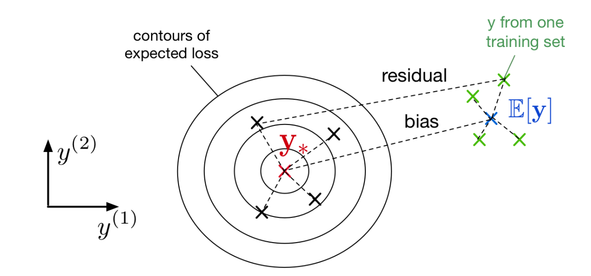
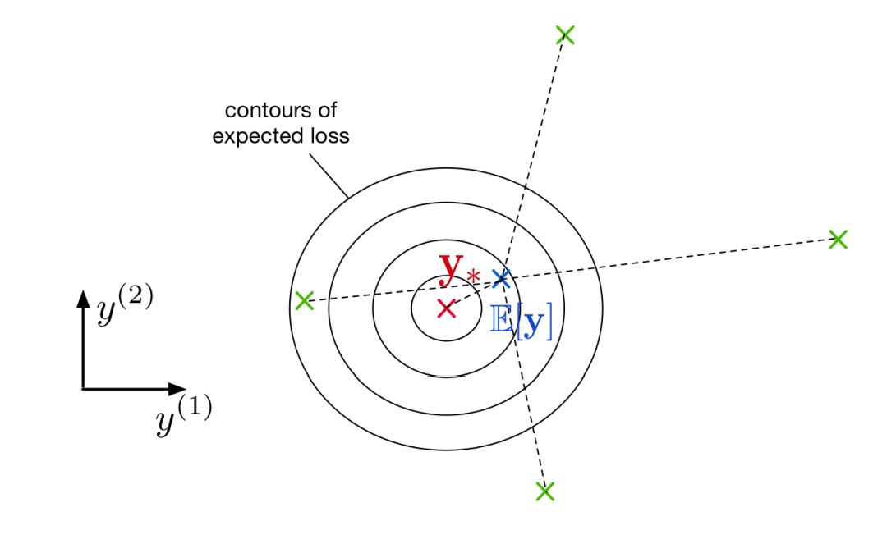
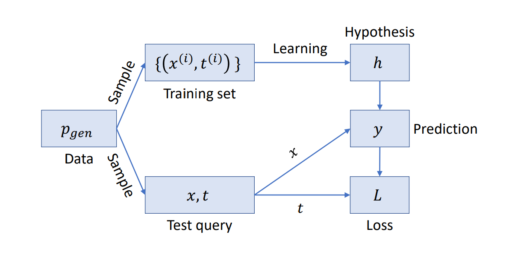
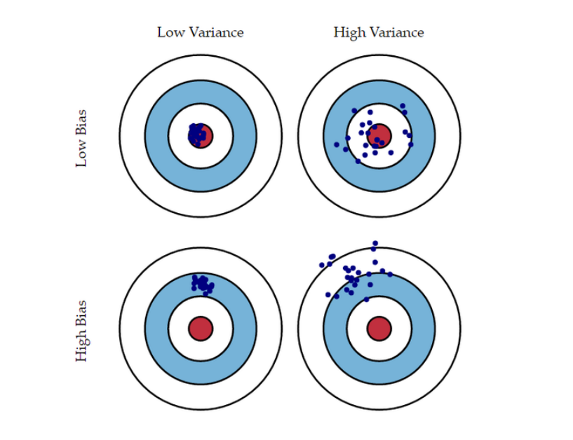

-----------------


[toc]

-----------

last:2019-09-04 21:45:21

update: 2020-06-20


### Voting：利用投票做分类

* hard-voting：多个分类器的结果中选择重合数目最多的。

* Soft-voting：会对预测的结果配上权重，使得预测结果最好的类别更大概率视为正确的。

* 比如用LR、SVM、随机森林等模型组合在一起进行投票：

  ```python
  from sklearn.ensemble import RandomForestClassifier
  from sklearn.ensemble import VotingClassifier
  from sklearn.linear_model import LogisticRegression
  from sklearn.svm import SVC
  
  log_clf = LogisticRegression(solver="lbfgs", random_state=42)
  rnd_clf = RandomForestClassifier(n_estimators=100, random_state=42)
  svm_clf = SVC(gamma="scale", random_state=42)
  
  voting_clf = VotingClassifier(
      estimators=[('lr', log_clf), ('rf', rnd_clf), ('svc', svm_clf)],
      voting='hard')
  
  """ Soft-voting
  voting_clf = VotingClassifier(
      estimators=[('lr', log_clf), ('rf', rnd_clf), ('svc', svm_clf)],
      voting='soft')
  """
  
  
  voting_clf.fit(X_train, y_train)
  from sklearn.metrics import accuracy_score
  
  for clf in (log_clf, rnd_clf, svm_clf, voting_clf):
      clf.fit(X_train, y_train)
      y_pred = clf.predict(X_test)
      print(clf.__class__.__name__, accuracy_score(y_test, y_pred))
      
  ## voting的结果比单个分类器好
  LogisticRegression 0.864
  RandomForestClassifier 0.896
  SVC 0.896
  VotingClassifier 0.912
  ```


* 背后原理：**Law of large numbers**：

* 前提：分类器独立，学习到的错误模式各不相同。


这一种做法是使用不同的分类器算法，

另一种做法是在不同的训练集上训练分类器。


### Bagging：（Bootstrap aggregating）：有放回采样训练集

* Pasting：不放回。。

```python
from sklearn.ensemble import BaggingClassifier 
from sklearn.tree import DecisionTreeClassifier

# 等于随机森林
#500个决策树的bagging，每个采样为max_samples（可设为【0，1】作为百分比），n_jobs=-1使用全部cpu
bag_clf = BaggingClassifier( DecisionTreeClassifier(), n_estimators=500, max_samples=100, bootstrap=True, n_jobs=-1)
bag_clf.fit(X_train, y_train) y_pred = bag_clf.predict(X_test)

```

* Out-of-Bag Evaluation：bagging里面没被采样的训练集上的验证预测：

  ```python
  >>> bag_clf.fit(X_train, y_train)
  >>> bag_clf.oob_score_
  0.90133333333333332
  
  ```

  


Extra variant methods：

​	Random Subspaces method（Sampling features ）、 

​	Random patches method（Sampling features and training instances）


特征重要性显示：

```python
from sklearn.datasets import load_iris
iris = load_iris()
rnd_clf = RandomForestClassifier(n_estimators=500, random_state=42)
rnd_clf.fit(iris["data"], iris["target"])
for name, score in zip(iris["feature_names"], rnd_clf.feature_importances_):
    print(name, score)

###   
sepal length (cm) 0.11249225099876374
sepal width (cm) 0.023119288282510326
petal length (cm) 0.44103046436395765
petal width (cm) 0.4233579963547681
```


### Boosting

做法：Train predictors sequentially，each trying to correct its predecessor.

#### AdaBoost：给每个训练样本学习一个权重

做法：先用base classifier在训练集上分类，对分类错误的样本增加它们的权重，然后下一个base classifier继续训练集上做分类，更新权重。上述过程也对每个base classifier学到一个权重， 预测的时候，把所有分类器的预测权重结合起来做预测。


#### Gradient Boosting


-------------


# overview

- 泛化性：用偏差与方差分解理解泛化性；
- 利用bagging降低方差；利用boosting降低偏差；


集成方法总览：

1. predictor的决策被联合在一起用来对新样本做决策，如voting；

2. 为了使每个预测器（predictor）不一样，它们应该学习不一样的学习假设（hypotheses）

   有四类方法使得预测器的学习假设不一样：

   1. 不同的算法；
   2. 不同的超参数选择；
   3. 训练不同的数据；
   4. 对训练样本采用不同权重的训练；

3. 集成学习的难点在于如何选择上述的集成目标。


- bagging方法：在训练集的随机子集上独立的训练每一个分类器；

  

- boosting方法：把分类器序列化的做训练，每一次的训练更关注上一轮训练中预测错误的样本。

  

- 上面的两个算法各有不同，通过**学习算法的偏差和方差**理论来作分析。


#### 方差偏差理论


可以通过KNN算法看到一种现象，不同的K的选择使得模型太简单，那么可能与数据形成欠拟合；也可能使得模型过于复杂，那么可能与数据形成过拟合；那么如何量化这种现象，那就是方差偏差理论。

增大$k$ 使得方差下降但是偏差增加，减小$k$使得方差增大但是偏差下降。随着$k$的增加，方差减小了；但是如果我们增加太多$k$，那么我们就不再沿着真正的边界线，我们观察到高偏差。
$$
Err(x) = \left(f(x)-\frac{1}{k}\sum\limits_{i=1}^k f(x_i)\right)^2+\frac{\sigma_\epsilon^2}{k} + \sigma_\epsilon^2 \\\\
Err(x) = \mathrm{Bias}^2 + \mathrm{Variance} + \mathrm{Irreducible\ Error}
$$

- 高偏差低方差图：$k$值大的时候，平均预测值离真实值比较远，但是方差比较小，预测的结果比较集中。




- 低偏差高方差图：$k$ 值小的时候，平均预测值离真实值比较近，但是方差太大，每一次的预测值波动性很大。




先从一个例子出发：

（1）假设训练集由$N$ 对样本组成，每个样本独立同分布地抽取于数据生成分布 $P_{\text{(data)}}$ ,

​			整个训练数据集的诱导分布（induced distribution）表示为 $P_{\text{(train)}}$.


（2）取一个固定的测试点$X$，然后做这么一个实验，我们不断的从 $P_{\text{(train)}}$里独立地采样多次训练数据集；


（3）我们的学习算法在每一个训练数据集$D$上做训练，产生一个分类器 $h_D$；然后对每一个分类器我们对刚才取的点做分类有 $h_D(X)=y$；


  (4) 结论是 $y$，一个样本的类别，成了随机变量；原因是 $D$是随机的，因此分类器 $h_D$ 是随机的，因此它的预测$h_D(X)$也是随机的；


因为 $y=h_D(X)$ 是随机变量， 

我们可以讨论它在训练集$P_{\text{(train)}} $ 的期望和方差！


如下图：




- 上图中，假设了给定了$X$的情况，$t$ 是确定的；

  

- 看出来对不同的数据集，存在一个对$X$的期望损失：
  $$
  \mathbb E_{D\sim P_{(train)}}=\left[L(h_D(X), t)\right]
  $$
  

  
- 每一个数据点$X$ 的期望损失是不同的，

  

现在假设$L$是均方误差$L(y, t) = \frac{1}{2} (y - t)^2$，对上面的期望损失做分解：


★：注意最后一步的时候， $\mathbb E_{(X,D)}$  是数据集 $D$ 与测试样本点 $X$  都是随机变量计算平均值，

 $h_D(X)$ 是对任何测试$X$都有一个训练值，它的随机变量只有训练集 $D$ ；

因此对随机变量 $D$  取期望之后化为 $\mathbb E_{D}[h_D(X)]$ ，

其他的值都不是变量$D$的函数，因此保持原样，最后得到的第一项为方差(**Variance**)，第二项为偏差(**Bias**)。
$$
\mathbb E_{(X,D)}\left[(h_D(X)-t)^2\right] = \mathbb E_{(X,D)}\left[(h_D(X) - \mathbb E_D\left[h_D(X)\right]+\mathbb E_D\left[h_D(X)\right] - t)^2\right]  \\\\
=\mathbb E_{(X,D)}\left[(h_D(X) - \mathbb E_D\left[(h_D(X)\right])^2 +(\mathbb E_D\left[h_D(X)\right] - t)^2 + \\\\
2(h_D(X) - \mathbb E_D[h_D(X)])(\mathbb E_D[h_D(X)] - t)\right] \\\\
= \mathbb E_{(X,D)}\left[(h_D(X) - \mathbb E_D\left[(h_D(X)\right])^2\right] +  \\\\
\mathbb E_{(X,D)}\left[(\mathbb E_D[h_D(X)] - t)(2h_D(X)-t-E_D[h_D(X)])\right] \\\\
= \mathbb E_{(X,D)}\left[(h_D(X) - \mathbb E_D\left[(h_D(X)\right])^2\right] + \mathbb E_{(X)}\left[(\mathbb E_D[h_D(X)] - t) ^2 \right]
$$


- 偏置：平均来说，我们的分类器离真实目标有多近；（对应于**underfitting**）

  

- 方差：当我们生成新的数据集时，我们的预测有多分散? (对应于**overfitting**)

  

  偏置：由公式看出，偏置是在一个固定的预测器下，训练集是随机变量，对所有可能的训练集的训练结果取均值，然后与真实值的误差；当然对所有预测值与真实值的误差都取均值。

  

  方差：有公式看出，训练集不一样时，预测的结果离对所有数据上的平均预测结果偏离的均值。

  

- 下图：投掷飞镖=对数据集的每次采样进行预测。看出来高bias的时候，数据的预测值离真实值都比较远，低bias的时候都离真实值比较近；高bias明显欠拟合更多；然后是低variance的时候，预测值都比较集中，高variance的时候预测值都比较分散；高variance明显说明了过拟合的情况，生成不同的数据，预测值也大范围的在变化，即泛化性差，太拟合训练数据（上一次或前几次投飞镖的位置作为训练数据，但是这次投飞镖的结果（测试）却与训练结果差很远）了。




#### Bagging: Motivation


假设我们可以从$P_{\text{(train)}}$ 里独立地采样$m$次，作为$m$ 个独立的训练集，

在每个训练集上我们可以训练$m$个预测器(predictor)：  $h_i=h_{(D_i)}$

对所有的预测器的结果求平均得到 $h=\frac{1}{m}\sum_{i=1}^mh_i$ 。推导这个 $h$ 是怎么影响bias和variance的：

- 对bias没有影响：因为平均预测具有相同的期望

$$
\mathbb E_{D_1,...,D_m\sim P_{(train)}}[h{(x)}]= \frac{1}{m}\sum_{i=1}^m\mathbb E_{D_i \sim P_{(train)}}[h_i(x)] = \mathbb E_{D\sim P_{(train)}}[h_D(x)]
$$

对所有数据集 $D_1,...,D_m$ 作为变量$D$的值，求该变量的均值，

由期望公式 $E(X)=\sum_{i} p_i x_i$ 得到中间式子，然后写成最后的式子形式。


- **方差下降了**：因为我们对独立样本的方差联合在一起求了均值，得到最后的方差：
  $$
  \text{Var}_{(D_1,...,D_m)}[h(x)]= \frac{1}{m^2}\sum_{i=1}^m\text{Var}_{(D_i)}[h_i(x)] = \frac{1}{m}\text{Var}_D[h_D(x)]
  $$
  方差公式$\text{Var}(aX) = a^2\text{Var}(X)$, 因此，第二式的每一项前面的系数都是$\frac{1}{m^2}$，然后求平均方差值。

  

#### Bagging: Idea

上面的分析说明了问题所在，只要有很多独立的数据集那么我的结果肯定会很好，因为我可以训练很多预测器然后综合起来，减小方差啊！~

但是现实是残酷的，如下：

1. 我们往往得不到数据生成分布$P_{(data)}$；
2. 收集独立的大量数据集是耗费资源的；

基于这样的情况，Bagging（或称为**bootstrap aggregation**）算法怎么考虑的呢？

我只有一个训练集$D$，里面有$n$个样本；好，这样的话，我利用$D$生成$m$个新的数据集，通过在$D$中进行$n$次有放回的采样方法，因此我的$m$个数据集里，每个里面都有数目相同的样本$n$个。之后就和上面的分析一样了，我就在每一个新的数据集上训练它$m$个预测器。

注意：往往数据集这种情况下，并非满足$i.i.d$，因此不可能得到方差降为$1/m$ 倍这么多。

加入训练的预测器有方差$\sigma^2$和相关系数$p$，那么我们最后计算的结果是：
$$
\text{Var} (\frac{1}{m}\sum_{i=1}^mh_i(x)) = \frac{1}{m}(1-p)\sigma^2 + p\sigma^2
$$
上面的公式咋来的，我还没明白，懂的人麻烦给我说说。

但是**总的来说，在算法中引入额外的可变性是有利的，只要它降低了样本之间的相关性。**

#### 随机森林

随机森林的公式为：
$$
\text{Random forests} = \text{bagged decision trees}  +  \text{extra trick to
decorrelate the predictions}
$$
也就是说随机森林不是别的，就是加入了bagging思想的一堆决策树的联合体，在实际操作的时候，当选择决策树的每一个节点时，选择大小为 $d$ 的输入特征的一个随机子集，然后只考虑在这些子集特征上做分割；

囧：他评价随机森林可能是最好的黑盒子机器学习算法，因为它们通常在没有任何调优的情况下工作得很好。


#### 贝叶斯最优理论（Bayes Optimality）

该理论想告诉我们一件事，不管你是什么分类器，你的性能上限永远是它，称为**贝叶斯最优**。

上面的分析里假设给定了测试点$X$，那么我的对应值$t$是固定的，但是现实是$t$也不是固定的，它作为$X$的条件概率为$p(t|X)$。

现在我们的预测值是一个分布的情况，那么可以测量它的期望是什么。设 $y_{\ast} = \mathbb E[t|X]$，下面的公式为在给定$X$ 的条件下，训练结果$y$与真实结果$t$的期望损失，其中后面的计算省掉了符号$\text{argmin}_y\mathbb E[(y-t)^2]$ 里的$\text{argmin}_y$:
$$
\text{argmin}_y\mathbb E[(y-t)^2] = \mathbb E_t[y^2 - 2 yt +t^2]  \\\\
=y^2 - 2y\mathbb E_t[t] + \mathbb E_t[t^2] \\\\
 = y^2 - 2y\mathbb E_t[t] + \mathbb E_t[t]^2 + \text{Var}[t|X] \\\\
 = y^2 - 2yy_{\ast} + y_{\ast}^2 + \text{Var}[t|X]  \\\\ 
  = (y - y_{\ast})^2 + \text{Var}[t|x]
$$
可以看到公式最后一行的左边是非负的， 当我们的预测器学习得到分类结果 $y_{\ast}$时，第一项为0；而第二项是和$y$无关的，也就是和我们学习的$y$居然无关；对它的解释是这是targets天生带有的不确定性，或不可预知性（unpredictability）或噪声，称为贝叶斯误差(**Bayes error**)。

分类算法学习得到$y_{\ast}$就了不得了，称为贝叶斯最优（**Bayes optimal**），这也是最好的预测，因为它将预期损失最小化。


再一次对期望损失做分解，但是这次视$t$为随机变量：
$$
\mathbb E_{(X,D,t)}\left[(h_D(X)-t)^2\right] = \mathbb E_{(X,D)}\left[(h_D(X) - \mathbb E_D\left[(h_D(X)\right])^2\right] +  \\\\
\mathbb E_{(X,D, t)}\left[(\mathbb E_D[h_D(X)] - t)(2h_D(X)-t-E_D[h_D(X)])\right]\\\\
=\mathbb E_{(X,D)}\left[(h_D(X) - \mathbb E_D\left[(h_D(X)\right])^2\right] + 
\mathbb E_{(X,t)}\left[(\mathbb E_D[h_D(X)] - t)(\mathbb E_D[h_D(X)]-t)\right] \\\\
=\mathbb E_{(X,D)}\left[(h_D(X) - \mathbb E_D\left[(h_D(X)\right])^2\right] + 
\mathbb E_{(X,t)}\left[((\mathbb E_D[h_D(X)])^2 - 2t\mathbb E_D[h_D(X)] + t^2)\right] \\\\
= \mathbb E_{(X,D)}\left[(h_D(X) - \mathbb E_D\left[(h_D(X)\right])^2\right] + 
\mathbb E_{(X)}\left[((\mathbb E_D[h_D(X)])^2 - 2\mathbb E[t] \mathbb E_D[h_D(X)] + \mathbb E[t^2])\right] \\\\
=\mathbb E_{(X,D)}\left[(h_D(X) - \mathbb E_D\left[(h_D(X)\right])^2\right] + 
\mathbb E_{(X)}\left[((\mathbb E_D[h_D(X)])^2 - 2\mathbb E[t] \mathbb E_D[h_D(X)] + (\mathbb E[t])^2 + \text{Var}[t])\right] \\\\
= \mathbb E_{(X,D)}\left[(h_D(X) - \mathbb E_D\left[(h_D(X)\right])^2\right] + \mathbb E_{(X)}\left[(\mathbb E_D[h_D(X)] - y_{\ast}(X)) ^2 \right] + \text{Var}[t|X]
$$
对比 $t$ 不是变量的期望损失：
$$
\mathbb E_{(X,D)}\left[(h_D(X)-t)^2\right] = \\\\
\mathbb E_{(X,D)}\left[(h_D(X) - \mathbb E_D\left[(h_D(X)\right])^2\right] + \mathbb E_{(X)}\left[(\mathbb E_D[h_D(X)] - t) ^2 \right]
$$
可以看到方差项未变，期望项里的 $t$ 成了假设的最优预测值$y_{\ast}$ ,然后便是贝叶斯误差。


------

#### Boosting

- Boosting：按序训练分类器，每次集中训练之前分类错误的数据点


Commonsense：

加权的训练集：误分类率（损失函数）$\sum_{n = 1}^N[h(x^{(N)}) \ne t^{(n)}]$在一开始对每一个训练样本是相等的；但之后样本被误分类的权重改变了，被误分为错误类的样本带来cost，因此考虑对这部分样本做加权处理，使得分类器更关注之前被错误分类的样本，损失函数成为：
$$
\sum_{n=1}^N\mathbf w^{(n)}\mathbb I[h(x^{(n)}) \ne t^{(n)}] \\\\
\text{s.t.,} \mathbf w^{(n)} > 0,\  \sum_{n=1}^N\mathbf w^{(n)} = 1.
$$
弱学习器（**weak Learner**）：性能稍微好于随机猜测的学习算法，所以对于加权训练集，得到的误差略小于0.5：
$$
\text{err} = \sum_{n=1}^N\mathbf w^{(n)}\mathbb I[h(x^{(n)}) \ne t^{(n)}] \le \frac{1}{2}-\gamma, \gamma > 0.
$$
关注它的原因更多是因为有很高的计算效率，比如决策树，或决策树桩（**decision stump**），即只有一个分割的决策树。


#### AdaBoost(自适应提升)


- AdaBoost的关键步骤:
  - 一、每轮迭代重新分配训练样本的权重，使得分类不正确的样本权重更大；
  - 二、在新权重样本上训练弱分类器；
  - 三、把所有的弱分类器集成为新分类器；
  - 四、重复该过程很多次；
- 实际上弱学习器将加权误差最小化，因此AdaBoost使每个分类器更关注上一次的错误分类，从而降低了**bias**.


AdaBoost算法如下：

- Input：

  - 数据集$D_N={(x^{(n)}, t^{(n)})},n=1,2,...,N$ 。
  - 弱分类器 $\text{WeakLearn}$，迭代次数$T$。

- Output：分类器$H(x)$。

- Initialize：采样权重$\mathbf w^{(n)} = \frac{1}{N},n =1 ,2,3...,N$。

- For $t= 1,....,T$

  - 用$\mathbf w^{(n)}$的权重化样本训练一个弱分类器：
    $$
    h_t = \text{argmin}_{h\in\mathcal H}\sum_{n=1}^N \mathbf w^{(n)}\mathbb I\{h(x^{(n)})\ne t^{(n)}\}
    $$

  - 计算权重误差（weighted error）：
    $$
    \text{err}_t = \frac{\sum_{n=1}^N\mathbf w^{(n)}\mathbb I\{h(x^{(n)})\ne t^{(n)}\}}{\sum_{n=1}^N\mathbf w^{(n)}}
    $$

  - 计算分类器系数（classifier coefficient）：
    $$
    \alpha_t =\frac{1}{2}\log \frac{1-\text{err}_t}{\text{err}_t}
    $$

  - 更新数据集的权重：
    $$
    \mathbf w^{(n)} \longleftarrow \mathbf w^{(n)}\exp(-\alpha_t t^{(n)}h_t(x^{(n)}))
    $$

- Return：
  $$
  H(x) = \text{sign} (\sum_{t = 1}^T\alpha_t h_t(x))
  $$


------


- Reference：
  1. http://scott.fortmann-roe.com/docs/BiasVariance.html
  2. https://www.cs.toronto.edu/~mren/teach/csc411_19s/lec/lec04_matt.pdf

