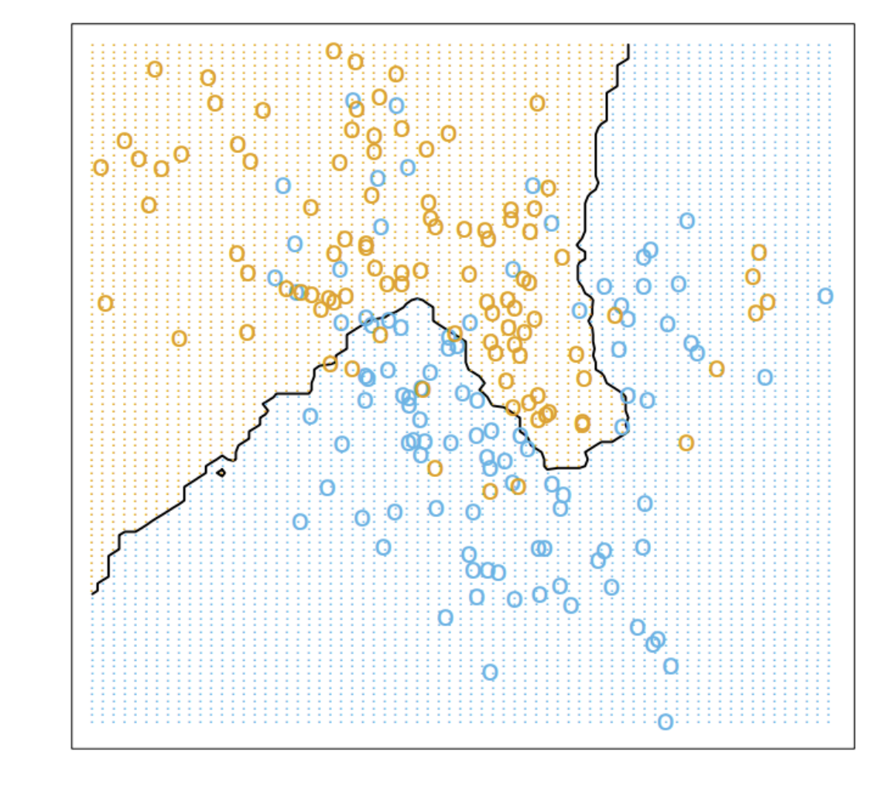
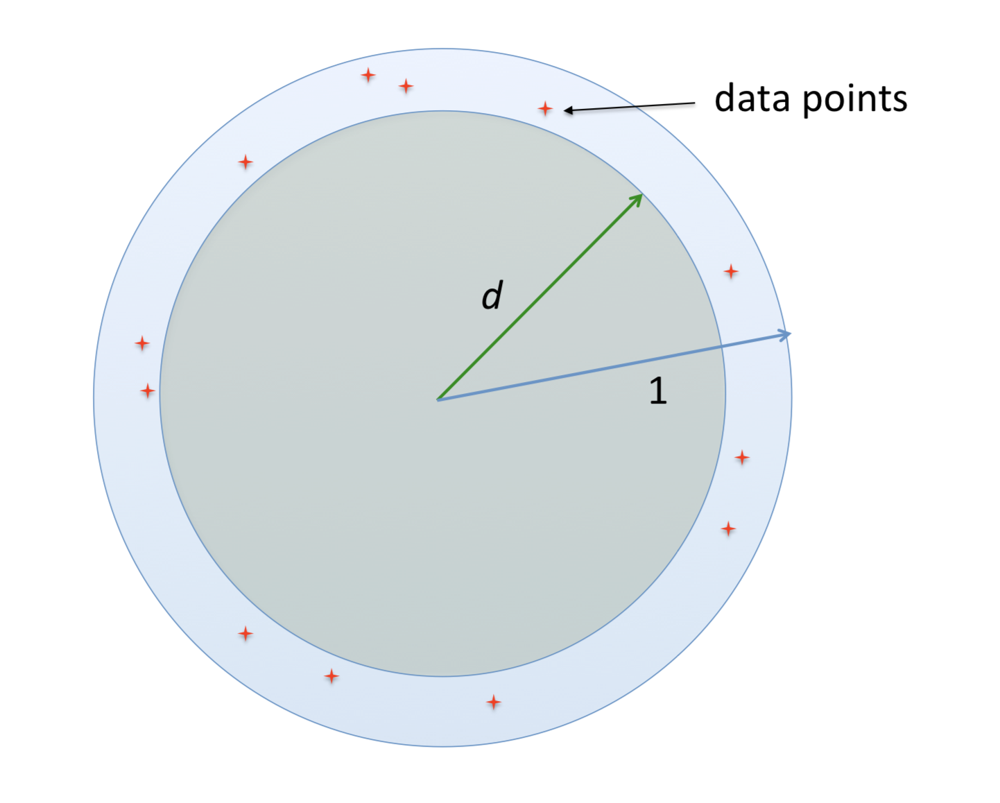

### 最近邻算法

(1).最初版本的算法是这样：

目标：对一个新输入向量 $\mathbf{x}$ 进行分类:

1. 在训练集中找到最近离$\mathbf x$最近的点$\mathbf x^{\ast}$，因此定义一个度量如欧几里得距离；

2. $\mathbf x^{\ast}$的标签$\mathbf y^{\ast}$就是$\mathbf x$的标签。

(2).为了更加平滑合理，找出最近的$k$个邻居，然后用它们的标签投票表决新样本的标签是什么；

1. 找到离 $\mathbf x$ 最近的 $k$ 个样本 $(x^{(r)},t^{(r)})_{r=1}^k$；

2. 分类为:
   $$
   y=\text{arg}\max_t\sum_{r=1}^k\mathbb I[t=t^{(r)}].
   $$

* 经验：

  $k$的选择：太小的话会过拟合，太大了会欠拟合，一般选择$k< \operatorname{sqrt}(n) $,其中$n$是训练样本的大小。

  或者使用验证集来搜索超参数，如果验证集上的损失低，那就用这个；

当k=15时的结果：

上面的图中，数据点是二维的，当数据特征维度增大，knn可能就不太好使了，因此下面说一下究竟维度扩大的时候，数据到底发生了什么。

### 维度灾难

用例子来说明：维度灾难发生了什么。

例子1：假设$n$维空间中存在一个边长为1的超立方体，因此超立方体的体积是1，如果我们想把这个超立方体看为由$N$个小立方体组成，每个小立方体的体积为$\frac{1}{N}$, 设小立方体的边长是$d$,由体积公式得：
$$
d^n =\frac{1}{N} \\\\
d = (\frac{1}{N})^{(1/n)}
$$

上面的例子说明了一件事，我们假设$N$个数据点均匀的分布在超立方体中，也就是每一个小立方体包含一个数据点，公式$(2)$发生的了什么，当$N$是有限的情况下，维度$n$不断增大趋于无穷，那么$d$的极限值为$1$，也就是说，小立方体的体积几乎和超立方体的体积也样大，无限维度的情况下，我们可以把$N$个体积为$1$的小立方体放进体积同样为1的立方体中；如果我们想保证$d$的值固定，那么维度$n$增大,需要的数据点$N$是呈指数增加的。

例子2：假设在维度$n$的空间里有一个半径为1的球体，它的体积设为$V=k_n1^N$,其中$k_n$是一个依赖于$n$的比例常数，如上面的例子一样，我们把这个球体看作由$N$个半径为$d$的小球体组成，小球体的体积为$k_nd^N$,那么$d$可以计算得到：
$$
d = (\frac{k_n}{N k_n})^{(1/n)} = (\frac{1}{N})^{(1/n)}
$$

例子3：将$N$个数据点均匀分布在半径为1的球上，因为是均匀分布，我们可以多次实验，取原点到离原点最近的点之间的中点记为$d$,  由于是均匀分布，可以说，实验中有一半的机会最近的点会比$d$近，有一半的机会比$d$远，也就是说，由二分之一的机会数据点落在半径为$d$的球内，或者落在内部半径为d外到半径为1内部的球中，由体积比例可得:
$$
\frac{1}{2} = {(\frac{k_n-k_nd^n}{k_n})}^N  \\\\
d = {(1- (\frac{1}{2})^{(1/N)})}^{1/n}
$$
因此当维度$n$趋于无穷，上面的$d$趋于$1$，也就是说，每一个数据点都基本远离原点，停靠在$n$维度的球面上，如下图：

虽然如此，但是我们依然有可能找到数据的本质特征，也就是高维度空间中，数据其实只是躺在里面的一个低维流形上。（ **some datasets (e.g. images) may have low intrinsic dimension, i.e. lie on or near a low-dimensional manifold**。）

#### 代码解析

* 球树：
* knn：

-----

Reference:

* https://www.inf.fu-berlin.de/inst/ag-ki/rojas_home/documents/tutorials/dimensionality.pdf
* https://www.cs.toronto.edu/~mren/teach/csc411_19s/lec/lec02_matt.pdf
* 