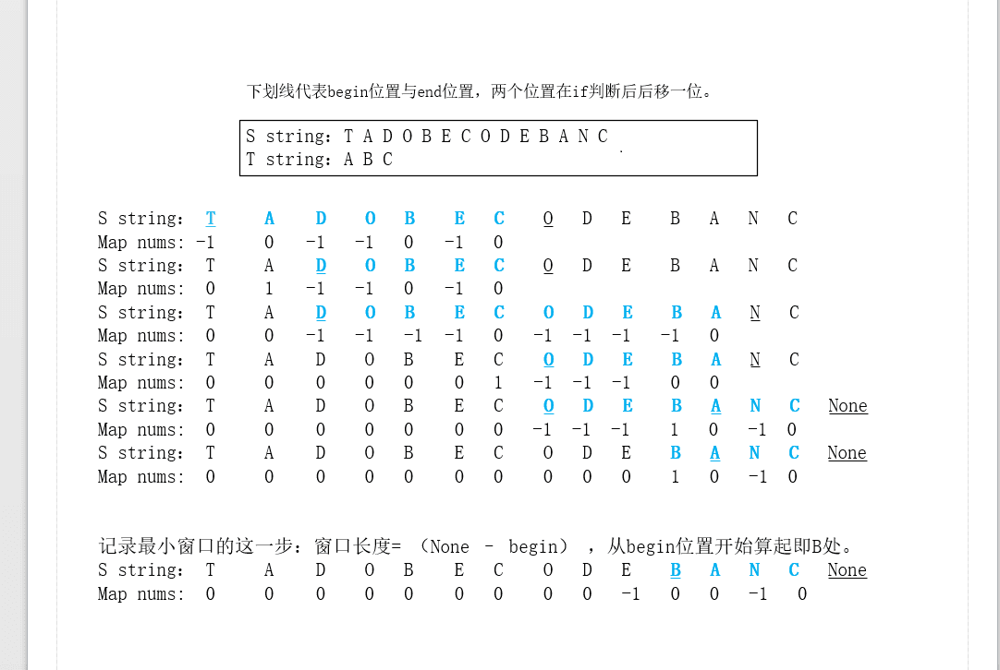

####  two sum

* 解析：用哈希表放入每一个，下一次检查每一个target的减数是否在表中；

```c++
class Solution {
public:
    vector<int> twoSum(vector<int>& nums, int target) {
        unordered_map<int, int> imap;   
        for(int i=0;; ++i){
            auto it = imap.find(target-nums[i]);
            
            if(it != imap.end())
                return vector<int>{i, it->second};     
            imap[nums[i]] = i;
        }
    }
};
```

```python
class Solution:
    def twoSum(self, nums, target):
        """
        :type nums: List[int]
        :type target: int
        :rtype: List[int]
        """
        if len(nums) <= 1:
            return False
        ans_dict = {}
        for i in range(len(nums)):
                if nums[i] in ans_dict:
                    return [ans_dict[nums[i]],i]
                ans_dict[target - nums[i]] = i
```


####  Add Two Numbers

* 解析：记住c++如何创建链表中的节点的；

```c++
/**
 * Definition for singly-linked list.
 * struct ListNode {
 *     int val;
 *     ListNode *next;
 *     ListNode(int x) : val(x), next(NULL) {}
 * };
 */
class Solution {
public:
    ListNode* addTwoNumbers(ListNode* l1, ListNode* l2) {
        ListNode preHead(0);
        ListNode* res= &preHead;
        int extra=0;
        while(l1 || l2 || extra)
        {
            if(l1) extra +=l1->val, l1=l1->next;
            if(l2) extra +=l2->val, l2=l2->next;
            res->next = new ListNode(extra%10); // new + ListNode(val)建立新节点
            extra /= 10; 
            res = res->next;
        }
        return preHead.next; //preHead不是指针，用`.`符号使用自带的方法
    }
};
```


####  Longest Substring Without Repeating Characters(最长不重复子串)

>

```
Input: "pwwkew"
Output: 3
Explanation: The answer is "wke", with the length of 3. 
             Note that the answer must be a substring, "pwke" is a subsequence and not a 
```

* 解析：参考如下连接给的解释，也就是说，给定一个字符串，我们用哈希表的value来保存了一个滑动窗口（左边和右边的索引），窗口内的子串都是不重复的，每次看到下一个字符的时候，检查该字符是否出现过，也就是检查哈希表中的值，若出现了并且位置处于滑动窗口内，说明左边的索引需要更新；若未出现，那么假如到滑动窗口中，即扩大窗口大小；还有一种情况是该字符出现过了，在滑动窗口外，也就是这个字符之前作为别的子串出现了，但是目前的子串并未使用它，因此也加入到滑动窗口内部；最后返回一个每次都记录的最大值便可。
* https://www.cnblogs.com/ariel-dreamland/p/8668286.html

```c++
class Solution {//method1
public:
    int lengthOfLongestSubstring(string s) {
        int hash[256]={0};
        int left=0;
        int res=0;
        for(int i=0; i<s.size(); ++i)
        {
            //当前字符未出现过或者不在滑动的窗口内，则加入当前字符
            if(hash[s[i]]==0 || hash[s[i]] < left)
            {
                res = max(res, i-left+1);
            }
            else //当前字符出现过且处于滑动窗口内部，左边需要向右方移动；
            {
                left = hash[s[i]];
            }
            //当前字符记录到哈希表中，即便已经出现过，也要更新它的value为现在的位置；
            hash[s[i]] = i + 1;
        }
        return res;
    }
};
```

```c++
class Solution {//method2
public:
    int lengthOfLongestSubstring(string s) {
        vector<int> hash(256, -1);
        int res=0;
        int left=-1;
        for(int i=0; i<s.size(); ++i)
        {
            //未出现，hash值为-1,结果还是left；
            //出现过了，但是在left的左边，也就是索引i小于left,结果还是left
            //出现过了，但是在left的右边，也就是在滑动窗口内，更新left;
            left = max(left, hash[s[i]]); 
            hash[s[i]] = i;
            res = max(res, i-left);
        }
        return res;
    }
};
```

```c++
class Solution { //method3
public:
    int lengthOfLongestSubstring(string s) {
        set<char> t;
        int res = 0, left = 0, right = 0;
        while (right < s.size()) {
            //set中的char顺序插入；用set表示滑动窗口内的不重复的字符集合
            if (t.find(s[right]) == t.end()) {
                t.insert(s[right++]);
                res = max(res, (int)t.size());
            }  else {
                t.erase(s[left++]);
            }
        }
        return res;
    }
};
```

#### Reverse Integer

> Given a 32-bit signed integer, reverse digits of an integer.
>
> ```c++
> Input: -123
> Output: -321
> ```

```C++
class Solution {
public:
    int reverse(int x,long r=0) {
        return x ? reverse(x/10, r*10 + x%10):(int(r)==r)*r;
    }
};
```

```c++
class Solution {
public:
    int reverse(int x) {
        long r=0;
        while(x) r = r*10 + x%10, x /= 10;
        return (int(r)==r) * r;
    }
};
```

python：

```python
class Solution:
    def reverse(self, x: int) -> int:
        r = x // max(1,abs(x)) * int(str(abs(x))[::-1])
        return r if r.bit_length() < 32 or r==-2**32 else 0
```

#### Longest Palindromic Substring

> Given a string **s**, find the longest palindromic substring in **s**. You may assume that the maximum length of **s** is 1000.
>
> ```c++
> Input: "babad"
> Output: "bab"
> Note: "aba" is also a valid answer.
> ```

* 解析：写一个判断回文串最大长度的辅助函数，对输入串做迭代，每次都计算新的开始处的最长回文串长度。

* c++中的子串操作：

  ```c++
  string substr (size_t pos = 0, size_t len = npos) const;
  返回一个新建的初始化为string对象的子串的拷贝string对象。
  子串是，在字符位置pos开始，跨越len个字符（或直到字符串的结尾，以先到者为准）对象的部分。
  ```

  

```c++
class Solution {
public:
    string longestPalindrome(string s) {
        int left=0,length=0;
        for(int i=0; i<s.size(); ++i)
        {
            extend(s, i, i, left, length);
            extend(s,i, i+1, left, length);
        }
        return s.substr(left, length);
    }
private:
    void extend(const string &s,int i, int j, int &left,int &length)
    {
        while(i>=0 && j<s.size() && s[i]==s[j])
        {
            --i;
            ++j;
        }
        if(length<j-i-2+1) length=j-i-1,left=i+1;
    }
};
```

#### ZigZag Conversion

> The string `"PAYPALISHIRING"` is written in a zigzag pattern on a given number of rows like this: (you may want to display this pattern in a fixed font for better legibility)
>
> more explanation：https://leetcode.com/problems/zigzag-conversion/discuss/3465/Share-simple-C%2B%2B-solution

* 解析：只有一行的情况，直接返回；用一个vector记录每行，定义一个step指示行数变量的移动方向,行数据此不断上下移动，该变量为0时朝下移动，到最下面时，朝上移动。

```c++
class Solution {
public:
    string convert(string s, int numRows) {
        if(numRows<=1) return s; //已经排除为1行的情况
        vector<string> svec(numRows,"");
        for(int i=0, row=0, step=1; i<s.size(); ++i)
        {
            svec[row] += s[i];
            if(row == 0) step=1;
            if(row == numRows-1) step = -1;
            row += step; //至少有两行
        }
        string res;
        for(auto sub:svec)
            res += sub;
        return res;
    }
};
```


#### Palindrome Number

>Determine whether an integer is a palindrome. An integer is a palindrome when it reads the same backward as forward.Coud you solve it without converting the integer to a string?

```c++
Input: -121
Output: false
Explanation: From left to right, it reads -121. From right to left, it becomes 121-. Therefore it is not a palindrome.
```

```c++
class Solution {
public:
    bool isPalindrome(int x) {
        if(x<0) return false;
        long p=x, q=0;
        while(p) q=q*10 + p%10, p/=10;
        return q==x;
    }
};
```

#### String to Integer (atoi)

>Implement `atoi` which converts a string to an integer.
>
>- Only the space character `' '` is considered as whitespace character.
>- Assume we are dealing with an environment which could only store integers within the 32-bit signed integer range: [−2^31,  2^31 − 1]. If the numerical value is out of the range of representable values, INT_MAX (2^31 − 1) or INT_MIN (−2^31) is returned.

```c++
Input: "   -42"  1.丢弃前面的空白格
Output: -42
Explanation: The first non-whitespace character is '-', which is the minus sign.Then take as many numerical digits as possible, which gets 42.
-----
Input: "4193 with words"
Output: 4193
Explanation: Conversion stops at digit '3' as the next character is not a numerical digit.
-----
Input: "words and 987" 4.无效输入；
Output: 0
Explanation: The first non-whitespace character is 'w', which is not a numerical  digit or a +/- sign. Therefore no valid conversion could be performed.
-----
Input: "-91283472332"     2.数组的符号；3.溢出
Output: -2147483648
Explanation: The number "-91283472332" is out of the range of a 32-bit signed integer. Thefore INT_MIN (−231) is returned.
```

解析：四种情况需要解决：1.丢弃前面的空白格；2.数组的符号；3.溢出；4.无效输入；

```c++
class Solution {
public:
    int myAtoi(string str) {
        int base=0, sign=1, i=0;
        while(str[i]==' ') i++; //1.空白问题
        if(str[i]=='+' || str[i]=='-') //2.符号问题
            sign = 1 - 2 * (str[i++]=='-');
        while(i<str.size() && str[i]>='0' && str[i]<='9')
        {
            if(base> INT_MAX/10 || (base==INT_MAX/10 && str[i]-'0' > INT_MAX%10)) //溢出问题
                    if(sign>0) return INT_MAX;
                    else return INT_MIN;
            base = base*10 + (str[i++]-'0');
        }
        return base * sign; //无效输入问题：若无效输入，那么输出0
    }
};
```


#### Container With Most Water

> Given *n* non-negative integers *a1*, *a2*, ..., *an* , where each represents a point at coordinate (*i*, *ai*). *n* vertical lines are drawn such that the two endpoints of line *i* is at (*i*, *ai*) and (*i*, 0). Find two lines, which together with x-axis forms a container, such that the container contains the most water.

* 解析：1.最宽的容器(使用第一行和最后一行)是一个很好的选择，因为它很宽。它的水位是第一条线和最后一条线中较小的那条线的高度。

   2 .所有其他容器都不那么宽，因此需要更高的水位来容纳更多的水；

   3 . 第一线和最后线中较小的一条不支持更高的水位，因此可以安全地从进一步考虑中移除。

  4. 当第一线和最后线相等的情况，第一线往前走，最后线往后走，后面的容量比现在大的唯一选择是更高的水位，第一线和最后线的水位都不能再选了，因为他们已经最宽了！若其中一个小于另一个，那么移动小的那一个提高水位就行。

  ```c++
  class Solution {
  public:
      int maxArea(vector<int>& height) {
          int water=0;
          int i=0, j=height.size()-1;
          while(i<j){
              int h = min(height[i], height[j]);
              water = max(water, h*(j-i));
              while(height[i]<=h && i<j) i++;
              while(height[j]<=h && i<j) j--;
          }
          return water;
      }
  };
  ```

  python：

  ```python
  class Solution:
      def maxArea(self, height: List[int]) -> int:
          i, j = 0, len(height) -1
          water = 0
          while(i<j):
              h = min(height[i], height[j])
              water = max(water, h*(j-i))
              if height[i]<height[j]:
                  i += 1
              else:
                  j -= 1
          return water
  ```

#### Roman to Integer

> Roman numerals are represented by seven different symbols: `I`, `V`, `X`, `L`, `C`, `D` and `M`.
>
> For example, two is written as `II` in Roman numeral, just two one's added together. Twelve is written as, `XII`, which is simply `X` + `II`. The number twenty seven is written as `XXVII`, which is `XX` + `V` + `II`.
>
> Roman numerals are usually written largest to smallest from left to right. However, the numeral for four is not `IIII`. Instead, the number four is written as `IV`. Because the one is before the five we subtract it making four. The same principle applies to the number nine, which is written as `IX`. There are six instances where subtraction is used:
>
> - `I` can be placed before `V` (5) and `X` (10) to make 4 and 9. 
>
> - `X` can be placed before `L` (50) and `C` (100) to make 40 and 90. 
>
> - `C` can be placed before `D` (500) and `M` (1000) to make 400 and 900.
>
>   Given a roman numeral, convert it to an integer. Input is guaranteed to be within the range from 1 to 3999.

* 解析：罗马数字的规律是如果两个字符挨着，左边的大于右边的，那么它们的表达意思就是左边加右边；如果是右边的大于左边的，那么表达意思就是右边的减去左边的。

  ```c++
  class Solution {
  public:
      int romanToInt(string s) {
          if (s.empty()) return 0;
          unordered_map<char, int> T={{'I', 1}, {'V',5}, {'X', 10}, {'L', 50}, {'C', 100}, {'D', 500}, {'M', 1000}};
          int sum=T[s.back()];
          for(int i=s.length()-2;  i>=0; --i)
          {
              if(T[s[i]]<T[s[i+1]]) //与上一个罗马数字比较
                  sum -= T[s[i]];
              else
                  sum += T[s[i]];
          }
          return sum;
      }
  };
  ```

#### Longest Common Prefix

> Write a function to find the longest common prefix string amongst an array of strings.
>
> If there is no common prefix, return an empty string `""`.
>
> All given inputs are in lowercase letters `a-z`.
>
> ```c++
> Input: ["flower","flow","flight"]
> Output: "fl"
> ```

* 解析：用第一个字符串做模板，对其中的每一个字符，遍历整个数组里的字符串，遇到不一致就退出；

  ```c++
  class Solution {
  public:
      string longestCommonPrefix(vector<string>& strs) {
          string res="";
          if(strs.empty()) return res;
          for(int i=0; i<strs[0].size();res+=strs[0][i++]) //第一个字符做遍历
              for(int j=0; j<strs.size(); ++j)  //对比，若后面的长度更小的单词，退出；或者串中的对应字符不等，退出；
                  if(i>=strs[j].size() || (j>0 && strs[j][i] != strs[j-1][i]))
                      return res;
          return res;
      }
  };
  ```

  python：

  ```python
  class Solution:
      def longestCommonPrefix(self, strs: List[str]) -> str:
          if not strs:
              return ""
          shortest = min(strs, key=len)
          for i, c in enumerate(shortest):
              for others in strs:
                  if others[i] != c:
                      return shortest[:i]
          return shortest
  ```

#### 3Sum

>Given an array `nums` of *n* integers, are there elements *a*, *b*, *c* in `nums` such that *a* + *b* + *c* = 0? Find all unique triplets in the array which gives the sum of zero.
>
>```c++
>Given array nums = [-1, 0, 1, 2, -1, -4],
>
>A solution set is:
>[
>  [-1, 0, 1],
>  [-1, -1, 2]
>]
>```

* 解析：1. `a+b = -c`，由此，3数求和问题成为2数求和问题；2. 解决重复的答案：在解决2sum问题的时候，我们假设固定了一个数num[s],那么另一个数必定是唯一的；因此，如果nums[s]==nums[s+1]的话，s++；3sum也是一样的，第一个数字nums[i]固定在了索引i处，在这里调用2sum函数知道数组最后，返回的是不重复的三元组，但是若nums[i] = = nums[i+1]，那么i+1找到的三元素必定是重复多余的；因此这里应该i++；

* https://leetcode.com/problems/3sum/discuss/7498/Python-solution-with-detailed-explanation

  ```c++
  class Solution { //暴力解法不能通过
  public:
      void add_to_result(auto& res, vector<int> v) {
          for (auto& r: res)
              if (r[0] == v[0] && r[1] == v[1] && r[2] == v[2])
                  return;
          res.push_back(v);
      }
      
      vector<vector<int>> threeSum(vector<int>& nums) {
          vector<vector<int>> res;
          if(nums.size() < 3) return res;
          sort(nums.begin(), nums.end());
          for (int i = 0; i < nums.size() - 2; i++)
              for (int j = i + 1; j < nums.size() - 1; j++)
                  for (int k = j + 1; k < nums.size(); k++)
                      if ((nums[i] + nums[j] + nums[k]) == 0)
                          add_to_result(res, {nums[i], nums[j], nums[k]});
          return res;
      }
  };
  ```

  ```c++
  class Solution { //时间复杂度：O(N^2)
  public:
      vector<vector<int>> threeSum(vector<int>& nums) {
          vector< vector<int>> res;
          if(nums.size() < 3) return res;
          sort(nums.begin(), nums.end()); //已经排好序
          for(int i = 0; i < nums.size() - 2; i++)
          {
              int a = nums[i];
              if(a > 0) return res;
              if(i - 1 >= 0 && a == nums[i-1]) continue;
              for(int j = i + 1,k=nums.size()-1; j < k;)
              {
                  int b = nums[j];
                  int c = nums[k];
                  int sums = a + b + c;
                  if(sums==0){
                      res.push_back(vector<int>({a, b, c}));
                      while(j < k && b == nums[++j]); //左右同时更新，因为是2sum，停留会导致重复值
                      while(j < k && c == nums[--k]);
                  }else{
                      if(sums < 0) //已经排好序；移动到更大的右边，因为最大的右边加上还不够大
                          j++;
                      else
                          k--; // 移动到更小的左边，因为最小的左边加上还不够小；
                  }
              }
          }
          return res;
      }
  };
  ```

  ```c++
  class Solution {//另一种方式：对第一个数固定，然后实施2sum。
  public:
      vector<vector<int>> threeSum(vector<int>& nums) {
          vector< vector<int>> res;
          if(nums.size() < 3) return res;
          sort(nums.begin(), nums.end()); //已经排好序
          for(int i=0; i<nums.size()-2;++i)
          {
              if(i-1>=0 && nums[i-1]==nums[i]) continue; //处理重复的第一个数字
              int a = nums[i];
              int front = i + 1;
              int back = nums.size() - 1;
              while(front < back) //2sum
              {
                  int b = nums[front]; //赋值，因为后面要用来比较是否重复
                  int c = nums[back];
                  int sums = a + b + c;
                  if(sums < 0)
                      front++;
                  else if( sums > 0)
                      back--;
                  else
                  {
                      res.push_back(vector<int>({a, b, c}));
                      while(front < back && b == nums[++front]); //处理重复的第二个数
                      while(front < back && c == nums[--back]); //处理重复的第三个数
                  }
              }
          }
          return res;
      }
  };
  ```

  python: 

  ```python
  class Solution:
      def threeSum(self, nums: List[int]) -> List[List[int]]:
          nums.sort()
          N, result = len(nums), []
          for i in range(N):
              if i > 0 and nums[i]==nums[i-1]: 
                  continue
              a = nums[i]
              front, back = i+1, N-1
              while front < back:
                  b, c = nums[front], nums[back]
                  sum = a + b + c
                  if(sum==0):
                      result.append([a, b, c])
                      front += 1
                      while front < back and nums[front]==b:
                          front += 1
                  elif sum < 0:
                      front += 1
                  else:
                      back -= 1
          return result
  ```

  

#### Valid Parentheses

> Given a string containing just the characters `'('`, `')'`, `'{'`, `'}'`, `'['` and `']'`, determine if the input string is valid.
>
> ```c++
> Input: "{[]}"
> Output: true
> ```

* 解析：用栈解决，非法输入则返回退出，有效输入则入栈出栈；最后判断栈是否为空，空则是有效输入；

```c++
class Solution {
public:
    bool isValid(string s) {
        stack<char> st;      
        for(auto i:s)
        {
            if(i=='(' || i== '[' || i=='{')
                st.push(i);
            else
            {
                if(st.empty())
                    return false;
                if((i==')' && st.top()=='(') || (i==']' && st.top()=='[') || (i=='}' && st.top()=='{'))
                    st.pop();
                else
                {
                    return false;
                }
                
            }
        }
        if (st.empty())
            return true;
        else
            return false;
    }
};
```

python：

```python
class Solution:
    def isValid(self, s: str) -> bool:
        if len(s)%2: return False
        leftParen = set("({[")
        valid = set([('(',')'), ('{', '}'), ('[', ']')])
        stack = []
        for paren in s:
            if paren in leftParen:
                stack.append(paren)
            else:
                if len(stack)==0:
                    return False
                last_paren = stack.pop()
                if (last_paren, paren) not in valid:
                    return False
        return len(stack)==0
```


#### Letter Combinations of a Phone Number

>Given a string containing digits from `2-9` inclusive, return all possible letter combinations that the number could represent.
>
>A mapping of digit to letters (just like on the telephone buttons) is given below. Note that 1 does not map to any letters.
>
>```c++
>Input: "23"
>Output: ["ad", "ae", "af", "bd", "be", "bf", "cd", "ce", "cf"].
>```


* 解析：对输入的数字现传唤为对应的字符串，对字符串中的每一个字符，以及后续的字符串做全排列，考虑递归；递归的返回条件是长度超过输入数字的长度；而添加结果的条件是长度刚才是输入数字的长度；
* c++：`map`中的`at(k)`方法：对键值等于`k`的元素的映射值的引用。如果map对象是`const`限定的，则函数返回对`const mapped_type`的引用。否则，它将返回对`mapped_type`的引用。

```c++
class Solution {
public:

    map<int, string> table={{2, "abc"}, {3, "def"}, {4, "ghi"}, {5, "jkl"}, {6, "mno"},
                                {7, "pqrs"}, {8, "tuv"}, {9, "wxyz"}};  
    
    vector<string> letterCombinations(string digits) {
        vector<string> res;
        if(digits.empty()) return res;
        recursive(res, "", digits, 0);
        return res;
    }
    
private:
    void recursive(vector<string> &res,string _res, const string& digits, int position)
    {
        if(position==digits.length()) return; //递归退出的条件
        string target =  table.at(digits[position]-'0');
        for(int i=0;i<target.size();i++)
        {	//满足添加到res的条件是递归到最后一个数字上
            if(position == digits.size()-1) res.push_back(_res+target[i]);
            //否则的话继续递归下去
            else recursive(res, _res+target[i], digits, position+1);
        }
    }
};
```

python:

```python
class Solution:
    def letterCombinations(self, digits):
        dict = {'2':"abc", '3':"def", '4':"ghi", '5':"jkl", '6':"mno", '7': "pqrs", 
                '8':"tuv", '9':"wxyz"}
        cmb = [''] if digits else []
        for d in digits:
            cmb = [p + q for p in cmb for q in dict[d]]
        return cmb       
```


#### Remove Nth Node From End of List

> Given a linked list, remove the *n*-th node from the end of list and return its head
>
> ```c++
> Given linked list: 1->2->3->4->5, and n = 2.
> 
> After removing the second node from the end, the linked list becomes 1->2->3->5.
> ```

```c++
class Solution {
public:
    ListNode* removeNthFromEnd(ListNode* head, int n) {
        ListNode* pFast=head, *pSlow=head;
        ListNode* pPreSlow=head;
        while(n--) pFast = pFast->next;
        while(pFast!=nullptr)
        {
            pFast = pFast->next;
            pPreSlow = pSlow;
            pSlow = pSlow->next;
        }
        if(pSlow==head) // 判断是不是头
            head = pSlow->next;
        else
            pPreSlow->next = pSlow->next;
        return head;
    }
};
```

python:

```python
class Solution:
    def removeNthFromEnd(self, head: ListNode, n: int) -> ListNode:
        slow = fast = head
        for _ in range(n):
            fast = fast.next
        if not fast:
            return head.next
        while fast.next:
            fast = fast.next
            slow = slow.next
        slow.next = slow.next.next
        return head
```

#### Regular Expression Matching

> Given an input string (`s`) and a pattern (`p`), implement regular expression matching with support for `'.'` and `'*'`.
>
> ```c++
> '.' Matches any single character.
> '*' Matches zero or more of the preceding element.
> ```
>
> **Example 3:**
>
> ```c++
> Input:
> s = "ab"
> p = ".*"
> Output: true
> Explanation: ".*" means "zero or more (*) of any character (.)".
> ```
>
> **Example 4:**
>
> ```c++
> Input:
> s = "aab"
> p = "c*a*b"
> Output: true
> Explanation: c can be repeated 0 times, a can be repeated 1 time. Therefore, it matches "aab".
> ```
>
> **Example 5:**
>
> ```c++
> Input:
> s = "mississippi"
> p = "mis*is*p*."
> Output: false
> ```

* 解析：`.`可以代表任何单个的字符，`*`可以表达为0或多个其前缀字符；这个解释最清楚，拿来理一下：

  * 1. 我们定义了$b[i+1][j+1]$ 代表字符串$S[0....i]$匹配$P[0....j]$的结果，如果为`True`,那么字符串$S[0....i]$和模式$P[0....j]$相匹配；

    2. 先对边界赋值，显然$b[0][0]=\text{True}$，两个空字符串的匹配结果自然为真；对$b[i+1][0]$赋值，也就是模式为空，匹配任何字符串都失败，因此都为$\text{False}$；对$b[0][j+1]$赋值，其值等于`j>0 && '*'==p[j] && b[0] [j-1]`, ---解释---：对于$j>0$的原因在于，若$j=0$，则$b[0][1]$表达的意思便是1个长度的模式去匹配一个空字符，因此1个长度的模式等于任意字符都不能匹配上空字符，（X*才能匹配一个空字符，X代表任意字符）；另一方面，`' * '== p [j] && b [0] [j-1]`就是我们要考虑的，若空串和一个模式想要匹配成功，只有可能是前面的模式$P[0...j-2]$与前面的空串匹配上了（ `b [0] [j-1]`），而且不管$P[j-1]$是什么字符，都要忽略掉，因此后一位的$P[j]$应该等于` * `。

    3. 之后便是填表，考虑如下：

       --3.1--：当模式$P$的$j$位置处不为` * `的时候，那么有`b[i + 1][j + 1] = b[i][j] && ('.' == p[j] || s[i] == p[j])`。这时候的根据是，字符串$S[0....i]$ 与模式 $P[0....j]$是否匹配取决于字符串$S[0....i-1]$与模式$P[0....j-1]$是否匹配，还有$S[i]$与$P[ j ]$能否匹配；若要匹配上，当前模式$P$在$j$位置必须得到配对，有两种这样的可能：`('.' == p[j] || s[i] == p[j])`，综合起来得到上式；

       --3.2--：当模式$P$的$j$位置处为` * `的时候，那么有`b[i + 1][j + 1] = j > 0 && b[i + 1][j - 1] || b[i + 1][j]  || b[i][j + 1] && j > 0 && ('.' == p[j - 1] || s[i] == p[j - 1]);` ，第一个情况是` * `号一次没用，也就是说星号忽略了前一个字符，此时字符串$S[0....i]$与模式$P[0....j]$是否匹配取决于字符串$S[0....i]$与模式$P[0....j-2]$是否匹配，同时保证 $ j $ 的位置是有效的，即 `j > 0 && b[i + 1][j - 1]`；第二个情况是` *`号用了一次，也就是说星号前面的字符用了一次，此时字符串$S[0....i]$匹配$P[0....j]$是否匹配取决于字符串$S[0....i]$与模式$P[0....j- 1 ]$是否匹配，即 ` b[i + 1][j]`；第三个情况是` * `号用了2次及以上的时候是如何匹配，若已经匹配了，那么字符串$S[0....i-1]$ 与模式$P[0....j]$已经匹配上了(` b[i][j + 1] `）且得保证$S[i]==P[j-1]$，即$S$中最后一个字符也是等于$P$中最后一个字符(星号前面的字符)，（`p[j - 1]==s[i]`或者`p[j - 1] == . `），此时考虑的前提是`*`被使用了2次，因此必须有`j>0`。 此时若匹配上了，得到`b[i+1][j+1]==1`（下一轮的`b[i] [j + 1]`），下一次更新新的字符`i`时 ( `b[i + 1] [j + 1]`），同样进入到该`if`判断处，星号同样被已经被使用一次，实际上考察了2次以上的重复星号使用。

  Reference：https://blog.csdn.net/fzzying3/article/details/42057935

```c++
class Solution {
public:
    bool isMatch(string s, string p) {
        
        /*
         * b[i + 1][j + 1]: if s[0..i] matches p[0..j]
         * if p[j] != '*'
         * b[i + 1][j + 1] = b[i][j] && s[i] == p[j]
         * if p[j] == '*', denote p[j - 1] with x,
         * then b[i + 1][j + 1] is true if any of the following is true
         * 1) "x*" repeats 0 time and matches empty: b[i + 1][j -1]
         * 2) "x*" repeats 1 time and matches x: b[i + 1][j]
         * 3) "x*" repeats >= 2 times and matches "x*x": s[i] == x && b[i][j + 1]
         * '.' matches any single character
         */
        int sLen = s.size(), pLen = p.size();
        
        int b[sLen + 1][pLen + 1];
        
        memset(b, 0, sizeof(int) * (sLen + 1) * (pLen + 1));
        
        b[0][0] = 1; //initial position
        // p[0..j - 2, j - 1, j] matches empty if p[j] is '*' and p[0..j - 2] matches empty
        for(int j = 0; j < pLen; ++j)
            b[0][j + 1] = j > 0 && '*' == p[j] && b[0][j - 1];
        
        for(int i = 0; i < sLen; ++i)
            for(int j=0; j < pLen; j++)
                if(p[j] != '*') 
                    b[i + 1][j + 1] = b[i][j] && (s[i] == p[j] || p[j] == '.');
                else
                    b[i + 1][j + 1] = (j > 0 && b[i + 1][j - 1]) || b[i + 1][j] || 
                    j > 0 && b[i][j + 1] &&  (p[j - 1] == s[i] || p[j - 1] == '.');
        return b[sLen][pLen];
    }
};
```

```c++
class Solution {
public:
    bool isMatch(string s, string p) {
        if (p.empty())    return s.empty();
        
        if ('*' == p[1])
            // x* matches empty string or at least one character: x* -> xx*
            // *s is to ensure s is non-empty
            // x* 使用了0次：isMatch(s, p.substr(2));
            // x* 使用了1次及以上：isMatch(s.substr(1), p)，前提是s非空，并且第一个字符以及匹配上；
            return (isMatch(s, p.substr(2)) || !s.empty() && (s[0] == p[0] || '.' == p[0]) && isMatch(s.substr(1), p));
        else
            // 非*位置，需要当前字符匹配的条件下（这就要求s非空），后续的子串能匹配上，即isMatch(s.substr(1), p.substr(1)；
            return !s.empty() && (s[0] == p[0] || '.' == p[0]) && isMatch(s.substr(1), p.substr(1));
    }
};
```

注：c++中string的最后一个字符是什么：

```c++
int main()
{
    string test="a";
    bool ans = test[1] == '\0'; //可以看到test超出最后字符一个位置的结尾处是'\0'
    cout << ans << endl; 
    cout << test.back() << endl; //返回test的有效最后一个字符
}
1
a
```


####  Merge Two Sorted Lists

> Merge two sorted linked lists and return it as a new list. The new list should be made by splicing together the nodes of the first two lists.
>
> ```c++
> Input: 1->2->4, 1->3->4
> Output: 1->1->2->3->4->4
> ```

* 解析：生成一个新的listNode，然后更新到这个新的链表上。

  ```c++
  class Solution {
  public:
      ListNode* mergeTwoLists(ListNode* l1, ListNode* l2) {
          ListNode newNode(0), *ptr;
          ptr = &newNode;
          while(l1 || l2)
          {
              if(!l1) {ptr->next = l2; break;}
              else if(!l2) {ptr->next = l1; break;}
              else if (l1->val < l2->val)
              {
                  ptr->next = l1;
                  l1 = l1->next;
              }
              else
              {
                  ptr->next = l2;
                  l2 = l2->next;
              }
              ptr = ptr->next;
          }
          return newNode.next;
      }
  };
  ```

  python:
  
  ```python
  class Solution: #确保l1是最小的，然后用它的头结点作为结果返回，其他的都连接到它的后面。
      def mergeTwoLists(self, l1: ListNode, l2: ListNode) -> ListNode:
          if l1 and l2:
              if l2.val < l1.val:
                  l1, l2 = l2, l1
              l1.next = self.mergeTwoLists(l1.next, l2)
          return l1 or l2
  ```
  
  ```python
  class Solution: # 确保a是非空且最小值的位置，然后把剩余的链接到a的后面；
      def mergeTwoLists(self, l1: ListNode, l2: ListNode) -> ListNode:
          if not l1 or l2 and l1.val > l2.val:
              l1, l2 = l2, l1
          if l1:
              l1.next = self.mergeTwoLists(l1.next, l2)
          return l1
  ```
  
  #### Implement strStr()
  
  >Return the index of the first occurrence of needle in haystack, or **-1** if needle is not part of haystack.
  >
  >```c++
  >Input: haystack = "hello", needle = "ll"
  >Output: 2
  >```
  
  
  
  * 解析：子串匹配，暴力跟KMP算法；
  
  ```c++
  class Solution {
  public:
      int strStr(string haystack, string needle) {
          if(needle.empty()) return 0;
          int n = haystack.size(), m = needle.size();
          for(int i = 0; i <= n - m; ++i)
          {
              int j = 0;
              for(; j < m; ++j)
              {
                  if(haystack[i+j] != needle[j])
                      break;
              }
              if(j == m) return i;
          }
          return -1;
      }
  };
  ```
  
  KMP算法：
  
  * 解析：https://www.jianshu.com/p/9e6acbf576c1
  
  ```c++
  class Solution {
  public:
      int strStr(string haystack, string needle) {
          int m = haystack.size(), n = needle.size();
          if (!n) return 0; // 空模式
          vector<int> next(n, 0);
          for(int i = 1, len = 0; i < n;) //step1:建立next表，len为模式needle的匹配长度，初始为0
          {
              if (needle[i] == needle[len]) //若匹配上了，next记录上匹配的长度len；
                  next[i++] = ++len;
              else if (len) //匹配长度len一直减小直到匹配上或者未匹配（匹配长度为0）
                  len = next[len - 1]; 
              else
                  next[i++] = 0; //头部不匹配为0，往前移动
          }
          for (int i = 0, j = 0; i < m;) {  //step2:查找子串
              if (haystack[i] == needle[j]) { //若是匹配的，则文本索引i与模式索引j都前进； 
                  i++, j++;
              }
              if (j == n) { //模式索引完毕了，返回模式needle的头部位置i-j
                  return i - j;
              }
              if (i < m && haystack[i] != needle[j]) { //失配位置j，通过next表中的靠左位置j-1找到下一个匹配位置
                  j ? j = next[j - 1] : i++;         //若是模式needle的第一个位置未匹配，那么直接往文本索引的下一位移动去匹配；
              }
          }
          return -1;  //找不到返回-1
      }
  };
  ```
  
  ```c++
  class Solution {
  public:
      int strStr(string haystack, string needle) {
          if(needle.empty()) return 0;
          if(haystack.empty()) return -1;
          vector<int> pi(needle.size(), 0);
          //KMP-algorithm:
          //Pre-process
          int k = 0, i;
          for(i = 1; i < needle.size(); i++) {
              while(k > 0  && needle[k] != needle[i]) k = pi[k - 1];
              if(needle[k] == needle[i]) pi[i] = ++k;
          }
          k = 0; //模式P上的游标；
          //Matching
          for(i = 0; i < haystack.size(); i++) {
              while(k > 0 && haystack[i] != needle[k]) k = pi[k - 1]; //看左边挨着的匹配位置
              if(haystack[i] == needle[k]) k++;
              if(k == needle.size()) return i - needle.size() + 1;
          }
          return -1;
      }
  };
  ```
  
  #### 33. Search in Rotated Sorted Array
  
  >Suppose an array sorted in ascending order is rotated at some pivot unknown to you beforehand.(i.e., `[0,1,2,4,5,6,7]` might become `[4,5,6,7,0,1,2]`).
  >
  >You are given a target value to search. If found in the array return its index, otherwise return `-1`.
  >
  >You may assume no duplicate exists in the array.
  >
  >Your algorithm's runtime complexity must be in the order of *O*(log *n*).
  >
  >```c++
  >Input: nums = [4,5,6,7,0,1,2], target = 0
  >Output: 4
  >```

* 解析：还是用二分查找，但是得确定`mid`跟`target`的方向关系，以此来二分递减数组的大小。

  可以看到，数组分为两个有序的子数组拼在一起，需要查看`mid`跟`target`的在同一个递增子数组上，还是分别在两个递增子数组上；同一递增子数组上，就用二分查找便可；不在同一递增子数组上，判断一下`mid`位置元素与target的大小关系，再去改变位置：

  ```c++
  class Solution {
  public:
      int search(vector<int>& nums, int target) {
          if (nums.empty()) return -1;
          int lo = 0, hi = nums.size() - 1;
          while(lo<hi)
          {
              int mid = lo + (hi - lo) / 2;
              if((nums[mid] - nums[nums.size() - 1]) * (target - nums[nums.size() - 1]) > 0)//mid位置跟target位置在递增子数组上；
              {
                  if (nums[mid] < target) lo = mid + 1;
                  else hi = mid;
              }
              else if (target > nums[nums.size() - 1]) //中间位置数<=末尾位置数<目标数，因此目标位置在mid左边
                 hi = mid - 1;
              else
                 lo = mid + 1; //目标数<=末尾位置数<中间位置数，因此目标位置在mid右边
          }
          if (nums[lo] == target) return lo;
          else return -1;
      }
  };
  ```

  
  
  #### 76. Minimum Window Substring
  
  >Given a string S and a string T, find the minimum window in S which will contain all the characters in T in complexity O(n).
  >Input: S = "ADOBECODEBANC", T = "ABC"
  >Output: "BANC"
  
  * 解析：利用滑动窗口的思想来解决这个题，先不考虑最小的子串，对T中的所有字符建立一个hash字典，键为字符，值为字符出现的次数 ；然后遍历S，遇到在字典里的字符就减去1，若减去的次数等于T串长度，说明遍历到这里的时候该S里包含了T的子串；现在考虑最小子串，那么把之间得到的S遍历长度看做一个窗口，这个窗口需要不断的扩大右边，使得窗口里刚好装着T中所有的字符,从左到右遍历S的过程中把遍历位置处的字符的值（-1）表示遍历过了；这时候开始缩小窗口左边的位置，缩小的过程是把遍历过的位置复原（+1），直到我们遍历到第一个属于T中的字符（比如a），该位置复原完成后，这一轮缩小窗口的操作便结束了，下一次又是扩大右边的窗口，注意，关键的是下一次窗口满足装下T的所有字符的条件是遇到刚才的a字符，因为我们差的就是它；这样，窗口滑动到S串末尾，我们便可以得到最小覆盖的子串长度和它的开始位置。
  
    下图是一个例子：
    * 其中S是输入串，T是要求覆盖的串，蓝色的区间表示该滑动窗口满足了T中的字符都被包含，接下来的一行是重置前面的字符直到遇到T中的字符；
    * 接下来窗口右边往下继续扩展，知道遇到上一次移除的T字符A为止，然后左边又开始移动。。。。
    最后窗口右边到达最后位置，窗口左边再次遍历得到最小的覆盖子串长度。
    可以看出来时间复杂度是$O(n)$,通过记录窗口的左边并缩小，最多移动2n便可得到结果。
  
    
  
  ```c++
  class Solution {
  public:
      string minWindow(string s, string t) {
          if (t.size() > s.size() || s.empty()) return "";
          unordered_map<char, int> table;
          for (auto c : t) table[c]++;
          int counter = t.size(), start = 0, end = 0, head = 0, minLen = INT_MAX;
          while (end < s.size())
          {
              //如果这个数非零那就是出现在T中的字符啦
              if (table[s[end]] > 0)  counter--;
              table[s[end]]--;  //不管s中end位置的字符出不出现都要递减1
              end++;//位置上升
              
              // 找到了一个有效窗口
              while (counter == 0)
              {
                  //记录所有有效窗口中最小的那个窗口的起点和长度
                  if (end - start < minLen)
                  {
                      minLen = end - start;
                      head = start;
                  }
                  //移动start寻找较小的窗口位置
                  table[s[start]]++;
                  if (table[s[start]] > 0) counter++;
                      start++;
              }
          }
          return minLen == INT_MAX ? "" : s.substr(head, minLen); 
      }
  };
  ```
  
  

####  88. Merge Sorted Array

> Given two sorted integer arrays *nums1* and *nums2*, merge *nums2* into *nums1*as one sorted array.
>
> - The number of elements initialized in *nums1* and *nums2* are *m* and *n*respectively.
>
> - You may assume that *nums1* has enough space (size that is greater or equal to *m* + *n*) to hold additional elements from *nums2*.
>
> - ```c++
>   Input:
>   nums1 = [1,2,3,0,0,0], m = 3
>   nums2 = [2,5,6],       n = 3
>   ```
> ```
> 
> ```
>
> ```
> 
> Output: [1,2,2,3,5,6]
> 
> ```
>
> ```
> 
> ```
>
> ```
> 
> ```

* 解析：nums1的长度是足够的，因此按照他们的最大长度，比较之后把最大的元素直接放入最终的nums1尾部的位置。

  ```c++
  class Solution {
  public:
      void merge(vector<int>& nums1, int m, vector<int>& nums2, int n) {
          if (nums2.empty()) return;
          if (nums1.empty()){
              nums1 = nums2; 
              return;
          }
          int i = m - 1;
          int j = n - 1;
          int k = m + n - 1;
          while(i>=0 && j>=0)
          {
              if (nums1[i] > nums2[j])
              {
                  nums1[k--] = nums1[i--];
              }
              else
                  nums1[k--] = nums2[j--];
          }
          while(i>=0) nums1[k--] = nums1[i--];
          while(j>=0) nums1[k--] = nums2[j--];
      }
  };
  ```

  python：

  ```python
  class Solution:
      def merge(self, nums1: List[int], m: int, nums2: List[int], n: int) -> None:
          """
          Do not return anything, modify nums1 in-place instead.
          """
          if not nums2: 
              return
          if not nums1: 
              nums1 = nums2
              return
          
          i, j = m - 1, n - 1
          k = m + n - 1
          while i >= 0 and j >= 0:
              if nums1[i] > nums2[j]:
                  nums1[k] = nums1[i]
                  k -= 1
                  i -= 1
              else:
                  nums1[k] = nums2[j]
                  k -= 1
                  j -= 1
          while i >= 0:
              nums1[k] = nums1[i] 
              k -= 1
              i -= 1
          while j >= 0:
              nums1[k] = nums2[j]
              k -= 1
              j -= 1
  ```

  #### **22. Generate Parentheses**
  
  > Given *n* pairs of parentheses, write a function to generate all combinations of well-formed parentheses.
  >
  > For example, given *n* = 3, a solution set is:
  >
  > ```c++
  > [
  >   "((()))",
  >   "(()())",
  >   "(())()",
  >   "()(())",
  >   "()()()"
  > ]
  > ```
  
  * 解析：一种：暴力构造+剪枝
  
    1.有效的括号在数量上左右括号分别是N个，剪枝的条件是若右括号比左括号多，说明无效，因为先递归生成处左括号的；2.左括号的数量超过N也是无效返回；3.左右都等于N是满足条件的时候，加入并返回；
  
    ```c++
    class Solution {
    public:
        vector<string> generateParenthesis(int n) {
            vector<string> resv;
            dfs(0, 0, "", n, resv);
            return resv;
        }
    private:
        void dfs(int left, int right, string res, int N, vector<string> &resv)
        {
            if (right > left) return;
            if (left > N) return;
            if (left == right && right == N)
            {
                resv.push_back(res);
                return;
            }
            dfs(left + 1, right, res + "(", N, resv);
            dfs(left, right + 1, res + ")", N, resv);
        }
    };
    ```
  
    python：骚哥[pochmann](https://leetcode.com/problems/generate-parentheses/discuss/10096/4-7-lines-Python)写的：慢慢体会。。。（o(╯□╰)o）
  
    ```python
    def generateParenthesis(self, n):
        def generate(p, left, right, parens=[]):
            if left:         generate(p + '(', left-1, right)
            if right > left: generate(p + ')', left, right-1)
            if not right:    parens += p,
            return parens
        return generate('', n, n)
    ```
  
    python:
  
    ```python
    class Solution:
        def generateParenthesis(self, n):
            def generate(p, left, right, parens = []):
                if left: generate(p + "(", left - 1, right, parens)
                if right > left: generate(p + ")", left, right - 1, parens)
                if not right: 
                    parens += p,
                return parens
            return generate("", n, n)
    ```
  
    

#### 26. Remove Duplicates from Sorted Array

> Given a sorted array *nums*, remove the duplicates [**in-place**](https://en.wikipedia.org/wiki/In-place_algorithm) such that each element appear only *once* and return the new length.
>
> Do not allocate extra space for another array, you must do this by **modifying the input array in-place** with O(1) extra memory.

* 解析：1. 返回不一样的数的长度；2. 把不一样的数都放前面；3.利用排好序的条件；

```c++
class Solution {
public:
    int removeDuplicates(vector<int>& nums) {
        int i = !nums.empty();
        for (auto num : nums)
            if(num != nums[i-1])
                nums[i++] = num;
        return i;
    }
};
```

python:

```python
class Solution:
    def removeDuplicates(self, nums: List[int]) -> int:
        i = nums != []
        for num in nums:
            if num > nums[i-1]:
                nums[i] = num
                i += 1
        return i
```

python的有序字典Ordered dict之所以有效，是因为它维护了原始列表的顺序，而set没有。

```python
from collections import OrderedDict
class Solution(object):
    def removeDuplicates(self, nums):
        nums[:] =  OrderedDict.fromkeys(nums)
        return len(nums)
```


#### 224. Basic Calculator

>Implement a basic calculator to evaluate a simple expression string.The expression string may contain open `(` and closing parentheses `)`, the plus `+` or minus sign `-`, **non-negative** integers and empty spaces ``.
>
>```pseudocode
>Input: "1 + 1"
>Output: 2
>```
>
>```pseudocode
>Input: "(1+(4+5+2)-3)+(6+8)"
>Output: 23
>```

* 解析：方法1：用栈来计算，tag1作为符号。

  ```c++
  class Solution {
  public:
      int calculate(string s) {
          if (s.empty()) return 0;
          s.erase(remove_if(s.begin(), s.end(),::isspace), s.end());
          stack<int> nums, opt;
          int otag = 1; //正负符号标示
          int res = 0; //当前累积计算的结果
          int num = 0; //提取的整数
          for (auto c : s)
          {
              if(isdigit(c)) //处理数字
              {
                  num = num * 10 + (c - '0');
              }
              else //处理运算符或者括号
              {
                  res += otag * num; num = 0; //处理字符串中的第一个数；放到最终结果。
                  if (c == '+') otag = 1;
                  else if (c == '-') otag = -1;
                  else if (c == '(') //重新计算开始
                  {
                      nums.push(res); 
                      opt.push(otag);
                      res = 0; otag = 1;
                  }
                  else if (c == ')')
                  {
                      res = nums.top() + opt.top() * res;
                      nums.pop(); opt.pop();
                  }
              }
          }
          res += otag * num;
          return res;
      }
  };
  ```

  

#### 227. Basic Calculator II

>Implement a basic calculator to evaluate a simple expression string.
>
>The expression string contains only **non-negative** integers, `+`, `-`, `*`, `/` operators and empty spaces ``. The integer division should truncate toward zero.
>
>```pseudocode
>Input: " 3+5 / 2 "
>Output: 5
>```

* 解析：1.先去掉空白符；2.处理数字与非数字；遇到非数字，即操作符号的时候总是把之前计算好的数存到栈中，若操作符号是乘除符号，那么取出栈顶左边数，与当前得到的右边数做对应运算，然后放入栈顶。可以看到，遇到操作符时，我们已经计算得到了符号的右边数，该符号是正负，那么先把右边数存起来便是，只有遇到乘除号需要计算之后入栈，反正栈中的元素全是计算完的部分结果，拿来出栈全部就和。

  

  ```c++
  class Solution {
  public:
      int calculate(string s) {
          s.erase(remove_if(s.begin(), s.end(), ::isspace), s.end());
          stack<int> nums;
          char opt = '+';
          long res = 0, num = 0;
          for (int i = 0; i < s.size(); i++)
          {
              if (isdigit(s[i]))  //处理数字
                  num = num * 10 + s[i] - '0';
              if (!isdigit(s[i]) || i == s.size() - 1) //处理非数字，总是入栈操作；
              {
                  if (opt == '+') nums.push(num);
                  else if (opt == '-') nums.push(-num);
                  else 
                  {
                      int tmp;
                      if (opt == '*')
                          tmp = nums.top() * num;
                      else
                          tmp = nums.top() / num;
                      nums.pop();
                      nums.push(tmp);
                  }
                  num = 0;
                  opt = s[i]; //记录的符号为乘除号时，下一次记录的num是乘除号右边的数，左边的数在栈顶上；
              }
          }
          while(!nums.empty())
          {
              res += nums.top(); nums.pop();
          }
          return res;
      }
  };
  ```

#### 611. Valid Triangle Number

>Given an array consists of non-negative integers, your task is to count the number of triplets chosen from the array that can make triangles if we take them as side lengths of a triangle.
>
>```pseudocode
>Input: [2,2,3,4]
>Output: 3
>Explanation:
>Valid combinations are: 
>2,3,4 (using the first 2)
>2,3,4 (using the second 2)
>2,2,3
>```

* 解析：先排序，然后满足山角不等式

```c++
class Solution {
public:
    //1.先对nums排序；
    //2.对于i,j,k分别为最小、中间、最大边的index;
    int triangleNumber(vector<int>& nums) {
        if (nums.size() < 3) return 0;
        sort(nums.begin(), nums.end());
        int res = 0;
        for (int k = nums.size() - 1; k >= 2; k--)
        {
            int i = 0, j = k - 1;
            while(i < j)
            {
                if(nums[i] + nums[j] > nums[k]) //若是大于最大的k边，那么j边固定，i可以为中间所有的数；因此都加上，然后j边下降；
                {
                    res += j - i; j--;  
                }
                else //否则最小i边不满足，中间j边已经最大不能改变，需要增加最小i边才行，i边上升；
                {
                    i++;
                }
            }
        }
        return res;
    }
};
```


#### 72. Edit Distance

>Given two words *word1* and *word2*, find the minimum number of operations required to convert *word1* to *word2*.

You have the following 3 operations permitted on a word:

1. Insert a character
2. Delete a character
3. Replace a character

```pseudocode
Input: word1 = "horse", word2 = "ros"
Output: 3
Explanation: 
horse -> rorse (replace 'h' with 'r')
rorse -> rose (remove 'r')
rose -> ros (remove 'e')
```


* 解析：之前做过几次，错在思考不全面上，比如这个题做过一次吧，应该就懂水了，然鹅在下次做的时候， 考虑不周，结果以为写对了吧，谁知道错了。比如初始dp矩阵的时候，第一个行和列的值对应的就是那个行号或者列号，因为空白字符串变一个长串嘛，操作大小就是长串大小呗。

```c++
class Solution {
public:
    //To convert a string to an empty string, the mininum number of operations (deletions) is just the length of the string.        //So we have dp[i][0] = i and dp[0][j] = j.
    // dp[i][j]:str1[0..i-1]与str2[0...j-1]的最小编辑距离
    // dp[i][j]: when str1[i-1] == str2[j-1]: dp[i][j] = dp[i-1][j-1]
    // when str1[i-1] != str2[j-1]: dp[i][j] = dp[i-1][j] + 1 (delete) or dp[i-1][j-1] + 1 (replace) or dp[i][j-1] (insert)
    int minDistance(string word1, string word2) {
        int row = word1.size(), col = word2.size();
        int dp[row + 1][col + 1] = {0};
        for (int i = 1; i <= row; i++)
            dp[i][0] = i;
        for (int j = 1; j <= col; j++)
            dp[0][j] = j;
        for (int i = 1; i <= row; i++)
        {
            for (int j = 1; j <= col; j++)
            {
                dp[i][j] = 1 + min(dp[i - 1][j], dp[i][j - 1]);
                if (word1[i - 1] == word2[j - 1])
                    dp[i][j] = min(dp[i][j], dp[i - 1][j - 1]);
                else
                    dp[i][j] = min(dp[i][j], 1 + dp[i - 1][j - 1]);
            }
        }
        return dp[row][col];
    }
};
```

