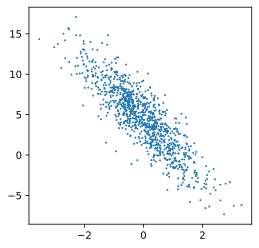
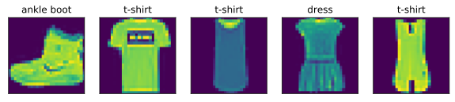

### LR

* $y = \mathbf{w}^\top \mathbf{x} + b + \epsilon \text{ where } \epsilon \sim \mathcal{N}(0, \sigma^2).$


* $p(y|\mathbf{x}) = \frac{1}{\sqrt{2 \pi \sigma^2}} \exp\left(-\frac{1}{2 \sigma^2} (y - \mathbf{w}^\top \mathbf{x} - b)^2\right).$


```python
%matplotlib inline
import torch
import random
from matplotlib import pyplot as plt
from IPython import display
```


```python
def synthetic_data(w, b, num_examples):
    """Generate y = X w + b + noise."""
    X = torch.zeros(size=(num_examples, len(w))).normal_()
    y = torch.matmul(X, w) + b
    y += torch.zeros(size = y.shape).normal_(std=0.01)
    return X, y
```


```python
true_w = torch.tensor([2, -3.4])
true_b = 4.444
features, labels = synthetic_data(true_w, true_b, 1000)
```


```python
features[0], labels[0]
```


    (tensor([-0.9447, -1.9361]), tensor(9.1399))


```python
# Plot settings
def use_svg_display():
    """Use the svg format to display a plot in Jupyter."""
    display.set_matplotlib_formats('svg')
    

def set_figsize(figsize=(6, 8)):
    """Set the figure size for matplotlib."""
    use_svg_display()
    plt.rcParams['figure.figsize'] = figsize
```


```python
set_figsize(figsize=(4, 4))
```


```python
# 特征的最后一维做可视化，
# 第三个参数：The marker size
plt.scatter(features[:, 1].numpy(), labels.numpy(), 1)
```


    <matplotlib.collections.PathCollection at 0x129ad8690>





```python
# golden example on batch-data access
def data_iter(batch_size, features, labels):
    num_examples = len(features)
    indices = list(range(num_examples))
    random.shuffle(indices)
    for i in range(0, num_examples, batch_size):
        j = torch.tensor(indices[i: min(i + batch_size, num_examples)])
        yield features[j], labels[j]
```


```python
batch_size =  10
for X, y in data_iter(batch_size, features, labels):
    print(X, '\n', y)
    break
```

    tensor([[-0.0140,  0.4955],
            [ 0.3740,  1.4491],
            [ 1.3240,  0.6199],
            [-0.0944, -0.1557],
            [-0.2420,  0.2464],
            [-0.6962, -1.4067],
            [ 0.6464, -0.7040],
            [-0.6650,  0.1285],
            [ 0.6528,  0.4227],
            [-1.4647,  0.0225]]) 
     tensor([2.7209, 0.2724, 4.9975, 4.7869, 3.1399, 7.8283, 8.1079, 2.6803, 4.3185,
            1.4501])


```python
#Model parameters
w = torch.normal(0, 0.01, size=(2, 1), requires_grad=True)
b = torch.zeros(1, requires_grad=True)
```


```python
#Model
def linreg(X, w, b):
    return torch.matmul(X, w) + b
#Loss
def squared_error(y_hat, y):
    return (y_hat - y.reshape(y_hat.shape))**2 / 2
```


```python
"""
Because our loss is calculated as a sum over the batch of examples, 
we normalize our step size by the batch size (batch_size), so that the magnitude of a 
typical step size does not depend heavily on our choice of the batch size.
"""
# optimizer
def sgd(params, lr, batch_size):
    for param in params:
        param.data.sub_(lr * param.grad / batch_size) #该梯度是所有batch的和，所有除以batch正则化
        param.grad.data.zero_()
```


```python
# Traning
lr = 0.03
num_epochs = 5
for epoch in range(num_epochs):
    for X, y in data_iter(batch_size, features, labels):
        loss = squared_error(linreg(X, w, b), y) # Minibatch-loss
        loss.mean().backward() # Compute gradient on loss with respect to [w,b]
        sgd([w, b], lr, batch_size) # 用随机梯度下降，利用它们的梯度更新参数
    with torch.no_grad():
        training_loss = squared_error(linreg(X, w, b), y)
        print(f"epoch {epoch + 1}, loss {float(training_loss.mean())}")
        
```

    epoch 1, loss 0.03302072733640671
    epoch 2, loss 0.0073621841147542
    epoch 3, loss 0.005785355810075998
    epoch 4, loss 0.002183828502893448
    epoch 5, loss 0.002760048722848296


## 框架自带的数据类构建LR


```python
from torch.utils import data
```


```python
def load_array(data_array, batch_size, is_train=True):
    dataset = data.TensorDataset(*data_array)
    return data.DataLoader(dataset, batch_size, shuffle=is_train)

batch_size = 10
data_iter = load_array((features, labels), batch_size)
```


```python
next(iter(data_iter))
```


    [tensor([[-0.6236,  0.8897],
             [-0.3073,  0.9034],
             [ 0.9847, -0.2340],
             [-0.6958,  0.5574],
             [-0.5059, -0.5852],
             [-1.0757, -0.4725],
             [-1.6130, -0.9148],
             [-1.2579,  0.1319],
             [-0.8099, -0.4857],
             [-0.2726,  1.0848]]),
     tensor([0.1864, 0.7726, 7.2163, 1.1565, 5.4282, 3.9169, 4.3345, 1.4896, 4.4729,
             0.2074])]


```python
from torch import nn
```


```python
net = nn.Sequential(nn.Linear(2, 1))
net[0].weight.data.uniform_(0.0, 0.01)
net[0].bias.data.fill_(0)
loss = nn.MSELoss()
trainer = torch.optim.SGD(net.parameters(), lr=0.03)
```


```python
num_epochs = 3
for epoch in range(1,num_epochs + 1):
    for X, y in data_iter:
        l = loss(net(X), y)
        trainer.zero_grad() # torch每次update需要清空grad
        l.backward()# 计算梯度
        trainer.step() # 梯度更新
    l = loss(net(features), labels) # 测试损失
    print("epoch {}, loss {}".format(epoch, l))
```

    epoch 1, loss 16.28912353515625
    epoch 2, loss 16.194189071655273
    epoch 3, loss 16.209455490112305


## MINIST图像多分类


```python
import torchvision
from torchvision import transforms
import sys
```


```python
# By default pytorch torchvision datasets are of type PIL. 
# change the PIL to Tensor format.
trans = transforms.ToTensor()
# parameter: transform takes in an PIL image and returns a transformed version
mnist_train = torchvision.datasets.FashionMNIST(
    root='fashion-mnist/data', train=True, transform=trans, download=True) 
mnist_test = torchvision.datasets.FashionMNIST(
    root="fashion-mnist/data", train=False, transform=trans, download=True)
```

    Downloading http://fashion-mnist.s3-website.eu-central-1.amazonaws.com/train-images-idx3-ubyte.gz to fashion-mnist/data/FashionMNIST/raw/train-images-idx3-ubyte.gz


    HBox(children=(FloatProgress(value=1.0, bar_style='info', max=1.0), HTML(value='')))


    Extracting fashion-mnist/data/FashionMNIST/raw/train-images-idx3-ubyte.gz to fashion-mnist/data/FashionMNIST/raw
    Downloading http://fashion-mnist.s3-website.eu-central-1.amazonaws.com/train-labels-idx1-ubyte.gz to fashion-mnist/data/FashionMNIST/raw/train-labels-idx1-ubyte.gz


    HBox(children=(FloatProgress(value=1.0, bar_style='info', max=1.0), HTML(value='')))


    Extracting fashion-mnist/data/FashionMNIST/raw/train-labels-idx1-ubyte.gz to fashion-mnist/data/FashionMNIST/raw
    Downloading http://fashion-mnist.s3-website.eu-central-1.amazonaws.com/t10k-images-idx3-ubyte.gz to fashion-mnist/data/FashionMNIST/raw/t10k-images-idx3-ubyte.gz


    HBox(children=(FloatProgress(value=1.0, bar_style='info', max=1.0), HTML(value='')))


    Extracting fashion-mnist/data/FashionMNIST/raw/t10k-images-idx3-ubyte.gz to fashion-mnist/data/FashionMNIST/raw
    Downloading http://fashion-mnist.s3-website.eu-central-1.amazonaws.com/t10k-labels-idx1-ubyte.gz to fashion-mnist/data/FashionMNIST/raw/t10k-labels-idx1-ubyte.gz


    HBox(children=(FloatProgress(value=1.0, bar_style='info', max=1.0), HTML(value='')))


    Extracting fashion-mnist/data/FashionMNIST/raw/t10k-labels-idx1-ubyte.gz to fashion-mnist/data/FashionMNIST/raw
    Processing...
    Done!


​    
​    


    /Users/distiller/project/conda/conda-bld/pytorch_1587428061935/work/torch/csrc/utils/tensor_numpy.cpp:141: UserWarning: The given NumPy array is not writeable, and PyTorch does not support non-writeable tensors. This means you can write to the underlying (supposedly non-writeable) NumPy array using the tensor. You may want to copy the array to protect its data or make it writeable before converting it to a tensor. This type of warning will be suppressed for the rest of this program.


```python
def get_fashion_mnist_labels(labels):  #@save
    text_labels = ['t-shirt', 'trouser', 'pullover', 'dress', 'coat',
                   'sandal', 'shirt', 'sneaker', 'bag', 'ankle boot']
    return [text_labels[int(i)] for i in labels]
```


```python
def show_images(imgs, num_rows, num_cols, title=None, scale=1.5):
    fig_size = (num_rows * scale, num_cols * scale)
    _, axes = plt.subplots(num_rows, num_cols, figsize=fig_size)
    axes = axes.flatten()
    for i, (ax, img) in enumerate(zip(axes, imgs)):
        if 'numpy' in dir(img): img = img.numpy()
        ax.imshow(img)
        ax.axes.get_xaxis().set_visible(False)
        ax.axes.get_yaxis().set_visible(False)
        if title:
            ax.set_title(title[i])
    return axes
```


```python
X, y = next(iter(data.DataLoader(mnist_train, batch_size=5)))
show_images(X.reshape(5, 28, 28), 1,  5, title=get_fashion_mnist_labels(y), scale=10)
```


    array([<matplotlib.axes._subplots.AxesSubplot object at 0x131bad250>,
           <matplotlib.axes._subplots.AxesSubplot object at 0x131be9910>,
           <matplotlib.axes._subplots.AxesSubplot object at 0x131c2a150>,
           <matplotlib.axes._subplots.AxesSubplot object at 0x131c5e950>,
           <matplotlib.axes._subplots.AxesSubplot object at 0x131c9e190>],
          dtype=object)





```python
batch_size = 256
# num_workers : num of multiple processes
    mnist_train = torchvision.datasets.FashionMNIST(
        root="../data", train=True, transform=trans, download=True)
    mnist_test = torchvision.datasets.FashionMNIST(
        root="../data", train=False, transform=trans, download=True)
    return (data.DataLoader(mnist_train, batch_size, shuffle=True,
                            num_workers=get_dataloader_workers()),
            data.DataLoader(mnist_test, batch_size, shuffle=False,
                            num_workers=get_dataloader_workers()))
train_iter = data.DataLoader(mnist_train, batch_size, shuffle=True, num_workers=4)
test_iter = data.DataLoader(mnist_test, batch_size, shuffle=False, num_workers=4)
```


```python
def load_data_fashion_mnist(batch_size, resize=None):  #@save
    """Download the Fashion-MNIST dataset and then load into memory."""
    trans = [transforms.Resize(resize)] if resize else []
    trans.append(transforms.ToTensor())
    trans = transforms.Compose(trans)

    mnist_train = torchvision.datasets.FashionMNIST(
        root="fashion-mnist/data", train=True, transform=trans, download=True)
    mnist_test = torchvision.datasets.FashionMNIST(
        root="fashion-mnist/data", train=False, transform=trans, download=True)
    return (data.DataLoader(mnist_train, batch_size, shuffle=True,
                            num_workers=4),
            data.DataLoader(mnist_test, batch_size, shuffle=False,
                            num_workers=4))
```


```python

train_iter, test_iter = load_data_fashion_mnist(batch_size)
```

#### Model


```python
num_inputs = 784
num_outputs = 10
W = torch.normal(0, 0.01, size=(num_inputs, num_outputs), requires_grad=True)
b = torch.zeros(num_outputs, requires_grad=True)
```


```python
X = torch.tensor([[1., 2., 3.], [4., 5., 6.]])
torch.sum(X, dim=0, keepdim=True), torch.sum(X, dim=1, keepdim=True)
```


    (tensor([[5., 7., 9.]]),
     tensor([[ 6.],
             [15.]]))


```python
def softmax(x):
    X_exp = torch.exp(x)
    denominator = torch.sum(X_exp, dim=1, keepdim=True)
    return X_exp / denominator  # [*, k] / [*, 1]
```


```python
def Net(X):
    return softmax(torch.matmul(X.reshape((-1, num_inputs)), W) + b)
```

####  cross-entropy 
* cross-entropy takes the negative log likelihood of the predicted probability assigned to the true label.
* $-\log P(y \mid x)$


```python
def crossEntropy(hat_Y, Y):
    return -torch.log(hat_Y[range(len(hat_Y)), Y])
```


```python
y_hat = torch.tensor([[0.1, 0.3, 0.6], [0.3, 0.2, 0.5]])
y_hat[[0, 1], [0, 2]]
```


    tensor([0.1000, 0.5000])


```python
def accuracy(hat_Y, Y):
    # 区别predicted是flatten的，还是未flatten
    if hat_Y.shape[1] > 1:
        # 对应arg就是类别
        return float((hat_Y.argmax(axis=1).type(torch.float32) == Y.type(torch.float32)).sum())
    return float((hat_Y.argmax(axis=1).type(torch.float32) == Y.type(torch.float32)).sum())
```


```python
y = torch.tensor([0, 2])
accuracy(y_hat, y) / len(y)
```


    0.5


```python
class Accumulator:
    """Sum a list of numbers over time."""

    def __init__(self, n):
        self.data = [0.0] * n

    def add(self, *args):
        self.data = [a+float(b) for a, b in zip(self.data, args)]

    def reset(self):
        self.data = [0] * len(self.data)

    def __getitem__(self, idx):
        return self.data[idx]
```


```python
def evaluate_accuracy(net, data_iter):  #@save
    metric = Accumulator(2)  # num_corrected_examples, num_examples
    for X, y in data_iter:
        metric.add(accuracy(net(X), y), y.size)
    return metric[0] / metric[1]
```


```python
def net(X):
    return softmax(torch.matmul(X.reshape((-1, num_inputs)), W) + b)
```


```python

```
