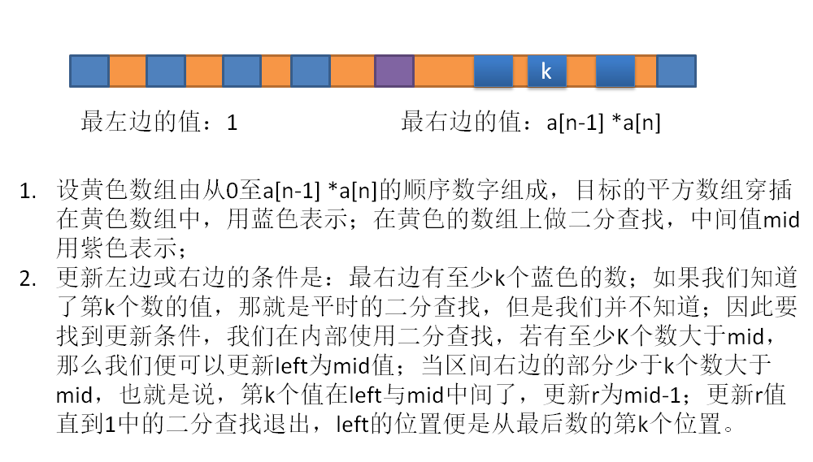

#### [编程题]山寨金闪闪

>链接：https://www.nowcoder.com/questionTerminal/9363dcb83ca44c61a2c1a8f65aa722b8来源：牛客网
>金闪闪死后，红A拿到了王之财宝，里面有n个武器，长度各不相同。红A发现，拿其中三件武器首尾相接，组成一个三角形，进行召唤仪式，就可以召唤出一个山寨金闪闪。（例如，三件武器长度为10、15、20，可以召唤成功。若长度为10、11、30，首尾相接无法组成三角形，召唤失败。）红A于是开了一个金闪闪专卖店。他把王之财宝排成一排，每个客人会随机抽取到一个区间[l,r],客人可以选取区间里的三件武器进行召唤（客人都很聪慧，如果能找出来合适的武器，一定不会放过）。召唤结束后，客人要把武器原样放回去。m个客人光顾以后，红A害怕过多的金闪闪愉悦太多男人，于是找到了你，希望你帮他统计出有多少山寨金闪闪被召唤出来。  
>
>  链接：https://www.nowcoder.com/questionTerminal/9363dcb83ca44c61a2c1a8f65aa722b8
>来源：牛客网
>
>第一行武器数量:n <= 1*10^7
>第二行空格分隔的n个int，表示每件武器的长度。
>第三行顾客数量：m <= 1*10^6
>后面m行，每行两个int l，r，表示每个客人被分配到的区间。（l<r）  

* 解析：找三角形：只需要使最小的两条边的和大于第三边就可以判断是有效三角形，但是一个trick是当区间【l,r】的范围大于45时，一定能找到三角形，为什么呢？假设刚好不能满足是有效三角形，那么有边1、1、2、3、5、8、13、、、，连续的三个数都正好最小两边和为第三边，不满足三角不等式，因此不能拼成三角形，但是选择这三个数的区间内，却一定是有效三角形，比如【3、5、8】，那么在区间 4 ~ 8 或 3 ~ 7 的数都满足三角不等式，可以是三角形。而上面的数字正好是斐波那契数列，【f1， f2,  f3、。。f45】正好可以把 INT_MAX大小部分覆盖，相当于整个1至INT_MAX的整数段，被斐波那契数列 f1 、f2、....、 f45 分割成了45个区间，如下。那么现在我在这个区间上放46个数，使得它们里面找的三个数不能组成三角形，那么我就把它们放在划分区间的边界处，也就是f0（为1）、f1、f2、。。。f45的地方，现在我再放一个数，它必然使得这里存着三个数组成三角形，由斐波那契数知道，【f1,f3】【f2，f4】【f3, f5】是三个划分区间，而每两个挨着的区间都有一半以上是重叠的。那么，我这个数X必然要与左边或者右边重叠，比如放在区间【f2,...,X, ...,f4】的正中间，它不能结合这个区间的两个边界成为有效的三角形，但是因为重叠，会使得【X,...,f3....,f4】成为一个有效的三角形组合。也可以视为【f2,...,f3....,f4】是无效三角形组合，但是必须放入一个到其中的时候，我们知道【f2,.......,f4-1】与【f2+1,.......,f4】内如果有三个数，那么必然是满足三角不等式。

```c++
int fibonacci(int n)
{
    unsigned long a = 1, b = 1, c;
    int count = 0;
    while(n--)
    {
        c = a + b;
        a = b;
        b = c;
        count++;
        if (c > INT_MAX) cout << "count---greater than INT_MAX---: " << count << endl;
        cout << count << " : " <<  c << endl;
    }
}

int main()
{
    fibonacci(45);
}

1 : 2
2 : 3
3 : 5
4 : 8
5 : 13
6 : 21
7 : 34
8 : 55
9 : 89
10 : 144
11 : 233
12 : 377
13 : 610
14 : 987
15 : 1597
16 : 2584
17 : 4181
18 : 6765
19 : 10946
20 : 17711
21 : 28657
22 : 46368
23 : 75025
24 : 121393
25 : 196418
26 : 317811
27 : 514229
28 : 832040
29 : 1346269
30 : 2178309
31 : 3524578
32 : 5702887
33 : 9227465
34 : 14930352
35 : 24157817
36 : 39088169
37 : 63245986
38 : 102334155
39 : 165580141
40 : 267914296
41 : 433494437
42 : 701408733
43 : 1134903170
44 : 1836311903
count---greater than INT_MAX---: 45
45 : 2971215073
```

题解：

```c++
#include <bits/stdc++.h>
using namespace std;
const int MAXS = 1e7+5;
int arr[MAXS];

int fibonacci(int n)
{
    unsigned long a = 1, b = 1, c;
    int count = 0;
    while(n--)
    {
        c = a + b;
        a = b;
        b = c;
        count++;
        if (c > INT_MAX)
            return count + 2;
    }
}
int main()
{
    int n; cin >> n;
    
    for (int i = 0; i < n; i++)
        cin >> arr[i];
    int m; cin >> m;
    int left , right;
    int res = 0;
    int count = fibonacci(1000);
    //cout  << count << endl;
    vector<int> table;
    while(m--)
    {
        cin >> left >> right;
        if (right - left + 1 >= count)
            res++;
        else if (right - left + 1 < 3)
            continue;
        else
        {
            copy(&arr[left - 1], &arr[right], back_inserter(table));
            //for(int i = left - 1; i <= right - 1; i++) table.push_back(arr[i]);
            sort(table.begin(), table.end());
            for (size_t i = 0; i + 2 < table.size(); i++)
                if (table[i] + table[i + 1] > table[i + 2])
                {
                    res++;
                    break;
                }
            table.clear();
        }
    }
    cout << res << endl;
}
```


#### 给定一个合法的表达式字符串，其中只包含非负整数、加法、减法以及乘法符号（不会有括号），例如7+3*4*5+2+4-3-1，请写程序计算该表达式的结果并输出；

同leetcode 227. Basic Calculator II

解析：1.先去掉空白符；2.处理数字与非数字；遇到非数字，即操作符号的时候总是把之前计算好的数存到栈中，若操作符号是乘除符号，那么取出栈顶左边数，与当前得到的右边数做对应运算，然后放入栈顶。可以看到，遇到操作符时，我们已经计算得到了符号的右边数，该符号是正负，那么先把右边数存起来便是，只有遇到乘除号需要计算之后入栈，反正栈中的元素全是计算完的部分结果，拿来出栈全部就和。

骚python：

```python
def main():
    while True:
        s = input()
        if s == "END":
            break
        exec("print(" + s + ")")
        
if __name__ == "__main__":
    main()
```


#### 小A最多会新认识的多少人

> 小A参加了一个n人的活动，每个人都有一个唯一编号i(i>=0 & i<n)，其中m对相互认识，在活动中两个人可以通过互相都认识的一个人介绍认识。现在问活动结束后，小A最多会认识多少人？
>
>   链接：https://www.nowcoder.com/questionTerminal/1fe6c3136d2a45fa8ef555b459b6dd26?f=discussion
> 来源：牛客网
>
> 第一行聚会的人数：n（n>=3 & n<10000）；
> 第二行小A的编号: ai（ai >= 0 & ai < n)；
> 第三互相认识的数目: m（m>=1 & m
> < n(n-1)/2）；
> 第4到m+3行为互相认识的对，以','分割的编号。  

* 图的深度优先搜索，先建立邻接表，然后深度搜索，问题要求的是A认识的新人，因此要删除A已经认识的人，还有查找集合里A本身。

```c++
#include <bits/stdc++.h>
using namespace std;
 

void dfs(int a, vector<int> &visit, map<int, vector<int>> &table)
{
    if (!visit[a])
    {
        visit[a]++;
        for (auto it : table[a])
            dfs(it, visit, table);
    }
}
int main()
{
    int n, a, m;
    cin >> n >> a >> m;
    map<int, vector<int>> table;
    vector<int> visit(n, 0);
    string relation;
    for (int i = 0; i < m; i++)
    {
        cin >> relation;
        int c = stoi(relation.substr(0, relation.find(',')));
        int d = stoi(relation.substr(relation.find(',') + 1));
        //邻接表：table[i]记录了i这个人到底已经认识了哪些人
        table[c].push_back(d);
        table[d].push_back(c);
    }
    dfs(a, visit, table);
    int num = accumulate(visit.begin(), visit.end(), 0);
    cout << (num - 1 - table[a].size()) << endl;
}

```

python：

利用并查集来做，它的概念：https://juejin.im/entry/5922593d44d904006cd20175；

它是用来把多个集合合并的数据结构，开始时，各个元素都属于各自的集合，根节点为它们自己；

当需要合并（union）任意两个节点时，先查找函数（find）它们的根节点，若是同一个根，说明它们已经在同一集合内；若不是，设置其中一个的根节点为另一个的根节点；设置的技巧可以先配一个rank，rank表示这个根节点的子节点数目，数目越多，该根节点更有理由作为另一个的根节点，这样整个森林才比较平衡，而平衡有利于快速的搜索。


因此，就有合并函数和查找函数：其中查找函数的为：

```python
    def find(self, x):
        if self.parents[x] != x:
            self.parents[x] = self.find(self.parents[x])
        return self.parents[x]
```

理解它只需要这个图就行：


现在要找到元素9所在树的根节点，在找根节点的过程中使用路径压缩，也就是说9到根的路径上的节点9，6，3，1的父节点都设置成为根节点0，所以呢，在FIND-SET(9)之后，树的形态就变成了下面的样子：


题目代码：

```python
class UnionSet:
    def __init__(self, n):
        self.rank = [1] * n
        # 初始时，每个节点都是单独一个集合，它们的父节点就是它们自己
        self.parents = [i for i in range(n)]
    def find(self, x):
        if self.parents[x] != x:
            self.parents[x] = self.find(self.parents[x])
        return self.parents[x]
    def union(self, a, b):
        pa, pb = self.find(a), self.find(b)
        # 先找出它们的父节点，若父节点不同，则它们现在还不属于同一集合
        # 对rank大的节点选择作为根节点，这样生成的森林比较平衡
        if pa != pb:
            if self.rank[pa] > self.rank[pb]:
                self.parents[pb] = pa # 设置父节点
                self.rank[pa] += self.rank[pb]
            else:
                self.parents[pa] = pb
                self.rank[pb] += self.rank[pa]
import sys
lines = sys.stdin.readlines()
n = int(lines[0].strip())
A = int(lines[1].strip())
us = UnionSet(n)
seen =set()
for line in lines[3:]:
    a, b = list(map(int, line.split(',')))
    us.union(a, b)
    if a == A:
        seen.add(b)
    elif b == A:
        seen.add(a)
# A所在集合的根节点,查找其他节点的根，若不是root，则不属于统一集合
root = us.find(A)
res = -1
for i in range(n):
    if us.find(i) == root:
        res += 1
print(res - len(seen))
```


#### 扭蛋机

  链接：https://www.nowcoder.com/questionTerminal/9d26441a396242a9a0f7d2106fc130c7?f=discussion

> 来源：牛客网
>
> 22娘和33娘接到了小电视君的扭蛋任务：
>  一共有两台扭蛋机，编号分别为扭蛋机2号和扭蛋机3号，22娘使用扭蛋机2号，33娘使用扭蛋机3号。
>  扭蛋机都不需要投币，但有一项特殊能力：
>  扭蛋机2号：如果塞x（x范围为>=0正整数）个扭蛋进去，然后就可以扭到2x+1个
>  扭蛋机3号：如果塞x（x范围为>=0正整数）个扭蛋进去，然后就可以扭到2x+2个
>  22娘和33娘手中没有扭蛋，需要你帮她们设计一个方案，两人“轮流扭”（谁先开始不限，扭到的蛋可以交给对方使用），用“最少”的次数，使她们能够最后恰好扭到N个交给小电视君。  
>
> 输入一个正整数，表示小电视君需要的N个扭蛋。
>
> 输出一个字符串，每个字符表示扭蛋机，字符只能包含"2"和"3"。

* 解析：

  链接：https://www.nowcoder.com/questionTerminal/9d26441a396242a9a0f7d2106fc130c7?f=discussion来源：牛客网

    初始位置是x=0，然后每步有两种选择 

    1、第一种选择是走到编号为 2*x+1 的方格，代号为 ‘2’ 

    2、第一种选择是走到编号为 2*x+2 的方格，代号为 ‘3’ 

    求一种可以正好走到 编号为 n 的方式

  ```python
  # 逆推法：根据最后一步的奇偶，判断前一步的选择
  n = int(input())
  res = ''
  while n > 0:
      if (n-2) % 2:
          n = (n-1) // 2
          res = '2' + res
      else:
          n = (n-2) // 2
          res = '3' + res
  print(res)
  ```

```python
# 简化版
N = int(input())
s = []
while(N):
    s.append('3' if N % 2 == 0 else  '2')
    N = (N - 1) // 2 
print("".join(s[::-1]))
```


#### 脸滚键盘

>
>
>  链接：https://www.nowcoder.com/questionTerminal/2a3dc06f337d4a2ba41d25c688f95e2f
>来源：牛客网
>
>av394281 中，充满威严的蕾米莉亚大小姐因为触犯某条禁忌，被隙间妖怪八云紫（紫m……èi）按住头在键盘上滚动。
> 同样在弹幕里乱刷梗被紫姐姐做成罪袋的你被指派找到大小姐脸滚键盘打出的一行字中的第 `k` 个仅出现一次的字。
> (为简化问题，大小姐没有滚出 ascii 字符集以外的字)  
>
>```
>每个输入都有若干行，每行的第一个数字为`k`，表示求第`k`个仅出现一次的字。然后间隔一个半角空格，之后直到行尾的所有字符表示大小姐滚出的字符串`S`
>```

* 解析：用map计算就行

  ```c++
  #include <bits/stdc++.h>
  #include <algorithm>
  using namespace std;
   
  string res(string s, int N)
  {
      if(s.empty() || N == 0) return "Myon~";
      unordered_map<char, int> table;
      for (auto c : s)
          table[c]++;
      int count = 0;
      string _res = "[*]";
      for (int i = 0; i < s.size(); i++)
      {
          if (table[s[i]] == 1)
          {
              count++;  _res[1] = s[i];
              if (count == N) break;
          }
      }
      return count == N ? _res : "Myon~";
  }
  int main()
  {
      int N;
      string s;
      while (getline(cin, s))
      {
          N = 0;
          while(s[N] != ' ') N++;
          string substr = s.substr(0, N);
          s = s.substr(N + 1, s.length());
          N = stoi(substr);
          cout << res(s, N) << endl;
      }
  }
  ```

  

#### 比较两个版本字符串version1和version2

>链接：https://www.nowcoder.com/questionTerminal/521049ca23f147d698e1cff923c3262a?f=discussion&toCommentId=4139205来源：牛客网
>
>  输入的version字符串非空，只包含数字和字符.。.字符不代表通常意义上的小数点，只是用来区分数字序列。例如字符串2.5并不代表二点五，只是代表版本是第一级版本号是2，第二级版本号是5.

* 考虑两个version的版本号长度不一样，为此，在最短的version号上添置0，使得长度一致。

```python
def main():
    a = list(input().split(" "))
    b, c = [list(map(int,it.split("."))) for it in a]
    l = abs(len(b) - len(c))
    if l and len(b) > len(c):
        c += [0] * l
    if l and len(b) < len(c):
        b += [0] * l
    for c1, c2 in zip(b, c):
        if c1 > c2:
            print(1)
            return
        elif c1 < c2:
            print(-1)
            return
    print(0)
if __name__ == "__main__":
    main()
```


#### 精灵鼠从入口到出口的最少减少速度

> 猛兽侠中精灵鼠在利剑飞船的追逐下逃到一个n*n的建筑群中，精灵鼠从（0,0）的位置进入建筑群，建筑群的出口位置为（n-1,n-1），建筑群的每个位置都有阻碍，每个位置上都会相当于给了精灵鼠一个固定值减速，因为精灵鼠正在逃命所以不能回头只能向前或者向下逃跑，现在问精灵鼠最少在减速多少的情况下逃出迷宫？

* 解析：

  ```python
  def main():
      n = int(input())
      table = [list(map(int, input().split(","))) for _ in range(n)]
      for i in range(n):
          for j in range(n):
              # 初始化第一行和第一列，即一直往下或者右走
              if i == 0 and j >= 1: table[i][j] += table[i][j - 1]
              if j == 0 and i >= 1: table[i][j] += table[i - 1][j]
              if i >= 1 and j >= 1: table[i][j] += min(table[i -1][j], table[i][j - 1])
      print(table[n - 1][n - 1])
  if __name__ == "__main__":
      main()
  ```


#### 顺时针打印数字矩阵

> ```
> 3 3
> 1 2 3
> 4 5 6
> 7 8 9
> -1 -1
> ```
>
> ```
> 1,2,3,6,9,8,7,4,5
> ```

* 解：充分利用python语言的extend还有pop性质，想法是每次从矩阵里消去第一行，倒数列，倒数行，第一列的循环，并且会发生失败，还搭上try/except语句。

```python
while 1:
    m, n = map(int, input().split())
    if m == -1: 
        break
    p = []
    table = [input().split() for  _ in range(m)]
    while 1:
        try:
            p.extend(table.pop(0))
            for i in range(len(table)):
                p.append(table[i].pop(-1))
            p.extend(table.pop(-1)[::-1])
            for i in range(len(table) - 1, -1, -1):
                p.append(table[i].pop(0))
        except: break
    print(','.join(p))
```


#### 判断输入的字符串是否属于内网IP

什么属于内网IP：

```python
if input().split('.')[0] in ['127','192','10','172']: print(1)
else: print(0)
```


####  给定一个整数数组,判断其中是否有3个数和为N

* 解析：固定其中一个数，然后使用初始化其他两个数的索引，对它们的索引更新使用二分查找。

```c
def main():
    m, n = input().split(',')
    m, n = list(map(int, m.split())), int(n)
    m.sort()
    if len(m) < 3:
        print("True")
        return
    for i in range(len(m) - 2):
        if i - 1 >= 0 and m[i] == m[i - 1]:
            continue
        j, k = i + 1, len(m) - 1
        while(j < k):
            res = m[j] + m[k] + m[i] - n
            if res > 0:
                k -= 1
            elif res < 0:
                j += 1
            else:
                print("True")
                return
    print("False")
if __name__ == "__main__":
    main()
```


#### 孙悟空的徒弟

	>  链接：https://www.nowcoder.com/questionTerminal/7b841a840db64f5ebec77f6ee7e307e2?f=discussion
	>  来源：牛客网
	>
	>  打败魔人布欧以后，孙悟空收了n个徒弟，每个徒弟战斗力各不相同。他教导所有的徒弟和体术，合体后战斗力为原战斗力相乘。任何两个徒弟都可以合体，所以一共有n*(n-1)/2种合体徒弟。有一天，他想考验一下孙悟天战斗力如何，希望在所有n*(n-1)/2种合体徒弟中选择战斗力第k高的，与孙悟天对战。可是孙悟空徒弟太多了，他已然懵逼，于是找到了你，请你帮他找到对的人。  
	>
	>  ```
	>  输入：第一行两个int。徒弟数量：n <= 1*10^6；战斗力排名:k <= n*(n-1)/2第二行空格分隔n个int，表示每个徒弟的战斗力。
	>  ```
	>
	>  ```
	>  输出：战斗力排名k的合体徒弟战斗力。
	>  ```
	>
	>  示例：
	>
	>  ```pseudocode
	>  5 2
	>  1 3 4 5 9
	>  output：
	>  36
	>  ```

* 解析：

  

  

  ```c++
  #include <iostream>
  #include <vector>
  #include <algorithm>
  using namespace std;
  typedef long long ll;
  int main()
  {
      ll n, k; cin >> n >> k;
      vector<ll> table(n, 0);
      for (ll i = 0; i < n; i++)
          cin >> table[i];
      sort(table.begin(), table.end());
      ll l = 1, r = table[n -1] * table[n - 2];
      while(l < r)
      {
          ll mid = (l + r + 1) >> 1; //要正确取到位置信息所以+1：可以尝试 3、 4、5 长度的数组除以2
          ll start = 0, end = n - 1;
          ll size = 0;
          while(start < end && size < k)
          {
              while(start < end && table[start] * table[end] < mid)
                  start++;
              //end - start:后半段的绝对长度
              size += max(end - start, ll(0)); //累加大于mid的数的数目；
              end--;
          }
          if (size >= k)
              l = mid;
          else
              r = mid - 1; // mid-1即一个一个往左移动
      }
      cout << l << endl;
  }
  ```

  

####  翻转链表

>对于一个链表 L: L0→L1→…→Ln-1→Ln,
>将其翻转成 L0→Ln→L1→Ln-1→L2→Ln-2→…
>
>输入是一串数字，请将其转换成单链表格式之后，再进行操作
>
>```
>1,2,3,4,5
>output:
>1,5,2,4,3
>```


```python
a = input().split(',')
# 反复横跳
c = [a.pop(-1) if i%2==1 else a.pop(0) for i in range(len(a))]
print(','.join(c))
```

参考一个答案：https://www.nowcoder.com/questionTerminal/f350f14cd22c41aabfa7e54a1b8e8825?f=discussion，不喜欢写链表。

```c++
#include <bits/stdc++.h>
using namespace std;
 
struct node {
    int val;
    node* next;
    node(int x): val(x), next(nullptr){}
};
 
node* getMid(node* head){
    node* slow = head;
    node* fast = head;
    while(fast != nullptr && fast->next != nullptr){
        slow = slow->next;
        fast = fast->next->next;
    }
    return slow;
}
 
node* reverse(node* head){
    node* pre = nullptr;
    node* curr = head;
    while(curr != nullptr){
        node* tmp = curr->next;
        curr->next = pre;
        pre = curr;
        curr = tmp;
    }
    return pre;
}
 
void print(node* curr){
    bool flag = true;
    while(curr != nullptr){
        if(flag){
            cout << curr->val;
            flag = false;
        }else{
            cout << "," << curr->val;
        }
        curr = curr->next;
    }
    cout << endl;
}
 
node* merge(node* l1, node* l2){
    node* dummy = new node(0);
    node* curr =dummy;
    while(l1 != nullptr && l2 != nullptr){
        curr->next = l1;
        curr = l1;
        l1 = l1->next;
        curr->next = l2;
        curr = l2;
        l2 = l2->next;
    }
    if(l1 != nullptr){
        curr->next = l1;
    }
    if(l2 != nullptr){
        curr->next = l2;
    }
 
    return dummy->next;
}
 
int main(){
    string s;
    string st;
    cin >> s;
 
    node* dummy = new node(2);
    node* curr = dummy;
 
    for(int i = 0; i < s.length(); i++){
        st = "";
        while(i < s.length() && s[i] != ','){
            st.push_back(s[i]);
            i++;
        }
        int num = stoi(st);
        node* nt = new node(num);
        curr->next = nt;
        curr = nt;
    }
 
    node* l1 = dummy->next;
    node* mid = getMid(l1);
    node* l2 = mid->next;
    mid->next = nullptr;
    l2 = reverse(l2);
 
    curr = merge(l1, l2);
    print(curr);
}
```

